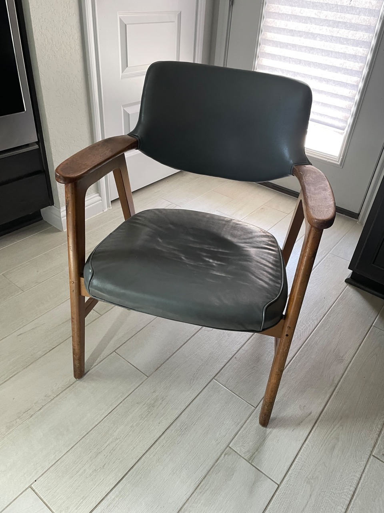

title: Chair Restoration
date: 2023-03-08
---

This was a very long project in the making. I picked up this chair from the [UT Austin surplus store](https://facilitiesservices.utexas.edu/divisions/support/surplus-property/surplus-reuse-store) for $40. It's branded "W.H. Gunlocke Chair CO. Wayland New York". I wasn't able to find an exact match online for this model but Gunlocke seems to have been a pretty reputable manufacturer of office chairs. I unfortunately destroyed the paper tag from the underside of the chair while sanding.

The original chair was in rough shape. The varnish on it was not in great shape, with lots of marring and inconsistent color on it. The chair was upholstered in a grey vinyl, both the chair seat and the back. This too was not in the best condition, and after removing it the underlying foam was also not looking particularly good. 

# Refinishing

## Tear down
To refinish the chair I started by removing the upholstery. Everything was held in place with more nails and staples than I cared to remove. With a good set of pliers and a small standard screwdriver I was able to remove most of the tacks, only a few casualties had to be cut down and sanded flush.

Removing the varnish took a while too. I started using a chemical stripper, citri-strip, which took off a fair amount but wasn't entirely effective. After two strips I resorted to sanding off the rest, starting at 80 grit. There was still a considerable about of varnish on the chair and I gunked up a lot of sandpaper in the process, but eventually got down to bare wood.

## Staining and Top Coat
Handling the chair-back was a difficult decision: while it was originally upholstered, it wasn't particularly attractive or an upholstery job I felt capable of taking on. Unfortunately underneath was a very blonde, unfinished wood (pine?) that didn't match the rest of the chair. This turned out to be an easy fix with some stain, I used the water-based Behr Red Mahogany that I thinned out with water and tinted slightly with orange acrylic paint.

I finished the chair with Natural Danish Oil. Three coats were more than enough to get a good protective coat on the chair and bring out the color of the wood.

## Seat Restoration
I tried fixing the seat a couple of ways. The first attempt was reupholstering the old spring form. I cut new foam to size then glued and stapled new fabric over in a burnt orange color. While comfortable enough, I was ultimately not a fan of how warm colored the fabric was and the creases that formed around the seams. I don't have a sewing machine, so creating matching beading wasn't something I could do.

The next iteration was an attempt at a wooden frame with danish cord woven across. I kerf-bent a ~6ft board of red oak to match the original dimensions of the seat. I calculated about 19 cuts for each turn based on the kerf width of my circular saw, so some 76 cuts later I had a piece I could bend to shape. I cut a tongue and groove across the two ends to join the seat and glued everything up. This was successful, but the plan itself was infeasible for weaving across given how wide the curve radii were.

The final attempt was another wooden frame with danish cord. The frame itself is a red oak trapezoid, joined with butts and dowels. The front piece was cut with a slight curve to put a dip in the seat. I wove the seat in laced danish cording. A particularly useful website was this [tutorial](http://www.modernchairrestoration.com/2016/05/how-to-do-the-looped-warp-weave-on-yugoslavian-folding-chair/).

The final touches were adding some leftover cord around the connection between the chair arms and seat back, the old upholstery had left an unfortunate looking groove and the transition from the nice chair wood to the cheaper seat back wood needed hiding.

## Outcome
In the end, I am very happy with the final outcome. The chair looks great in my living room, is comfortable, and the all in budget was significantly less than if I were to buy something similar new or professionally refinished. It was also a great project to get more practice with weaving and woodworking. The kerf bending technique I actually ended up using to make two lamps.

