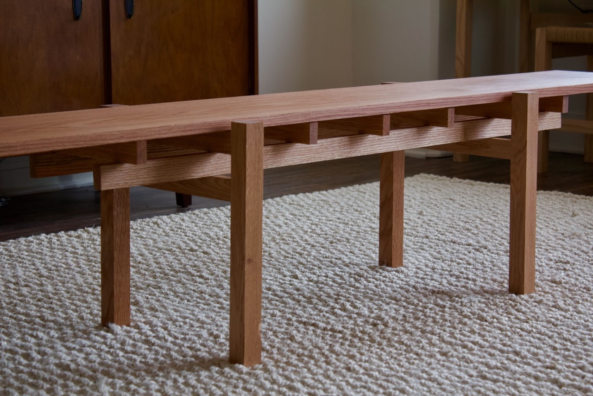
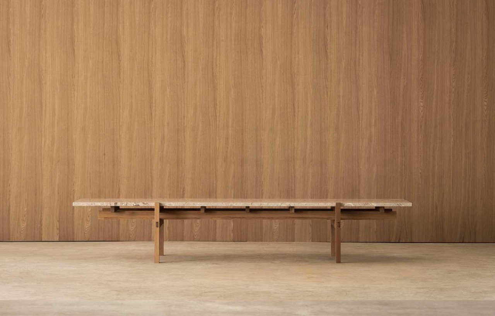
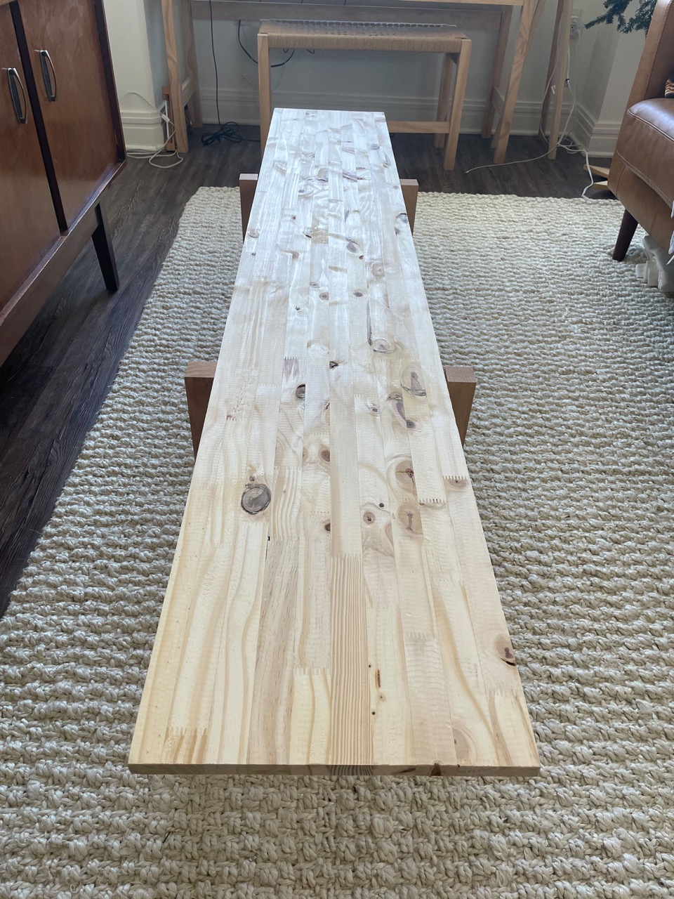
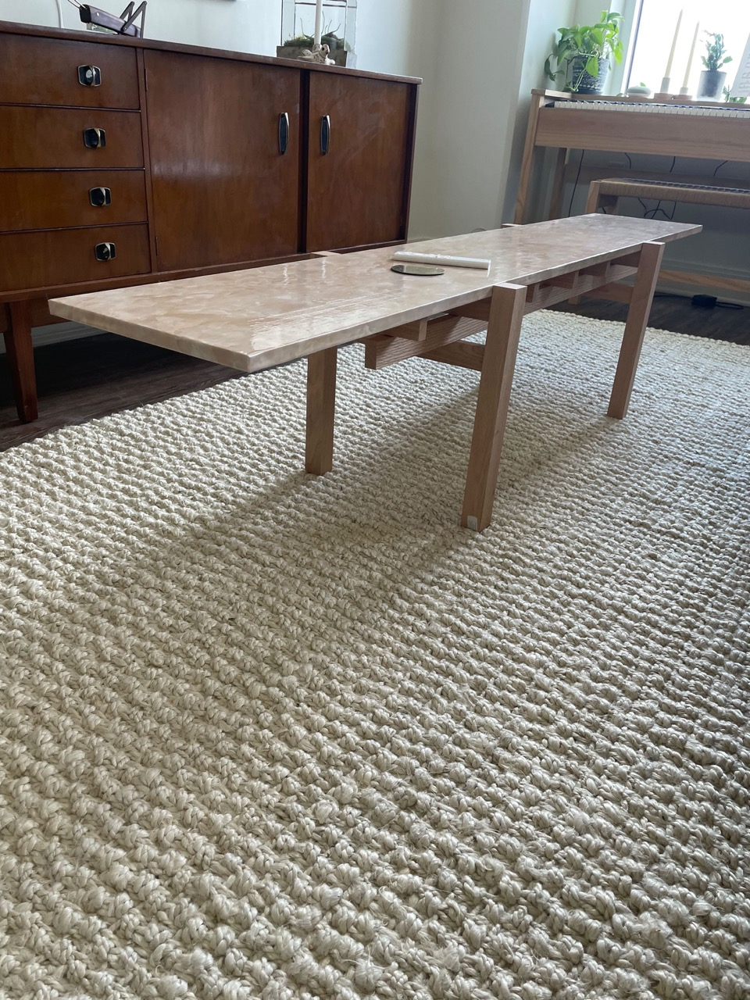
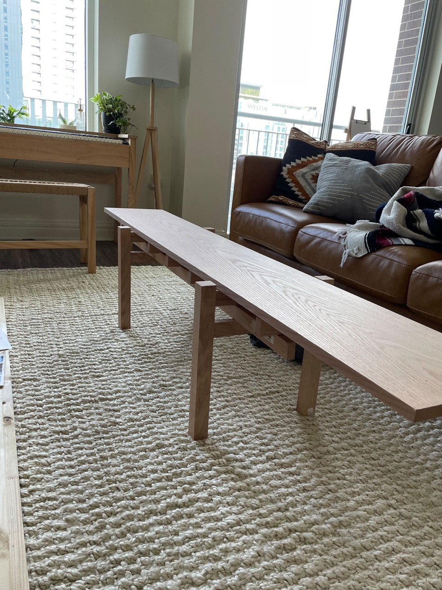
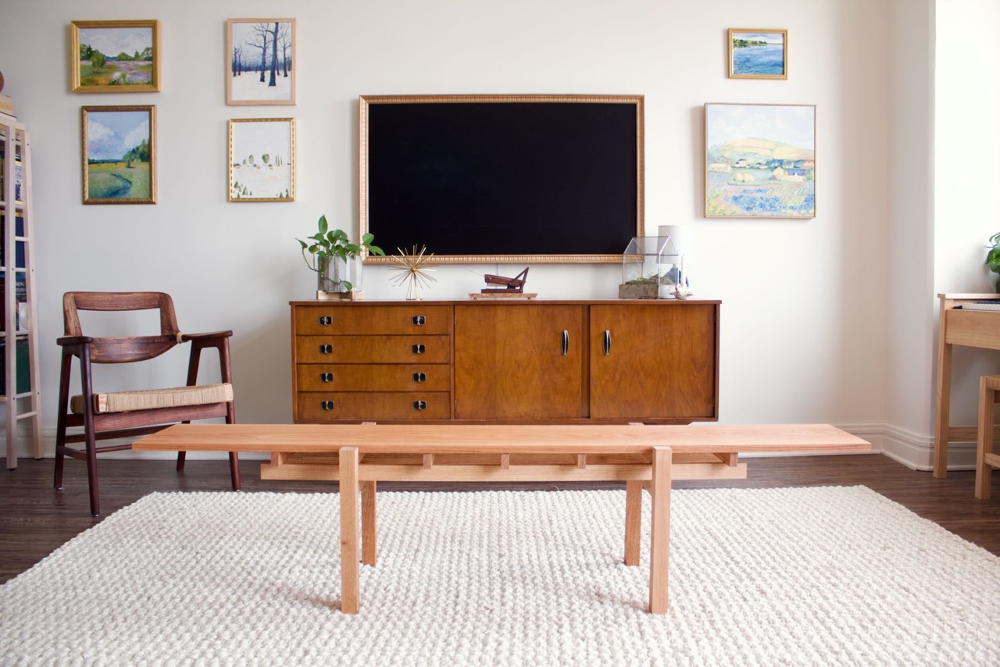
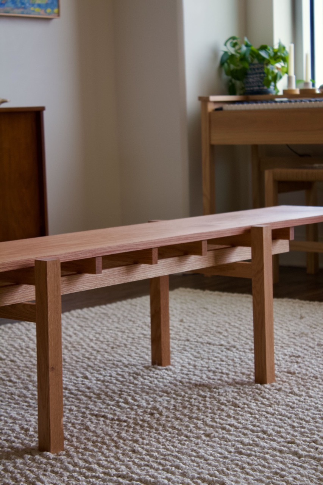
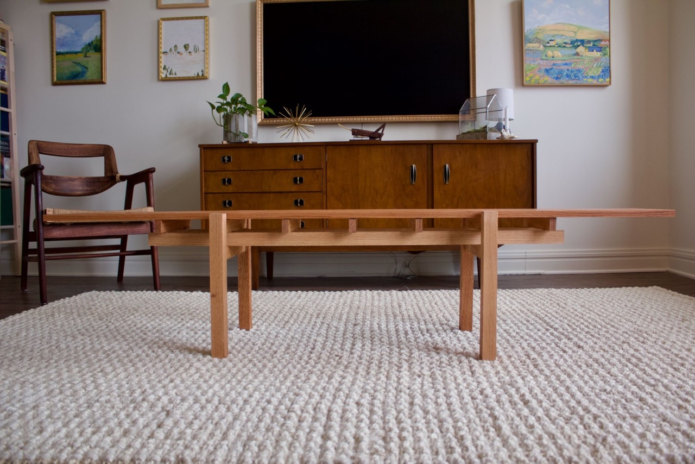

title: Coffee Table
date: 2023-03-09
tags: furniture,woodworking,design
---
I recently moved into a new apartment downtown. It's a pretty nice space but square footage is a premium and I have a shorter-than-average distance from couch to tv to work with. So many coffee tables on the market are fairly deep and would make my space feel even more cramped, so I opted to build my own table that fit the dimensions of my space.

# Design
The design of this table was heavily inspired by a similar table from one of my favorite design firms, Norm Architects. Specifically the [N - CT01](https://www.karimoku-casestudy.com/furniture/kinuta-n-ct01/) from the Karimoku Case Study - Kinuta Terrace collection. It's such a well-designed coffee table but unfortunately beyond my budget.

# Construction
All the wood in the final project I used were red oak boards I picked up from the local big box store. 

Since the boards were already joined and planed it was easy work, mostly just cutting, drilling, and gluing. Thankfully I had access to a miter saw (or chop box as my dad calls it) for this project.

The cut list (nominal sizes):

- `1x2x11` - 5 (cross support, at or shorter than top piece width)
- `2x2x12` - 4 (legs, pegs used to attach the longer supports running between two legs)
- `1x2x12` - 4 (support the top, at or longer than the top piece width)
- `1x2x48` - 2 (full length beams, pegs used to attach to the cross and leg supports )
- `1x12x55` - 1 (top piece)

All joinery was done with `5/8"` pegs. I did not glue the cross pieces into the full length beams but did glue legs to the cross pieces. The top is free floating and removable.

# Choosing a top
I originally built the project to match a cheaper 12 inch pine board that I was planning to coat in cement. My tests at coating scrap wood were unsuccessful, the cement was not suited for being in such thin coats, there was lots of cracking and adhesion was poor. If I were to try again I'd add some sort of substrate to the board and do a thicker covering.

I also considered getting a piece of stone cut to size. After scouring a couple of remnant countertop sites for a few weeks though I didn't see any stone that fit my price range and was the warm off-white color I was looking for. So instead I tried a roll of marble-look contact paper on the pine top.

The application could have been a bit better, there were a few bubbles. But the paper itself also had slight ridges to it that broke the illusion of stone. So that idea was scrapped in favor of a solid wood top.

The final iteration was a nice (re: expensive) oak board that had a strong grain pattern. 

# Finishing touches
The whole table was then finished in natural Danish Oil. My apartment smelt strongly of off-gasses for a couple of days (definitely will be asking a friend to use their yard next time I stain/finish stuff).

# Final thoughts
I'm very happy with the current state of the coffee table. It looks great and is incredibly sturdy; I have no fears standing on it! If I were to do it again, I think for the cross supports between the legs I would have used through tenons instead of pegs. While the pegs certainly are strong enough, the look of the through tenons would really add to the overall hand-build quality I was going for. I still might get a piece of stone cut to size as well if I ever find a slab I like.