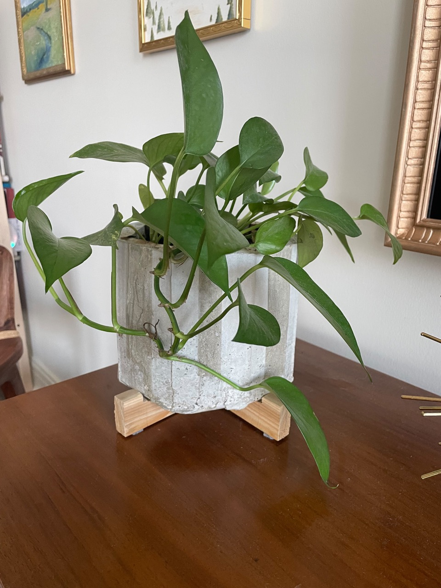
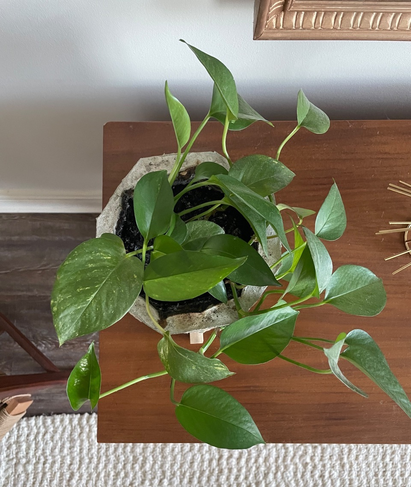
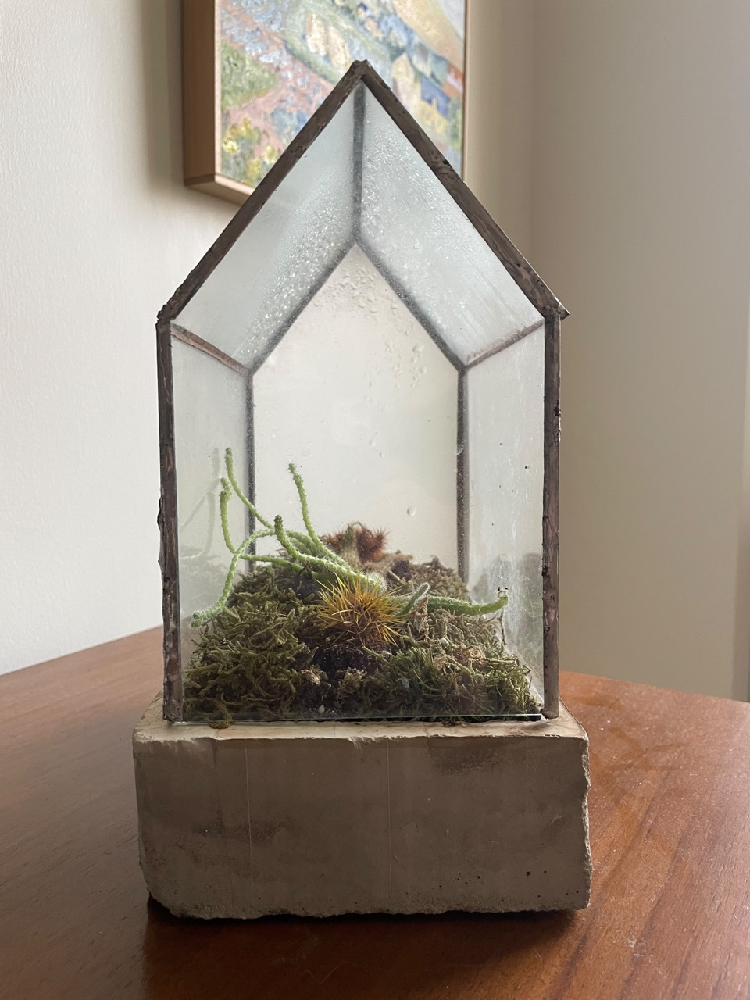
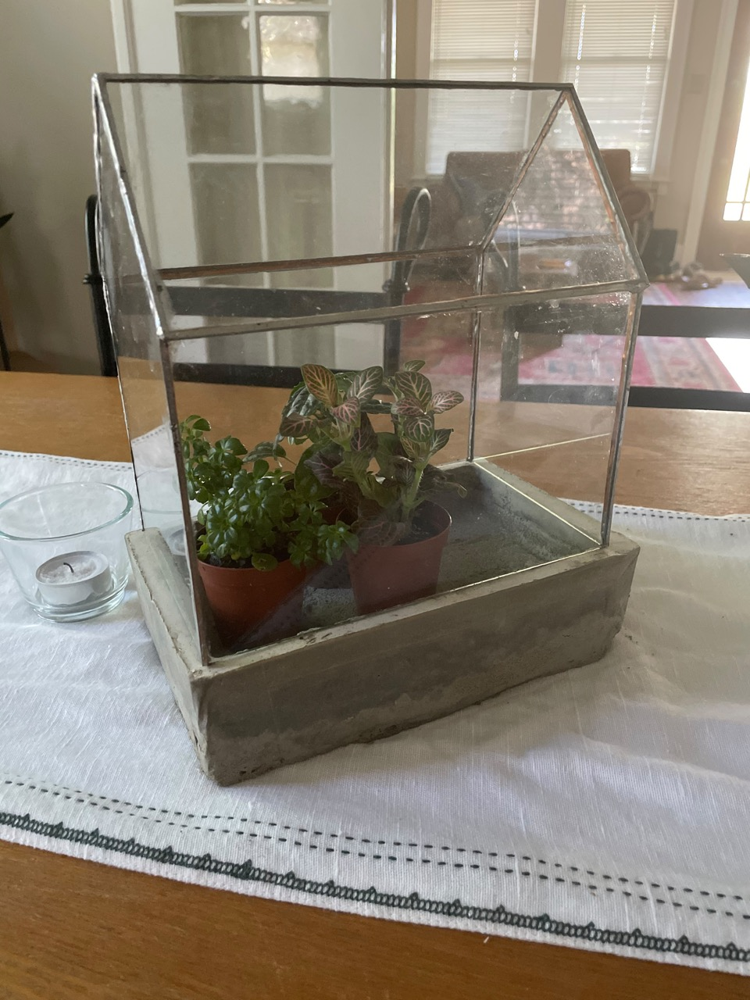
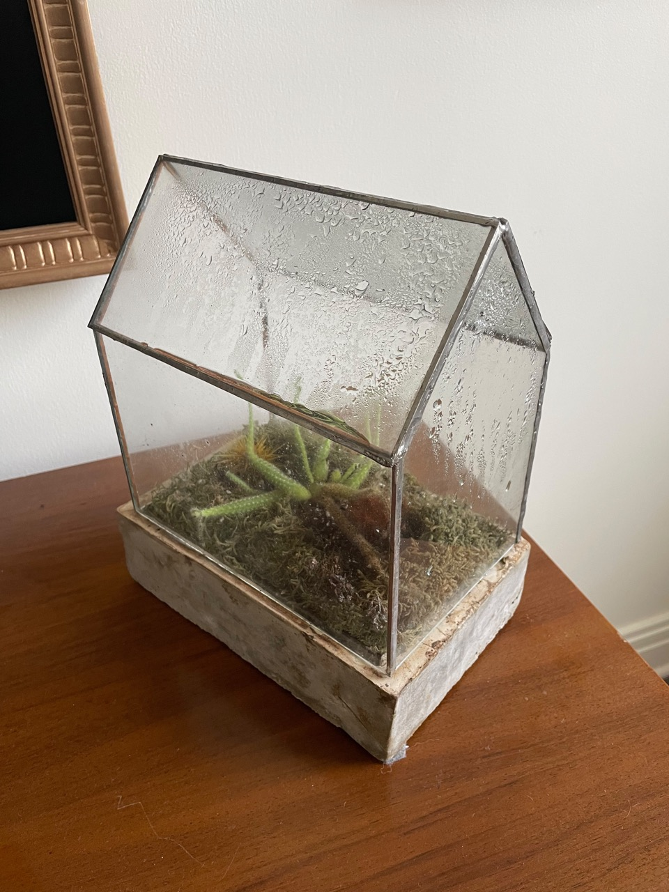

title: Concrete Planters
date: 2021-04-08
tags: art,design,furniture
backdated: true
---

I love working with new materials, and concrete is one that I've always wanted to do. It's essentially castable stone, what's cooler than that?

# Planter

The form was a hack job of cardboard and packing tape. I started with a larger piece for the base that I coated in tape to keep it from getting wet. The outer form was on octagonal prism formed from a piece of folded cardboard, with all the corners reinforced with packing tape. The inner form was made similarly with smaller dimensions. I used regular Quikrete branded concrete mix to cast these. The form nearly collapsed on me and needed some field-surgery with a lot of packing tape to keep it alive for the curing process. I should have made sure all of the cardboard was sealed in packing tape beforehand. Ah well, you live and learn, and it turned out just as well at any rate. 

The feet are crudely carved pieces of cedar, they work for now and aren't noticeable enough in day to day life to redo (yet)

# Terrarium

I did a variation on a theme and made this terrarium. The glass is recycled from thrifted frames I used for paintings, and pieced together with copper tape and solder from stained glass project. The form for the casting was cardboard again, but this time fully wrapped in tape to prevent it from getting wet.

