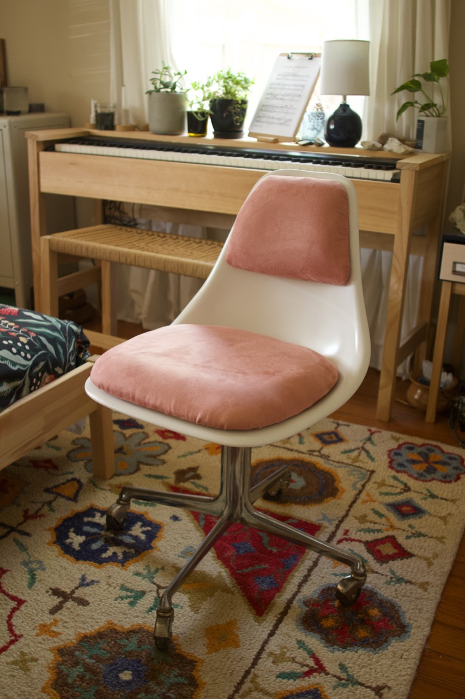
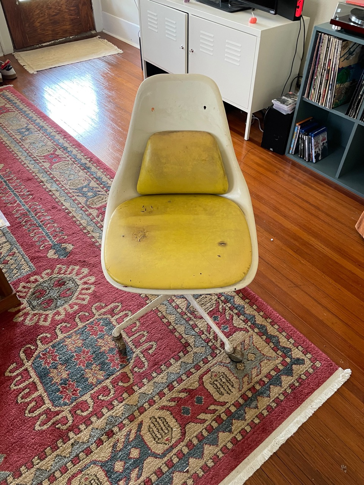
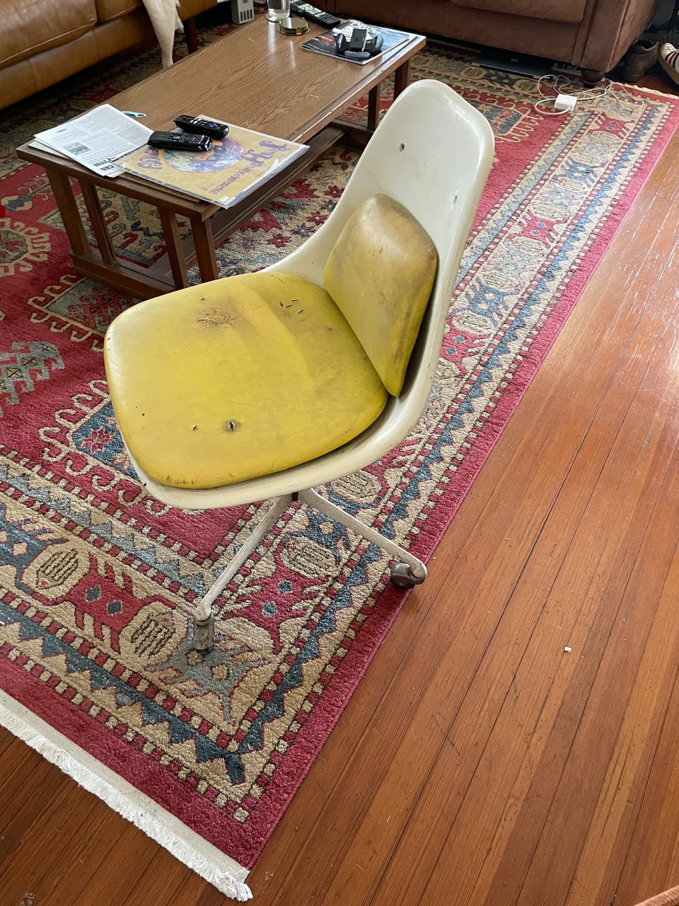
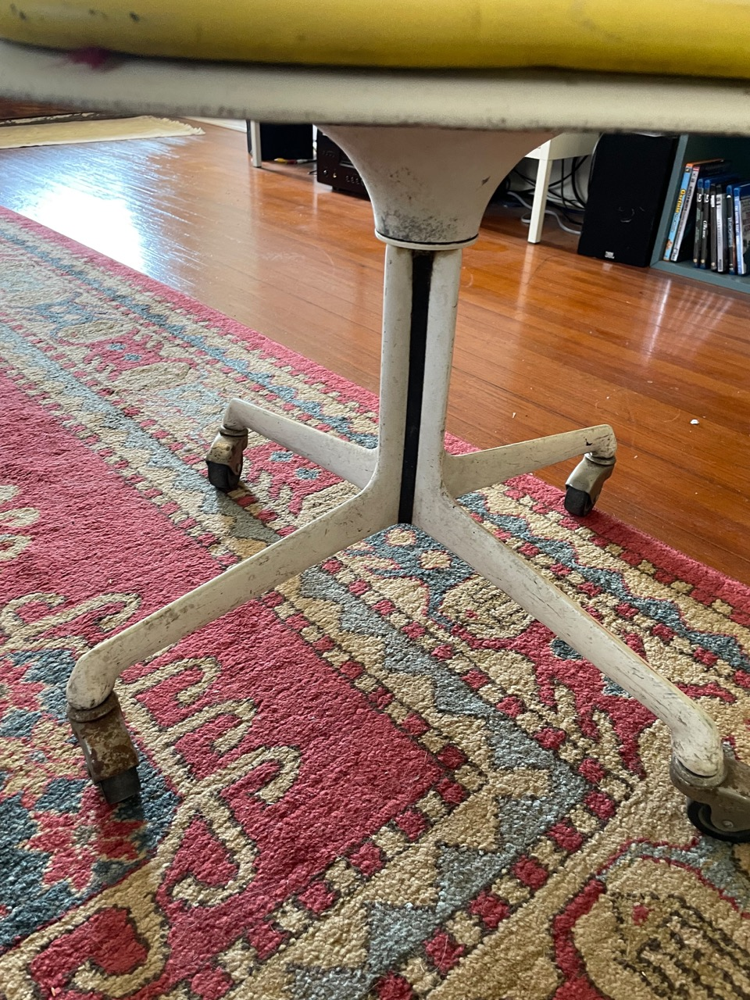
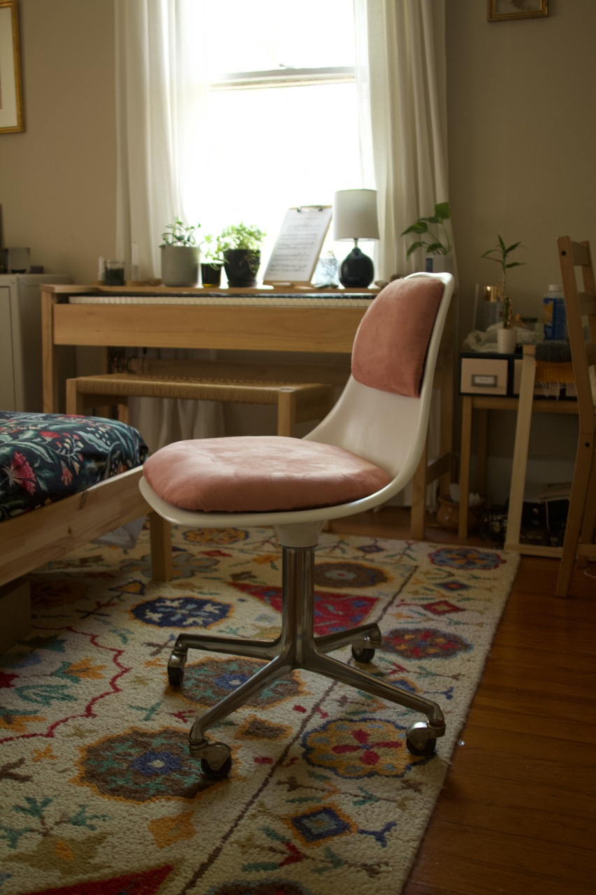

title: Desk Chair Restoration
date: 2022-04-14
tags: design,furniture
backdated: true
---

I picked up this chair for $16 from a local vintage store. It was in pretty rough shape but had great bones to work with.

The existing upholstery was not salvageable. So many holes and it seemed like something may have gotten into the foam of the seat pad at some point. So I stripped the fabric and foam and was able to re-cover the shaped mdf with new foam and fabric. Shaping the foam was quite the experience, I made a special tool from a jam lid I punched some holes in with a nail. The resulting tool let me pass over the foam and shave off parts in order to get it to the shape I wanted. The shavings were impossible to clean and stuck to everything ... do not do this indoors.

Refinishing the shell was pretty straightforward. All I did was sand it down a bit then spray paint with white.

The base paint was peeling and generally in bad shape. I used citri-strip to remove it. After several application I was able to git it down to bare metal. I decided I liked the chrome look and kept it as it was.

