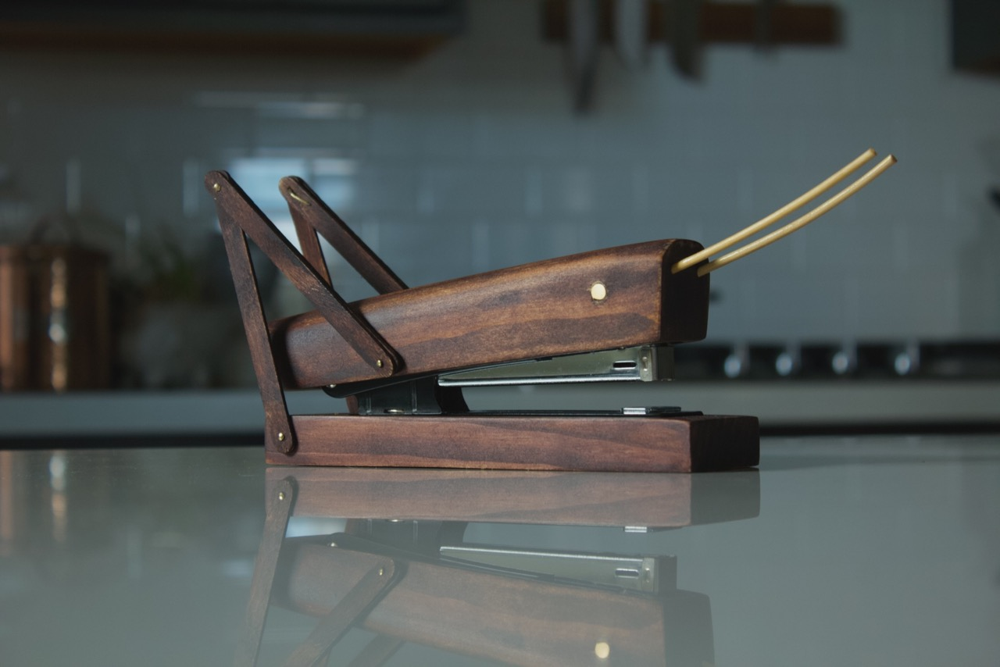
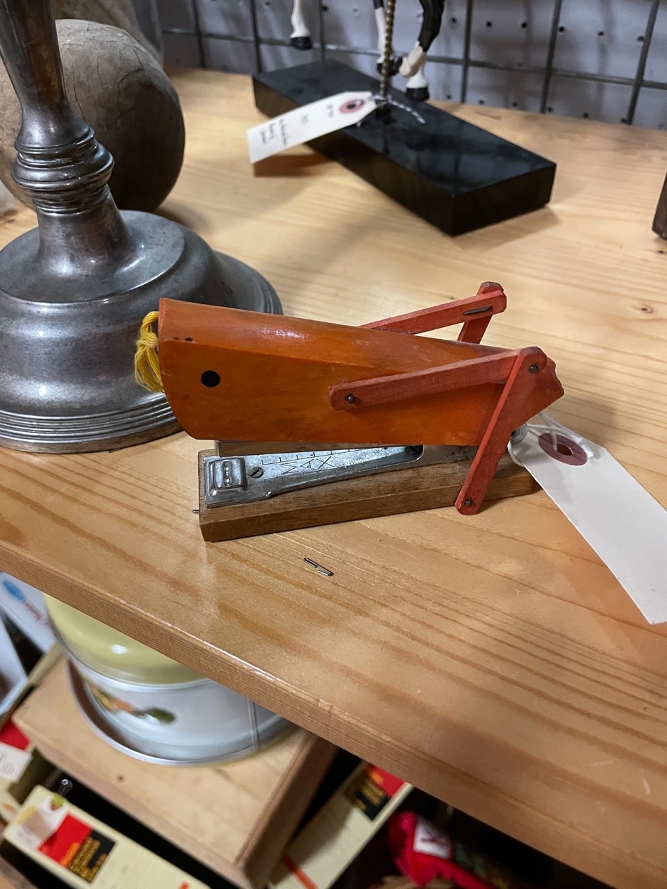

title: Grasshopper Stapler
date: 2022-08-08
tags: woodworking,design
backdated: true
---

A while back while browsing a thrift store I saw the most amazing stapler ever made by man. But it was $24 and I staple things once a year (when I print out my tax returns) so I couldn't justify the purchase. I eventually broke down and decided to go back and buy him but someone else had beaten me to the chase. So much regret.

I mean look at it! So I did the next best thing and made my own from a $2 stapler I got at a state surplus store and off-cut pine from other projects. I shaped the body from a `2"x2"` block with a plane, chisels, and router. The legs are popsicle sticks, and the antennae are skewers I soaked in hot water and bent to shape. The eye is a brass screw I cut flush and the legs are affixed with brass nails. The whole thing was stained with a darker water based stain that I've lost track of.
