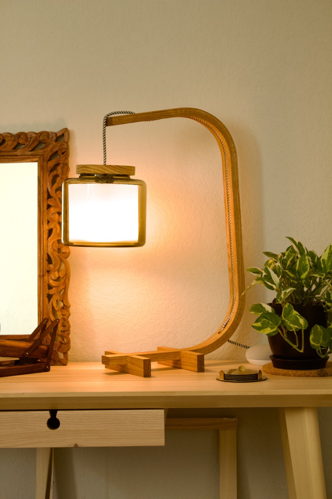

title: Bent Lamp
date: 2022-08-09
tags: furniture,woodworking,design,lighting
backdated: true
---

This lamp was the result of experiments in kerf-bending for the seat in another project, [chair restoration](/furniture/chair/chair_restore.html). I cut a very similar shape in trying to match the profile of the original seat of that chair, and with some refinements in length and proportions of the overhangs I ended up with the design as it is currently.

The piece is made from `1"x2"` red oak (actually `3/4"x1 1/2"`). The bent part was first cut to length and then the central chanel routed out for the lamp cord. Using my circular saw I crosscut the piece leaving `1/4"` of wood on the reverse side. Each corner was 19 cuts. To glue up the piece I filled the kerfs with wood glue and bent it into place with a ratchet strap. Next I drilled holes for the cord to enter and exit the lamp at the base and head.  For the feet, I chiseled out a notch to fit the base of the curved piece. No glue was needed to secure them as the opening was tight enough. All the wood was finished with natural Danish Oil.

The shade is a glass vase I picked up from Ikea. The diffuser inside is plastic I found from B&H photo. Inside the lip of the jar is two pieces of cardboard with a hole in the middle small enough for the lip of the light socket to not fit through. The lid is a circle of scrap pine I cut out with the router. The cord was fished through the lid and the light socket then wired into place.

See my larger version [bent lamp](/furniture/lighting/bigBentLamp.html)