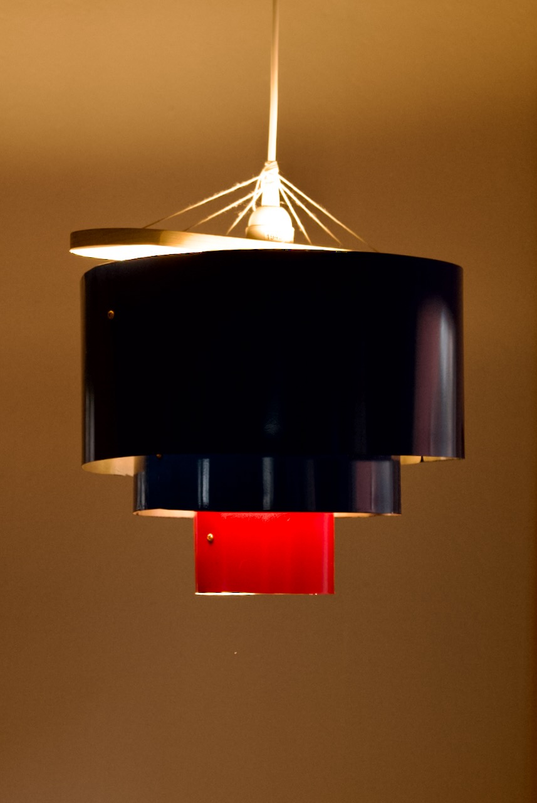
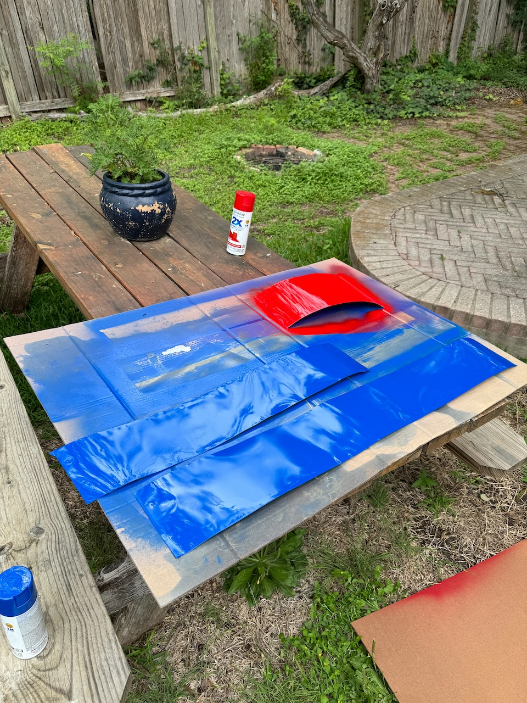
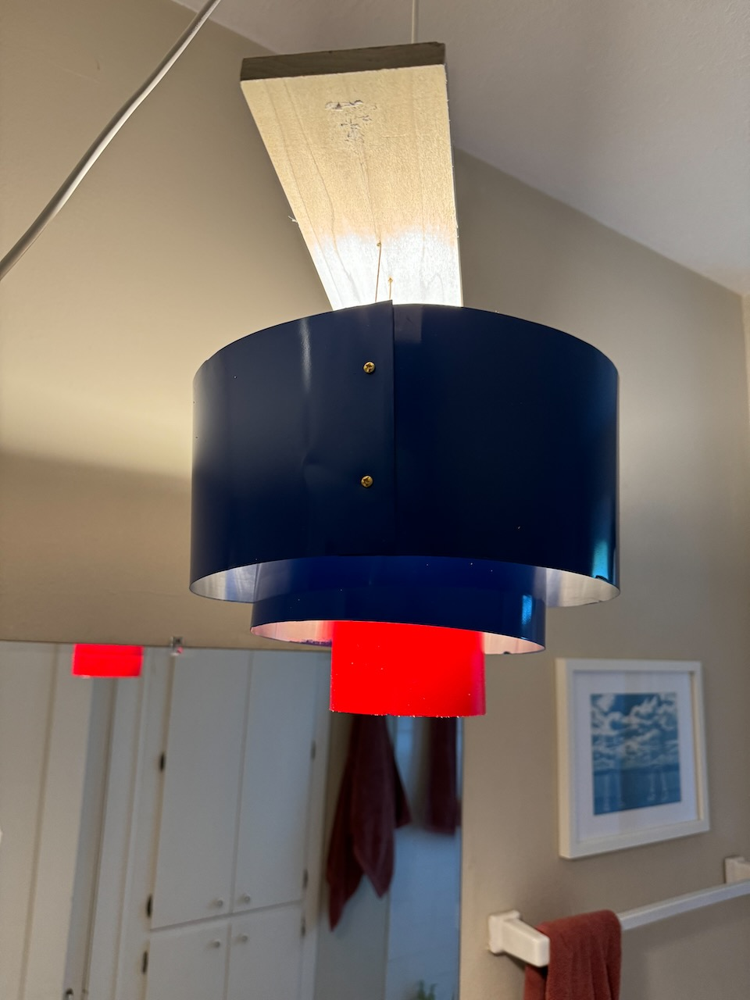
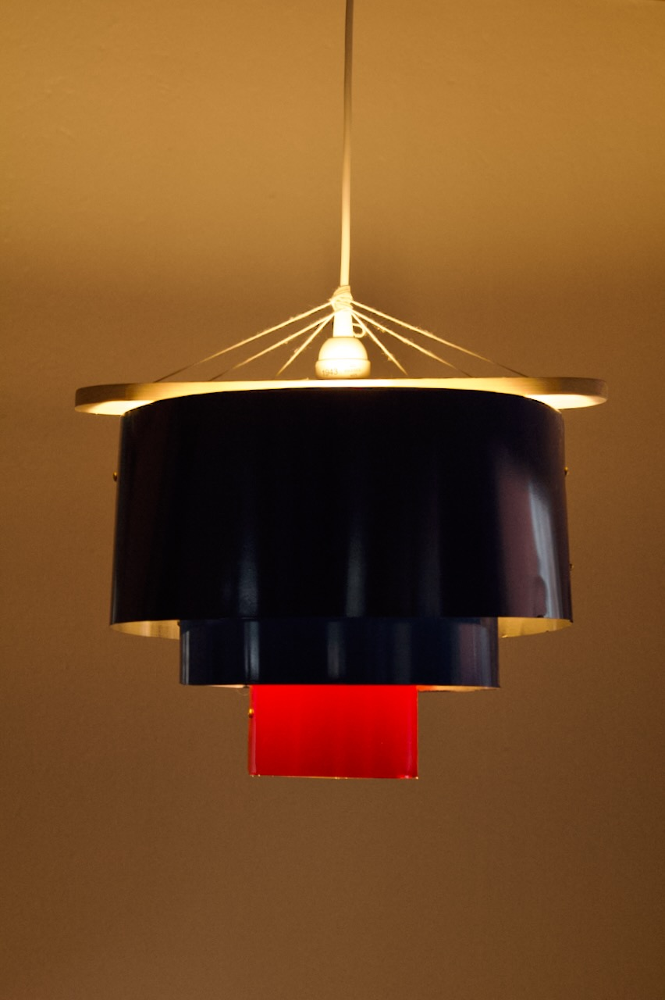
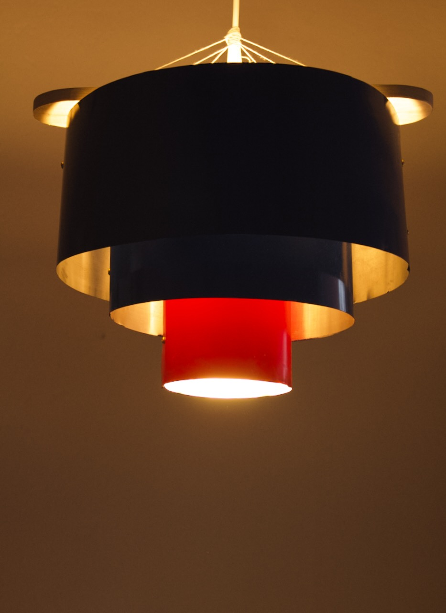
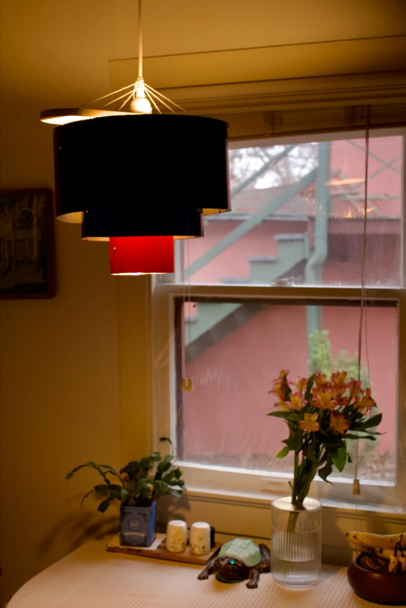
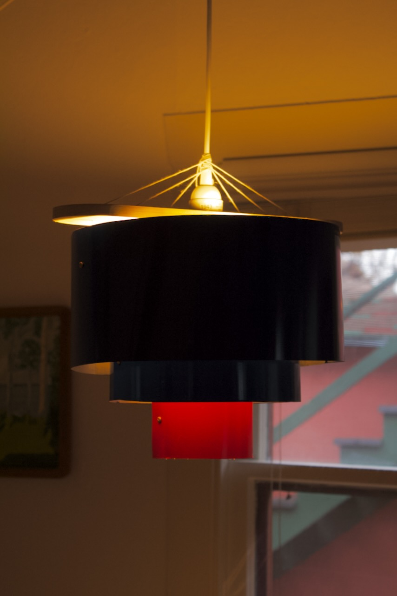

title: Chandelier
date: 2024-04-27
tags: furniture,woodworking,design,lighting
backdated:true
---

Originally this fixture was made to provide better lighting in the bathroom of my old place. It now serves as the chandelier over my kitchen table.

The construction is pretty simple. It is made from sections of aluminum flashing that have been spray-painted and then fastened together with some machine screws to form circles. The screws work as hooks to hold each section of the shade with twine that is threaded through a board on top

The board has a holes for the twine to pass through as well as a larger one for a pendant light. The twine is tied around the cord of the pendant fixture to hold the shades level at and at the appropriate heights.

<section class="gallery" markdown="span">
    

        
        
        
        
    

</section>

