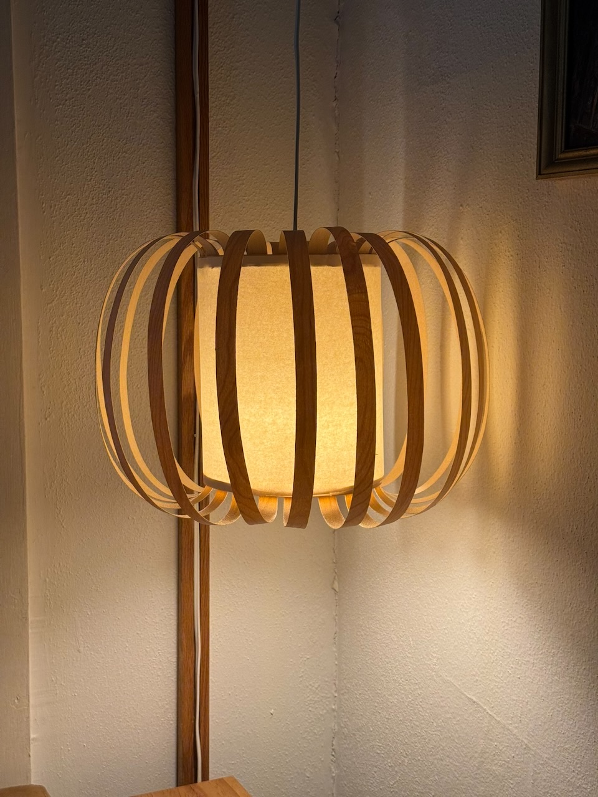
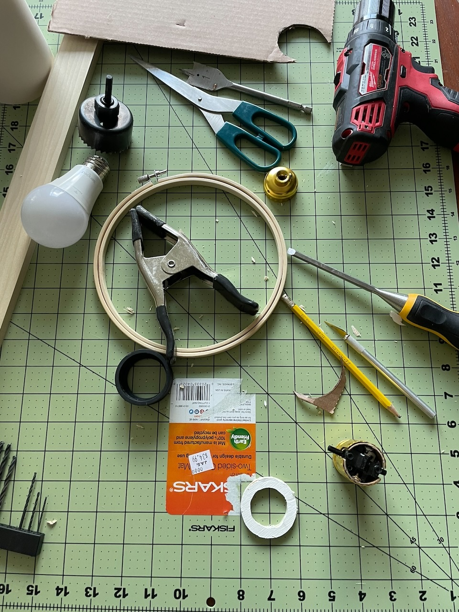
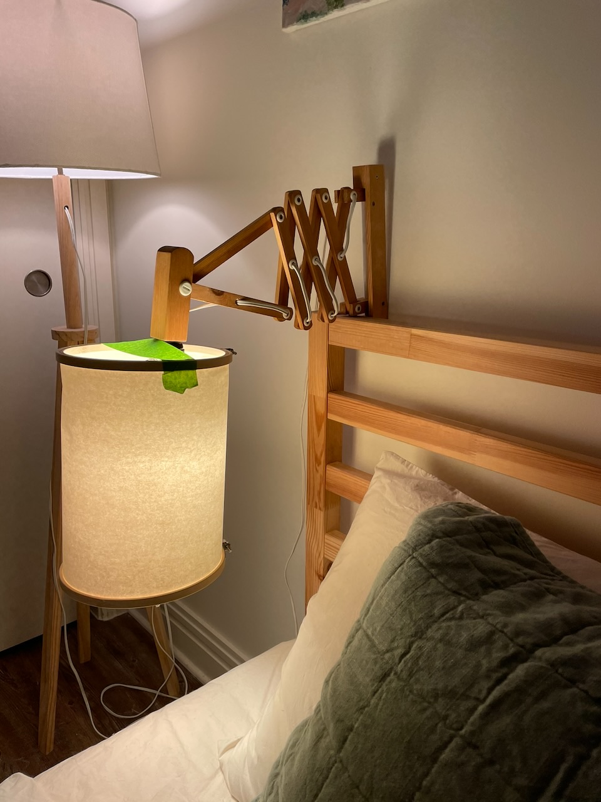
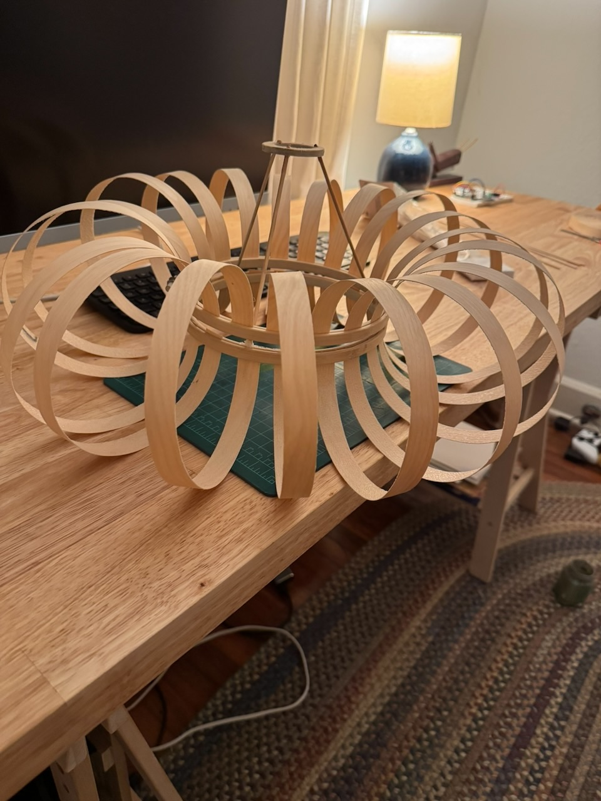
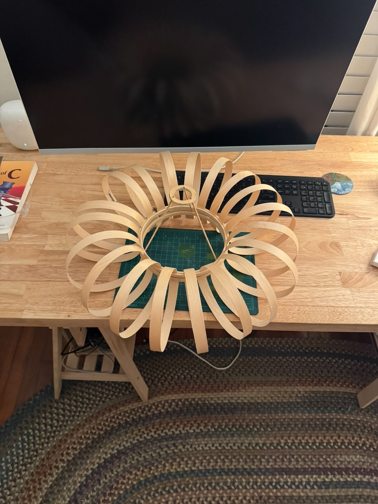
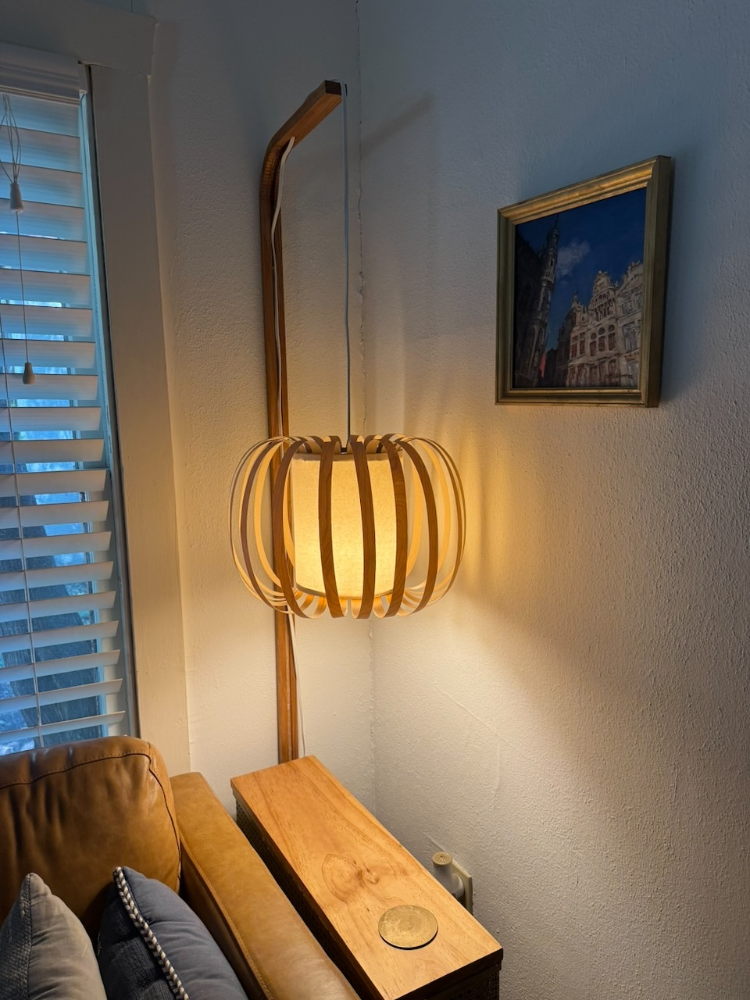

title: Edge Banding Lampshade
date: 2025-08-11
tags: furniture,woodworking,design,lighting
backdated:true
---
Another update on my [big bent lamp](/furniture/lighting/bigBentLamp.html).

Also see the [update](/furniture/lighting/bigBentLampUpdate.html)

The previous lampshade on this lamp had serious balancing issues. Using poster putty I could eventually get the shade to sit level on the pendant, but the location of the switch at the base of the bulb receptacle meant that any time I turned on the lamp, the shade would be knocked askew.

I was able to live with the faults for much longer than I initially thought, but eventually capitulated that it wasn't an ideal situation to spend an extra minute rebalancing a shade each time I turn the light on or off. So it was time for a new shade, and an excuse to justify my growing hoard of craft supplies by using things I already own.

Construction is simple, the central column of the shade I had built for another lamp before starting this blog. Although it never got a full post, the shade lived a short life in my bedroom over my nightstand. It consists of two embroidery hoops with a sheet of craft paper suspended between. Within it an annulus of wood, designed to sit around the base of the light socket, is suspended from the hoops using skewers and glue.

I cut strips of edge banding I had from my [shelves](/furniture/shelves/shelves.html). These inserted into the hoops after a bit of struggle to get tension right to hold them all in place while till leaving space for the new ones.

<section class="gallery" markdown="span">
    

        
        
    

</section>

After a huge amount of struggle to hold the paper in the hoops without unseating any of the strips, I sealed off the top with cardboard to reduce the amount of uplightin from the lamp, and mounted it on the lamp. 

