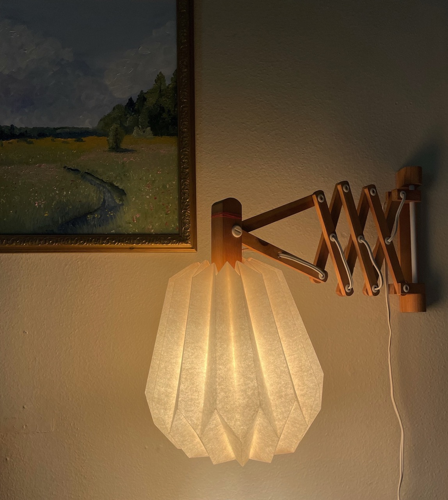
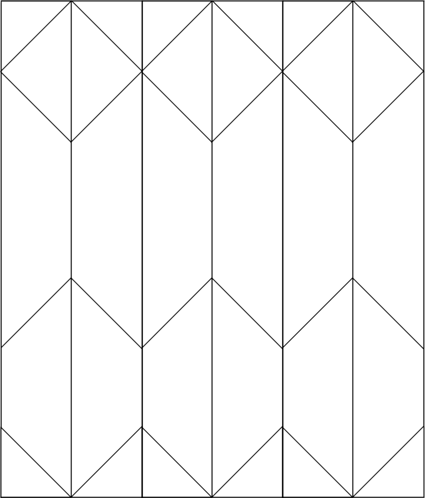
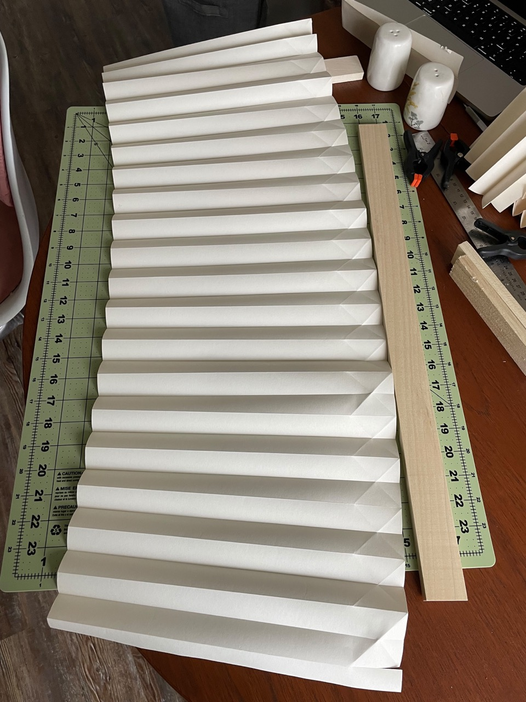

title: IKEA Paper Shade Lamp
date: 2022-05-13
tags: furniture,design,lighting
backdated: true
---

I found this lamp for $4 at a thrift store. It's *vintage* IKEA. Sadly it came without a shade, so I folded the pictured one from a roll of craft paper also from IKEA.

# How to Build
To construct, start with a piece of paper at least `40"x13"`.

Using the blunt side of butter knife or some other tool, score lines every `1"` across the short side of the paper.

Accordion fold along the scored lines.

Score the diagonals following this template (not to scale)

The "zig-zag" in the middle should have it's lowest point around 2 inches from the bottom of the shade

Fold to shape, the parallel lines folded in the first step will switch direction at every zig-zag intersection

Thread the top together with a needle and yarn.

Glue the two ends together then tighten the yarn to finish the shade.
