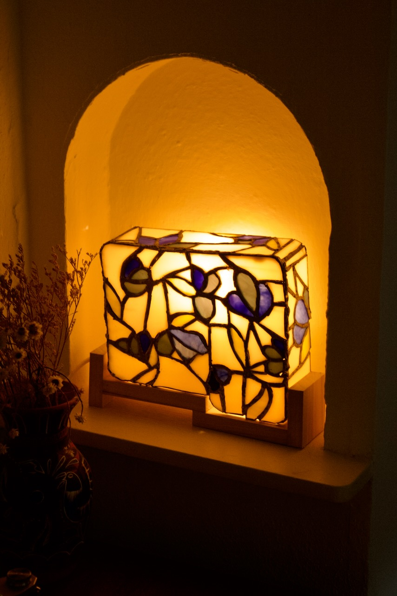
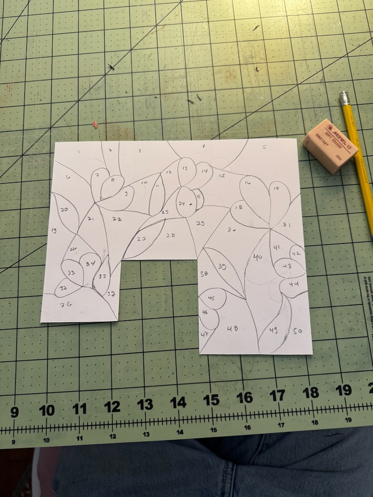
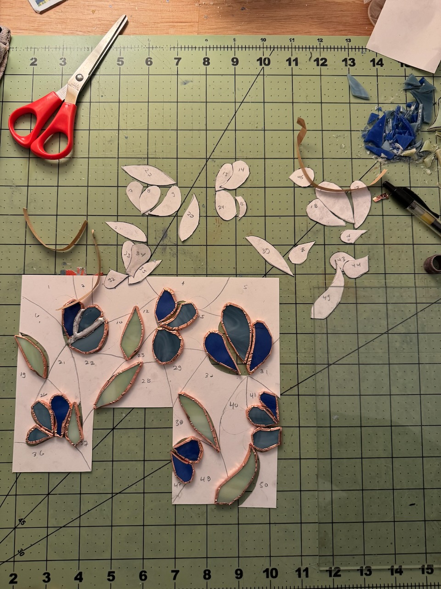
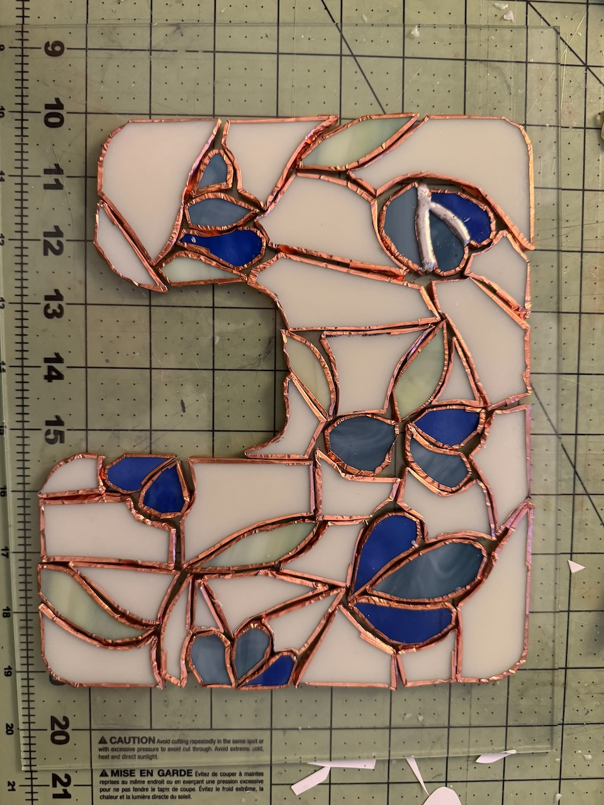
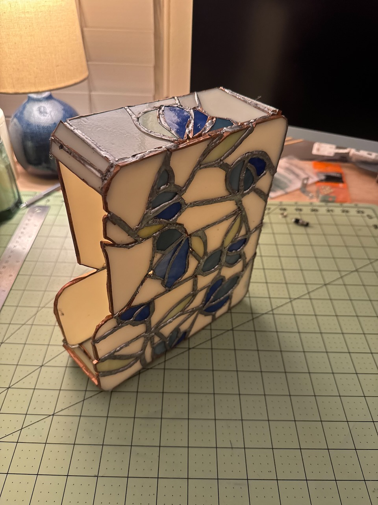
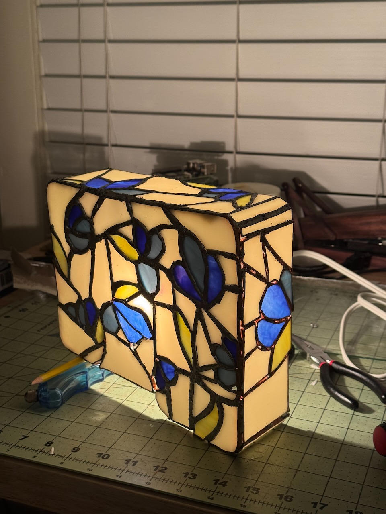
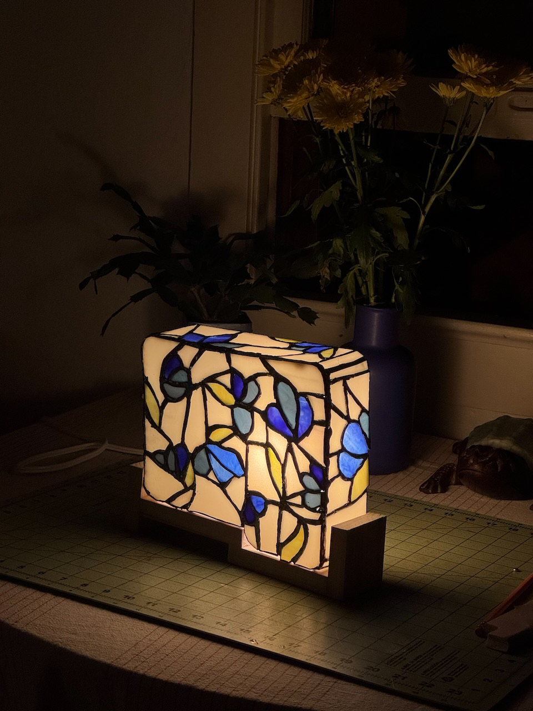
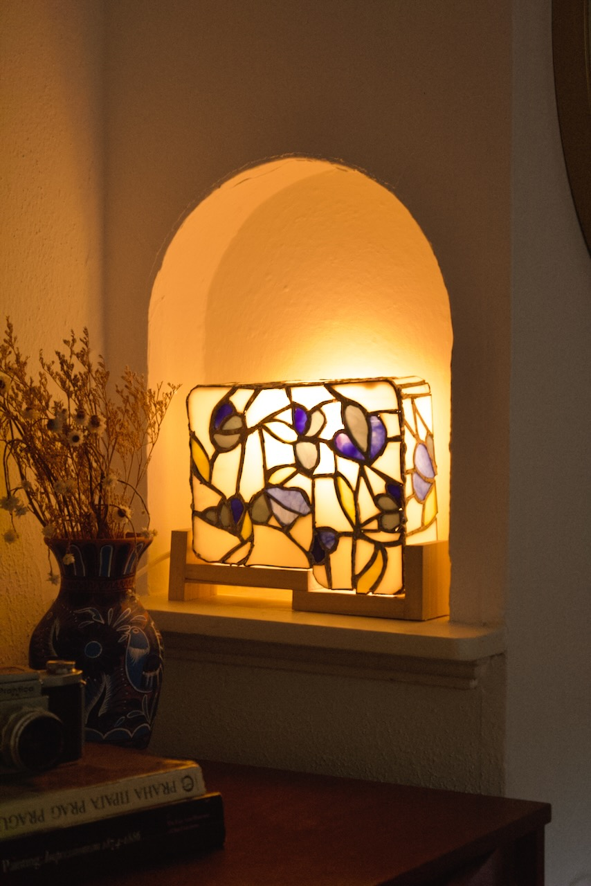

title: Stained Glass Lamp
date: 2025-05-09
tags: furniture,woodworking,design,lighting
backdated:true
---

I was a bit ambitious on this project, turns out stained-glass is incredibly hard to do. In my naivety I thought it would be as simple as "cut the shapes and piece them together". Cutting accurately: hard. Soldering cleanly: harder. Soldering in 3D: impossibly difficult. But I finished it (or close enough at any rate). 

This lamp was greatly inspired by the work of [Shawn Michael Lucas](http://www.shawnmlucas.com).

## The Process
<section class="gallery" markdown="span">
    

        
        
        
        
        
    

</section>

## Complete
<section class="gallery" markdown="span">
    

        
        
    

</section>

