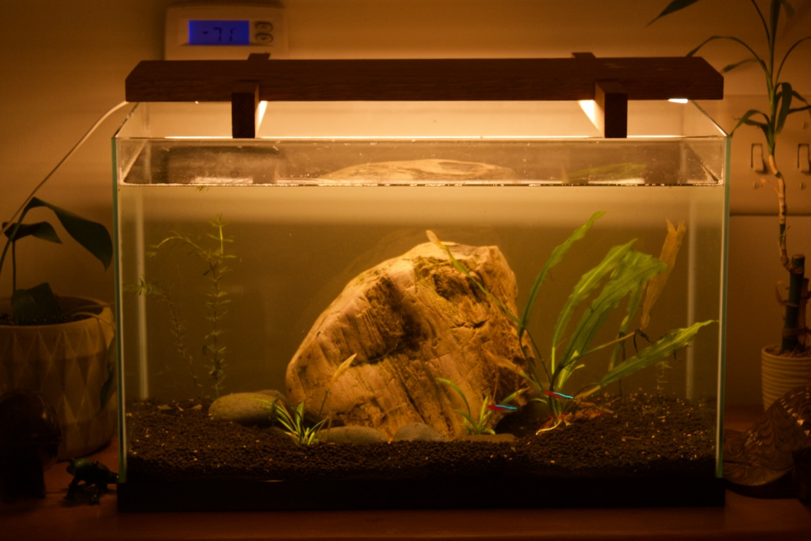
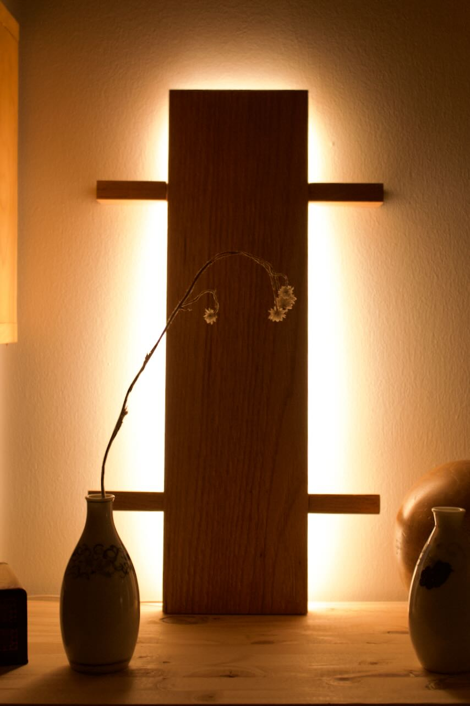
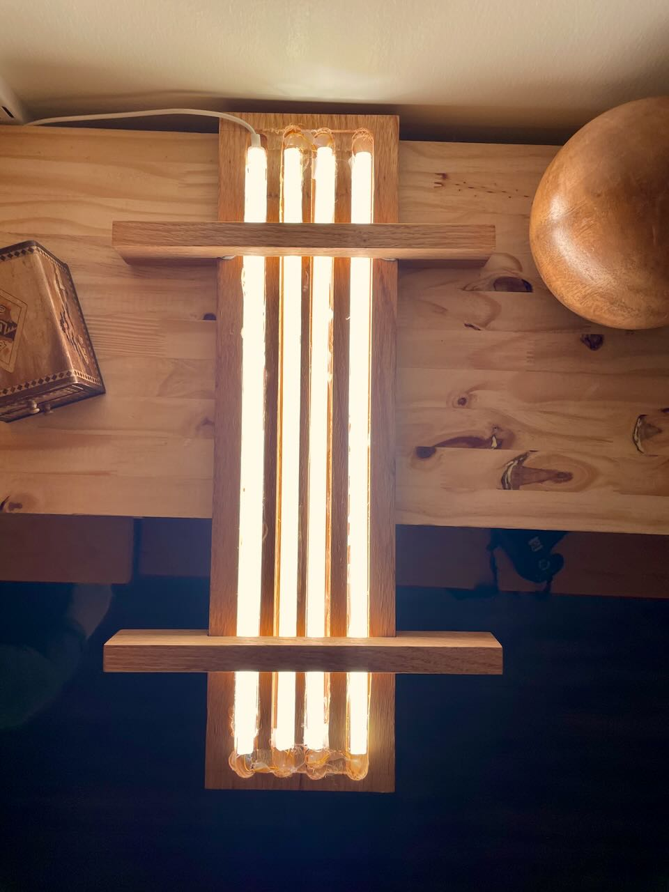
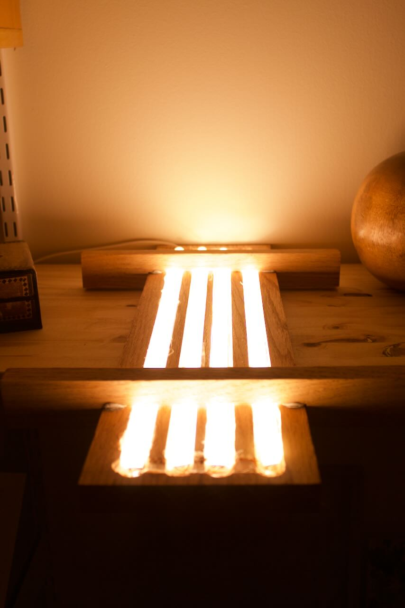

title: Tank Light
date: 2023-11-30
tags: furniture,woodworking,design,lighting
---

This light was initially meant to serve as the main light on my fish tank. Unfortunately I made it too bright and algae growth was faster than I wanted to deal with, so now it serves as ambient lighting in my hallway.

Construction was generally straight forward. The main section of the light is large oak board with routed channels in which led strip lights sit. The 'legs' of the lamp (what used to sit on top of the tank) are also oak, notched out with a hand saw and chisel to that the top sits flush with the main piece.

The led strips are all cut from the same ikea [MYRVARV](https://www.ikea.com/us/en/p/myrvarv-led-light-strip-flexible-dimmable-90487191/) strip and powered by an [ANSLUTA](https://www.ikea.com/us/en/p/ansluta-led-driver-with-cord-white-90405845/) driver. I had to solder the individual tracks together with some spare wire in order to light everything. The strips are held in place with hot glue.

There is another driver that supports dimming, so this may get resurrected as a tank light in the future, but for now I am happy with the light it gives in my hallway.

<section class="gallery" markdown="span">
    

        
        
        
        
        
        
        
    

</section>

