title: Wooden PC Case
date: 2025-08-31
tags: furniture,woodworking,design
backdated:true
---
My old PC was starting to show its age, I had first built it in college around 2017. As I had very little money, I sourced parts from used machines from ebay, and it was nearing end of life. The CPU was for the lga1150 socket, the motherboard was a monstrous one for servers that I could find cheap, the PSU was inefficient, the GPU was severely underpowered, and the ram was a mix of random sticks I could get cheap. The Oblivion remaster came out and my machine died as soon as I exited the sewers, so it was time to rebuild.

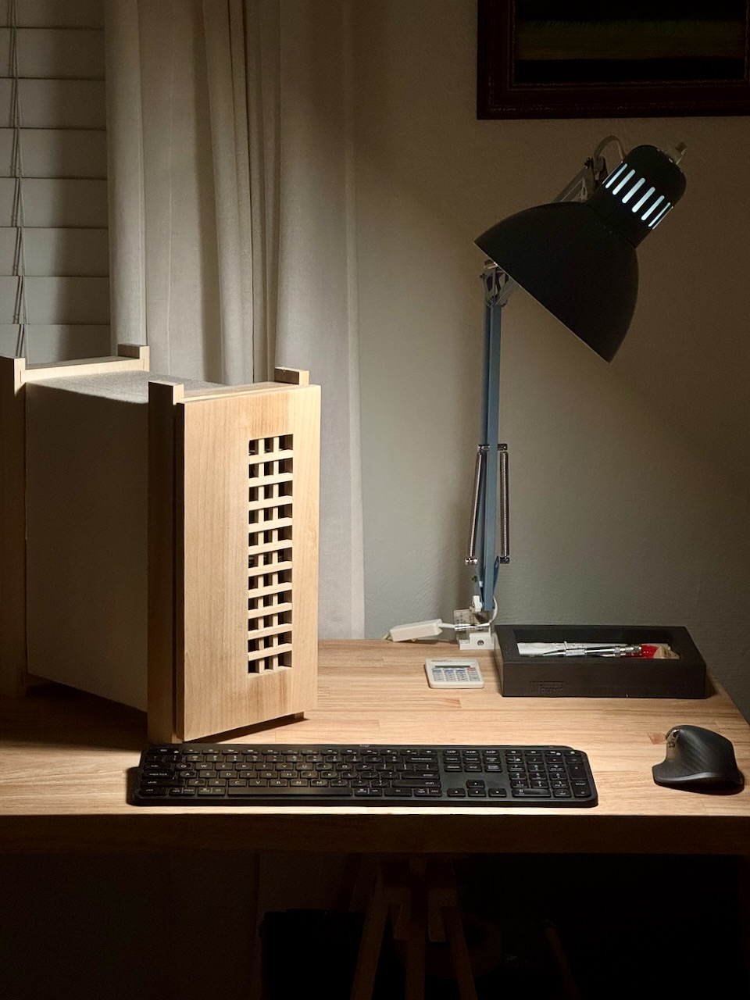

## First iteration

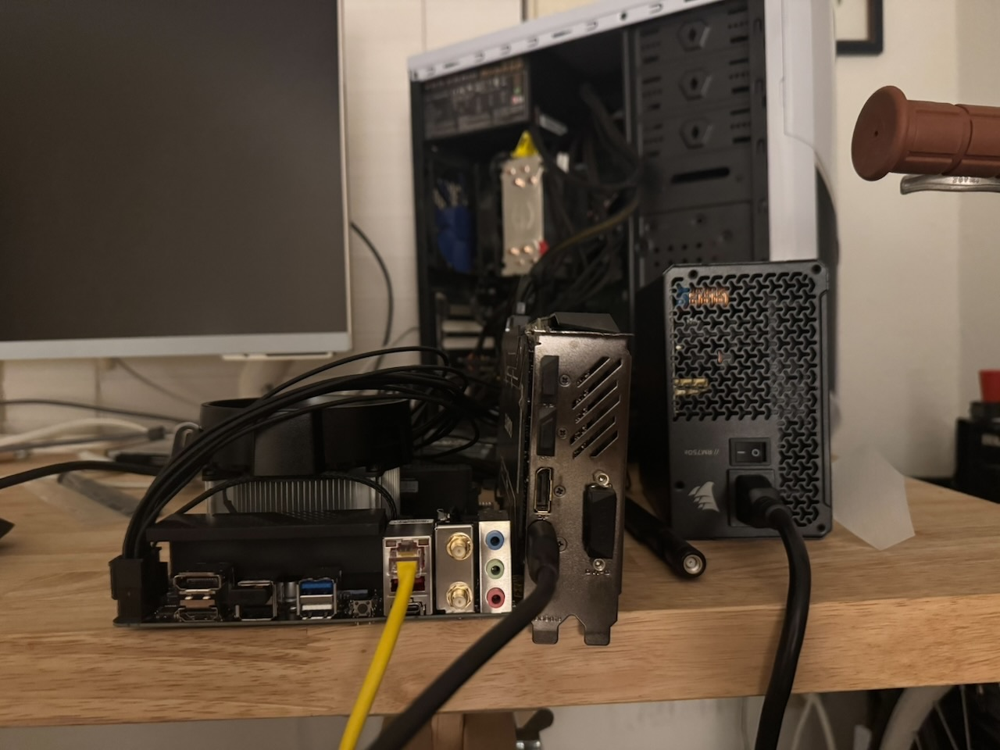

The midsize ATX case I had was fine, but nothing fancy and took up way more space than I should like. After shopping around, there weren't any cases that really spoke to me design wise. Unfortunately the consumer PC market is incredibly gaudy, and cases that aren't RGB vomit or big ugly boxes end up being insanely expensive. So I built my own.

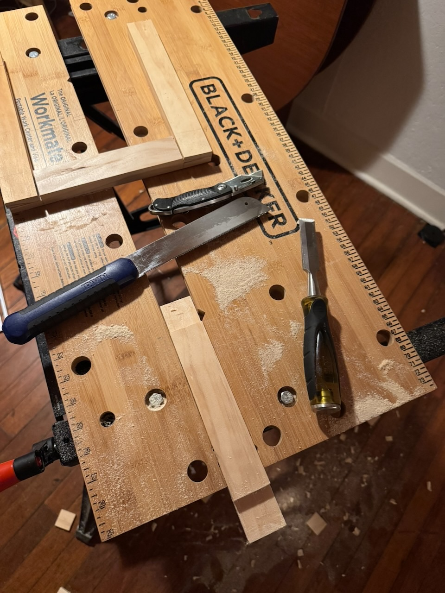

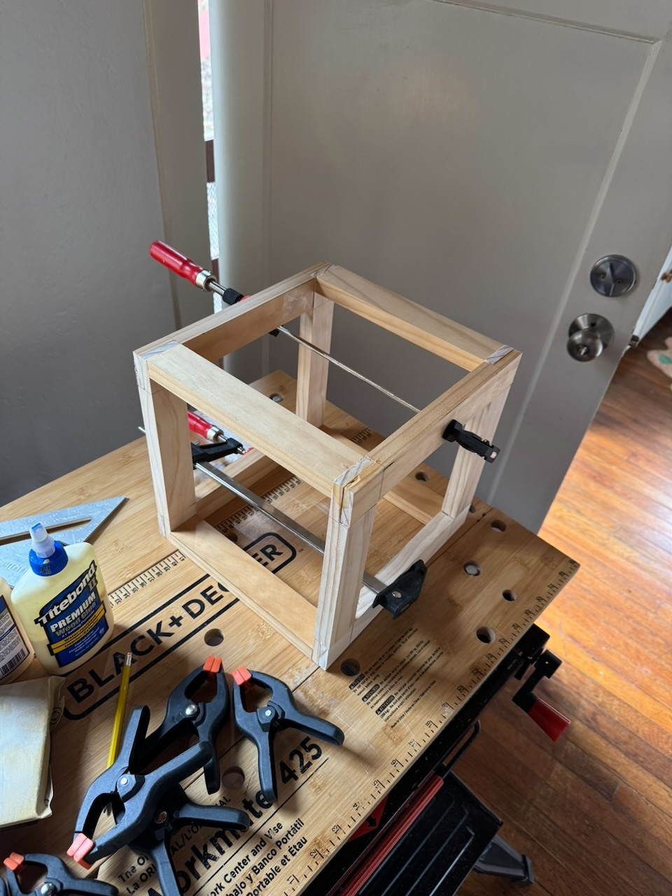

The computer itself is built on a mini-itx mobo. That, the power supply, and the GPU became the geometry constraints, and the rest was just designing around airflow and finding a shape that I liked. The first iteration was too cube-like, a clunky box with an incredibly dangerous temporary mounting bracket for the PSU made from aluminum flashing. I nearly cut myself too many times handling this monstrosity.

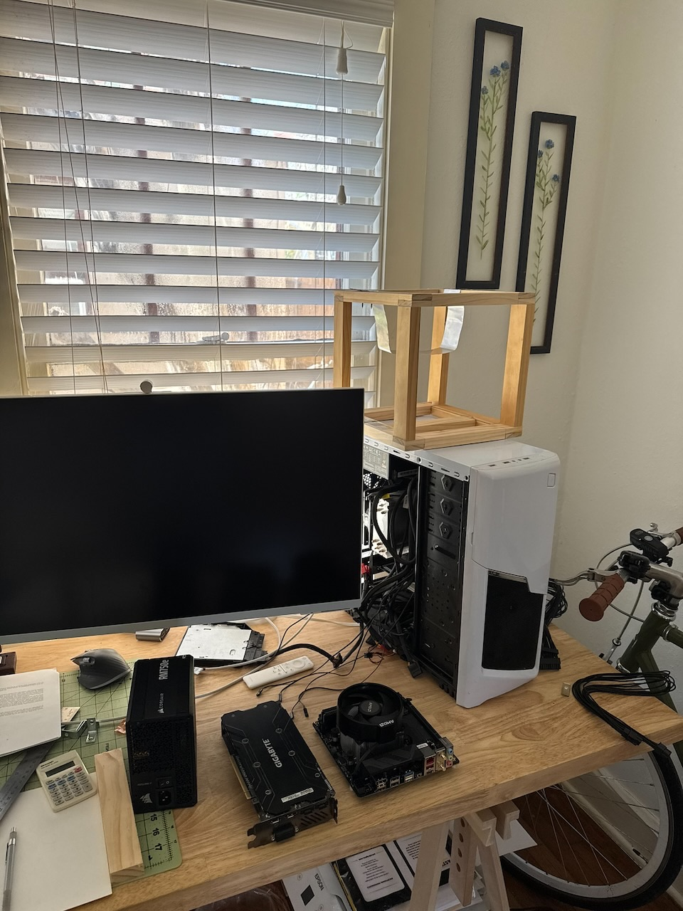

## Refining the shape
After some thought, I was able to reconfigure a more vertical setup. The original plan was built to fit my existing graphics card, as the new one was still coming in. This proved to be a small problem down the line, the card did not fit when inserted into the PCIe slot, but was eventually solved with a riser cable.

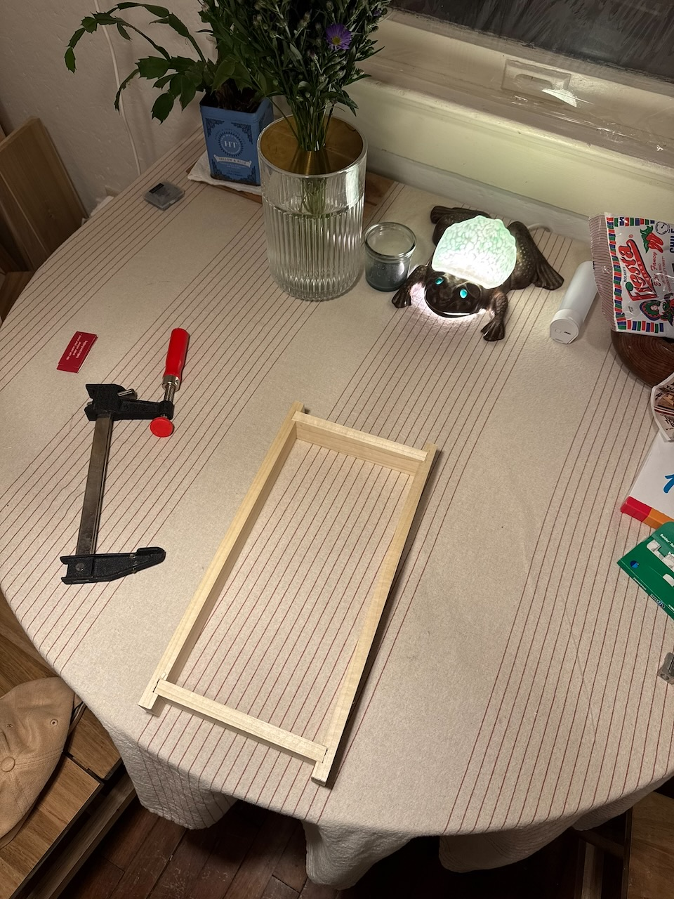

Most of the woodworking was simple joinery, some dados for the front and back frames, and nails and glue for the side rails and interior mounting brackets. The brackets for the mobo have brass standoffs glued into shallow holes.

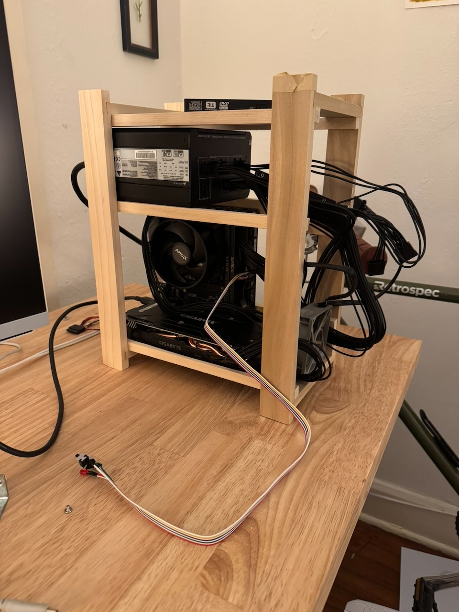
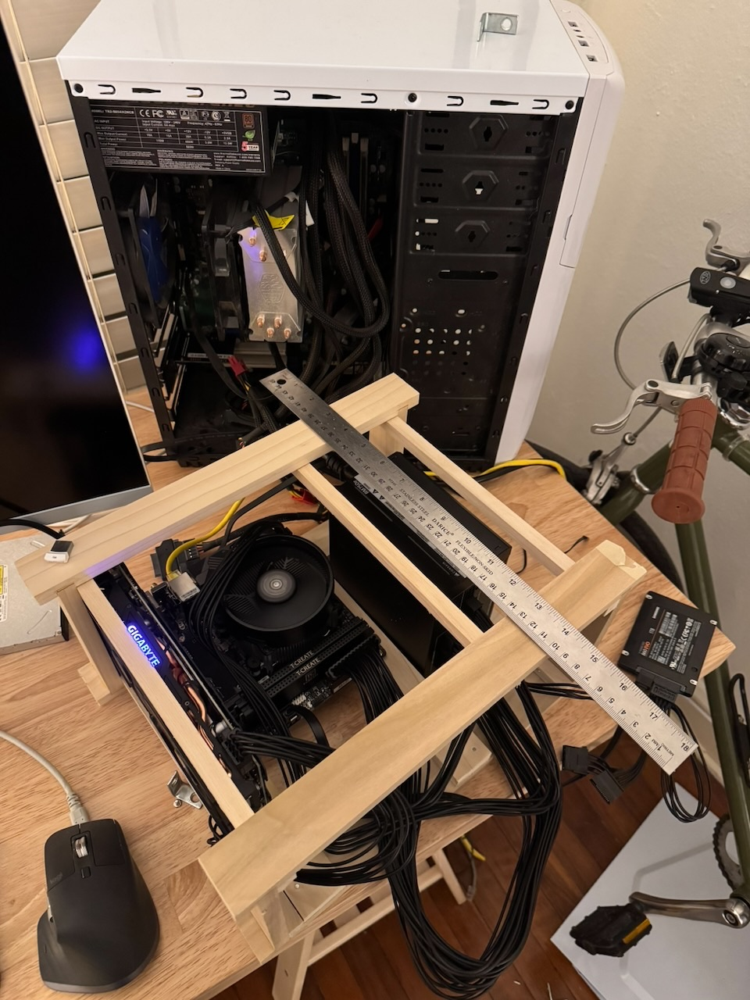

## More natural materials

The side is encased  in canvas, which is secured underneath with twine lacing. The goal was to have something that allowed some airflow to avoid heating issues. So far temps have been fine and there have been no major issues, but I have considered opening up a few holes in the fabric for more venting. Another concern is how this will affect static buildup and accidental discharge. I have not noticed any problems in that regard, but don't touch the machine very much to definitively say it is no longer a concern.

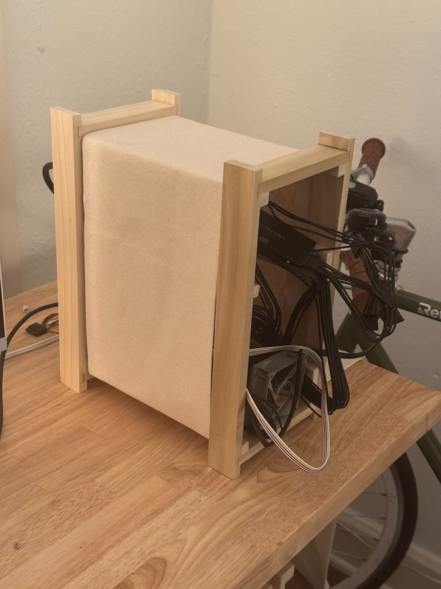
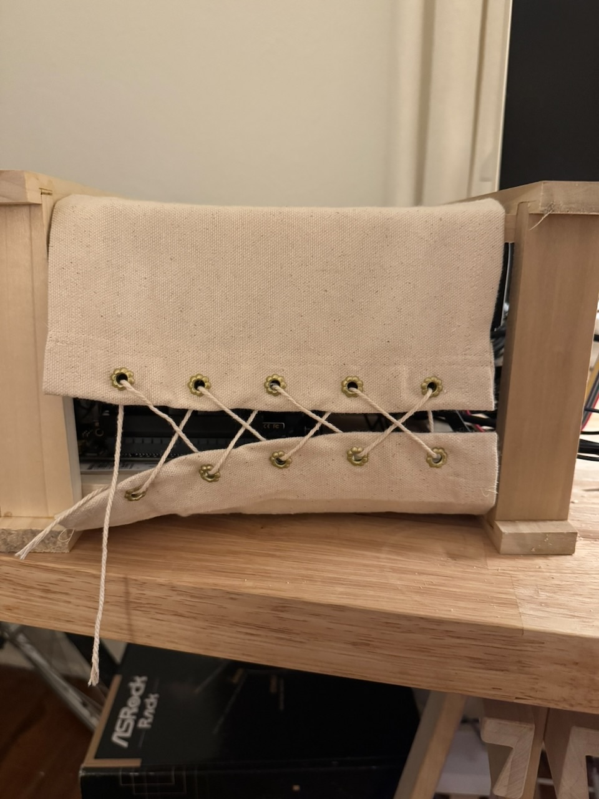

## Building the front panel

When building the front panel, the goal was to create vents that were both functional but aesthetic. I constructed a simple lattice from some square doweling. The chisel-work was a bit messy, but I was able to hide imperfections well enough. It is friction-fitted into the frame.

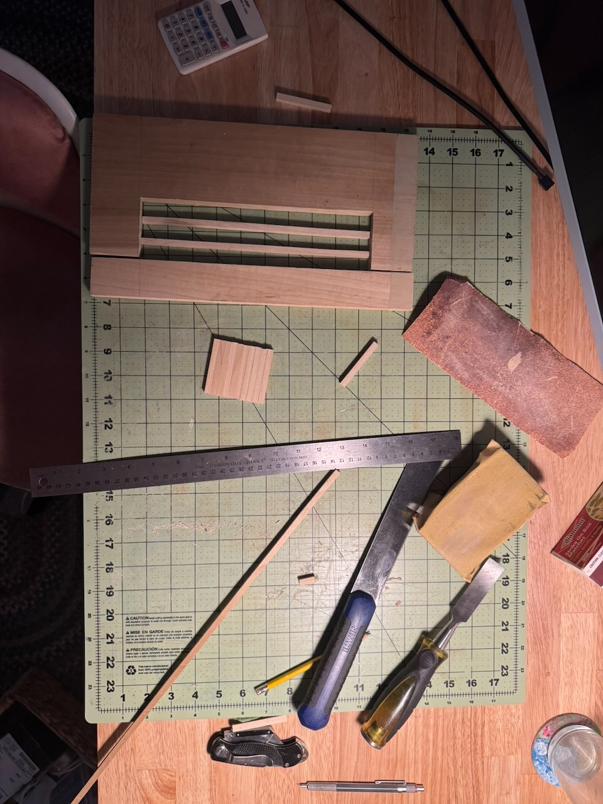
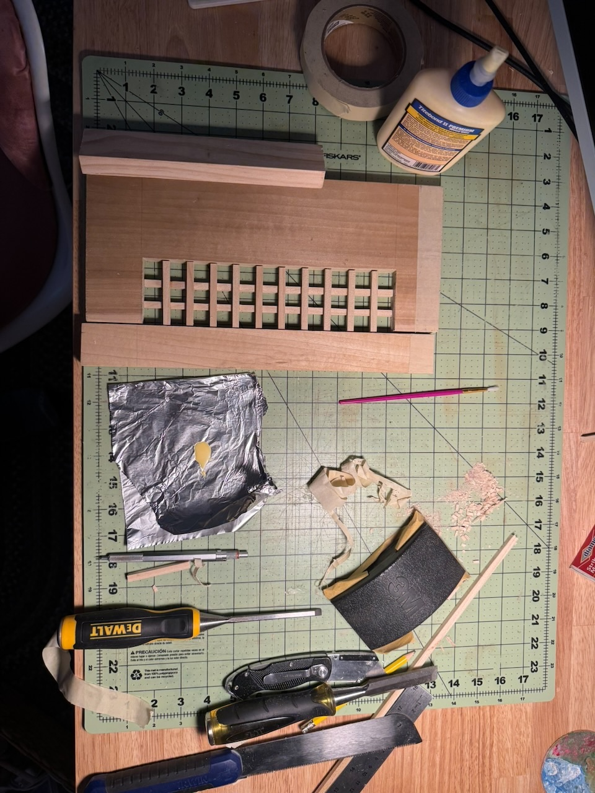

## Things to improve

The newer, larger GPU meant I had to mount it with fans pointing out rather than down. The two major drawbacks of this being that, firstly, the GPU is interfacing with the PC over a PCIe riser cable. This has the potential to bottleneck performance and cause instability. Secondly, rather than the GPU exhausting heat down through the bottom, which I could lace to be open, it is sent out through the fabric. There is a gap where the front-to-back airflow can carry some heat out, but I have considered cutting buttonholes in the side panel if temps become an issue.

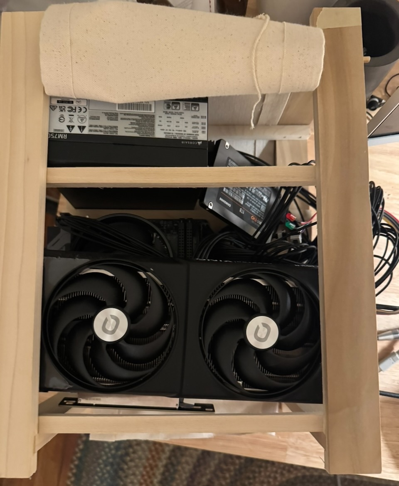

Visually the front could be improved by re-building it with a kumiko panel. I'm unsure if I have the skills for such precise work at this time. At any rate, I'm quite pleased with how the final panel turned out. 

The power switch is currently just a long cable that hangs out the back. In future iterations I would like to move it to the front with a push button, but I haven't come up with any viable mechanism that matches the visual style I'm aiming for. 

Additionally, the case could benefit from some enhancements that make the computer more useful. I have a slim disk drive that can fit in the dead space, but mounting and blending it in into the front panel will require some significant rebuilding. I'd also like to add front usb ports for easier interfacing with some peripherals I use on occasion but have yet to find a component that would be easy to modify.
