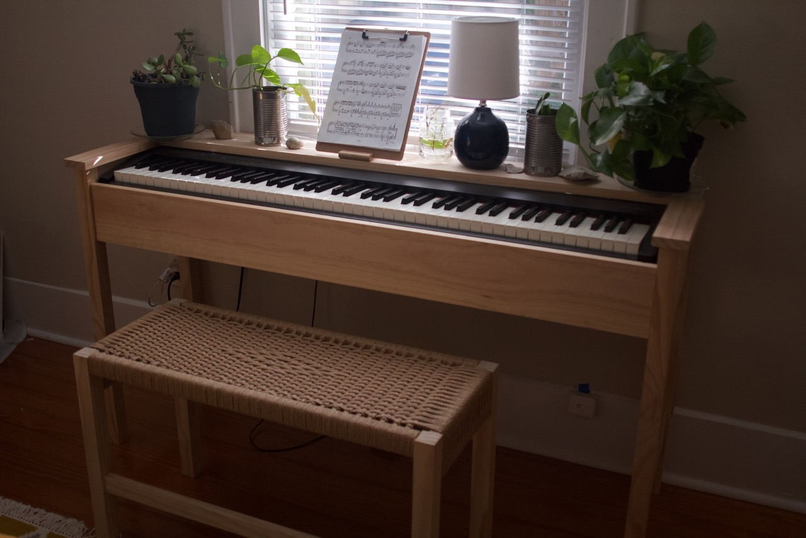
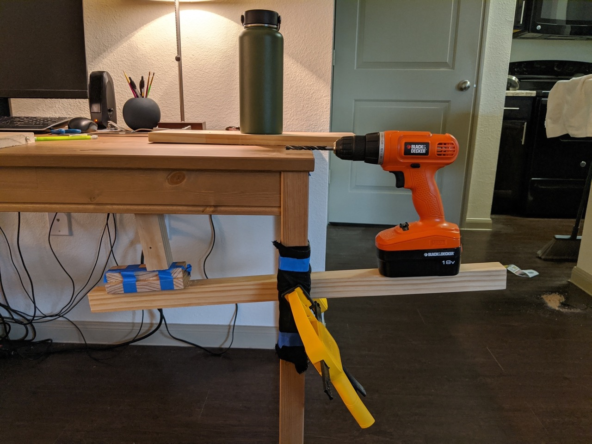
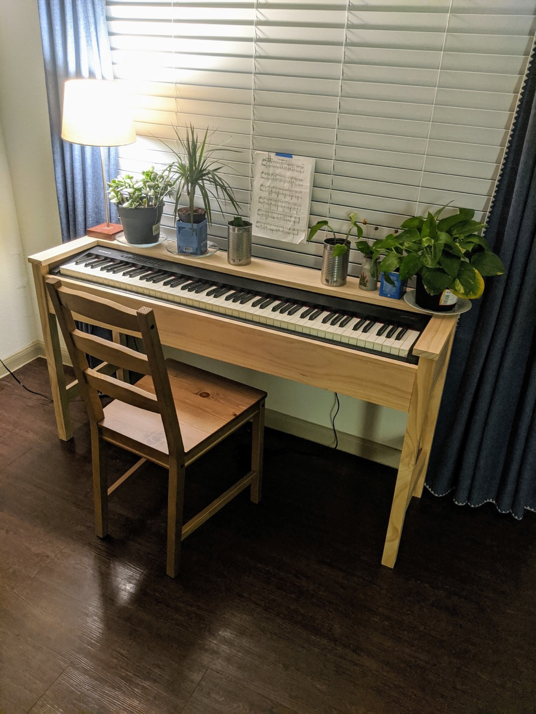

title: Piano Stand
date: 2020-03-15
tags: woodworking,furniture
backdated: true
---

I moved to Austin at the beginning of 2020 with no friends or family living nearby. One of my first purchases once my paychecks started hitting was a Roland FP-30 digital piano that I got for a great President's Day sale. This turned out to be a fantastic purchase since the world fell to shit the following weeks with Covid-19 lockdowns beginning; I had a lot of free time on my hands to practice and build this project.

I hate the basic keyboard stand available from the stores, they are ugly utilitarian chunks of metal or particle board and lack the appeal of a traditional acoustic upright piano. So I made my own.

# A Game of Limitations
Mind you when I moved down here I fit everything I owned into my 2005 Cadillac STS and both of my parents. Re: I didn't bring much at all. Coupled with the fact I had $125 in my bank after the first months rent, I was working with limited funds and very few tools. This whole project I completed with the following tools:

- A cheap power drill
- Hand miter saw
- Speed square
- A single clamp
- A dowel kit

My janky setup to drill straight. 

The wood I used was select pine from Home Depot. While attractive, the softness of the wood isn't something I'm particularly thrilled with (writing this post in 2023). If I were to rebuild I'd definitely consider something better suited for furniture like ash or white oak. But I could buy pre-jointed and planed boards in nominal sizes so it made construction pretty easy. Everything is held together with dowels.

This, my desk, and my bed were the only furniture I had in my first apartment down here. Take note of the wonderful sheet music stand...I still need to come up with a better solution.

I did eventually replace the ikea chair, see my [piano bench](/furniture/piano/piano_bench.html).
