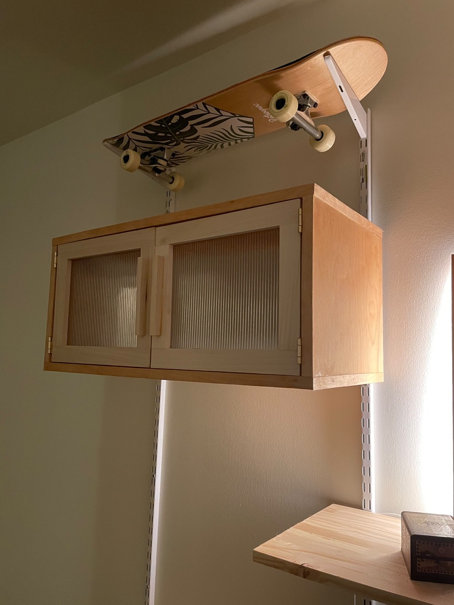

title: Modular Shelving Unit
date: 2023-03-31
tags: furniture,design,woodworking
---

# Motivation
I wish I had the reckless abandon needed to live a minimalist lifestyle. But I don't, and instead I've got a ton of stuff (re: art supplies) that needs to be stored. My apartment is lacking in storage options, the only closet I have is the one in my bedroom for clothes --- no coat closet, no linen closet, really nothing useful, so I decided to fix this issue.

I love wall modular wall units. There's so many types of things you can put on them, shelves, cabinets, desks, lecterns --- and you can rearrange them as you wish? Truly one of the great design options of our time. 

# Design

The project started out pretty simply, I grabbed some double-rail closet organizers from the store and hung up four side by side. The studs in my wall are spaced `24"`, which ended up dictating a lot of the design decisions I made later in terms of proportion.

The design was simple, I needed one larger chest to hold 2 plastic totes, a shelf to reuse an existing board I had from my [coffee table](/furniture/coffee-table/coffeTable.html). I planned for a second smaller chest for up high, and originally another small shelf.

# Building

The width of the large chest had to span three of the vertical supports in order to be supported by three brackets, so at least `4'` wide. The smaller chest only needed to have two supporting brackets, so it came out closer to `2'`. I made the two out of birch plywood that a friend had no need for, both came out of single `4' x 8'` board with leftover for the lectern.

So far, so good. I was pretty happy with the state of everything. The lectern still needed some work since it was being held in place with poster putty and was way too steep --- I eventually had to get longer brackets for it to reduce the angle. Finally had a place to store my skateboard too!

# Finishing

To finish the cabinets, I wrapped them in birch veneer edgebanding. The banding has a heat activated glue on the backside making application real easy. All I needed to do was cut to length, run an iron over it, and trim the excess. I then sanded and coated everything in Danish Oil.

I decided I wanted a darker color to the wood, so I attempted to stain the smaller chest with a water-based stain on top of the Danish Oil. This did not go well, the cabinet looked splotchy and the overall finish was not what I wanted. I built a second smaller cabinet with the plan of scrapping the first, but was eventually able to remove enough of the bad finish that I ended up keeping both small one.

# Hiding my stuff

The next task at hand was coming up with doors to hide my clutter. I had some cheap thin wooden project panels lying around from some paintings I did, and also found these neat wooden mats from IKEA. I was really hoping to use the mats as a pre-made tambour style door, but they were a bit too short in both directions for this application. Maybe in another project... At any rate, the wood project panels were more than sufficient. It was just a matter of cutting to size and using some square dowels to create tracks for them to slide in.

I also wanted some doors for the smaller cabinet. I ran to Blue Moon Glassworks here in Austin, a local art glass company near my old house, and picked up some sweet fluted glass. I glued them into some poplar shaker-style doors and attached them to the cabinet with some simple brass hinges. Love the look of the fluted glass, and it does just enough to obscure the inside of the cabinet without it being wood-overload.

# Final thoughts
I'm very happy with how this project turned out. Originally I intended for everything to hang from the wall, but after seeing some bowing in the larger chest, I did decide to add a couple of feet underneath to support the structure. At some point I may go back and paint the metal shelving rails and brackets, possibly in a gold finish, but for now they will stay white.

