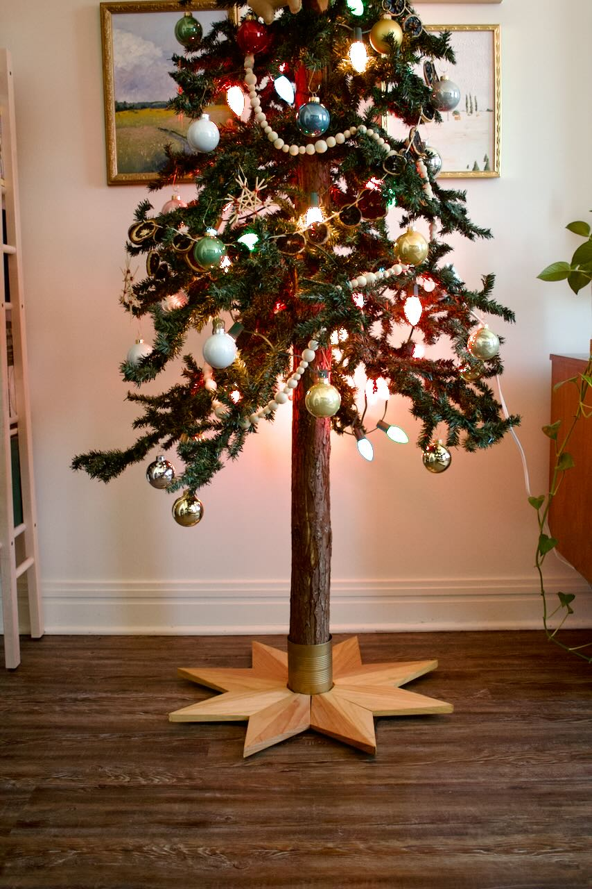
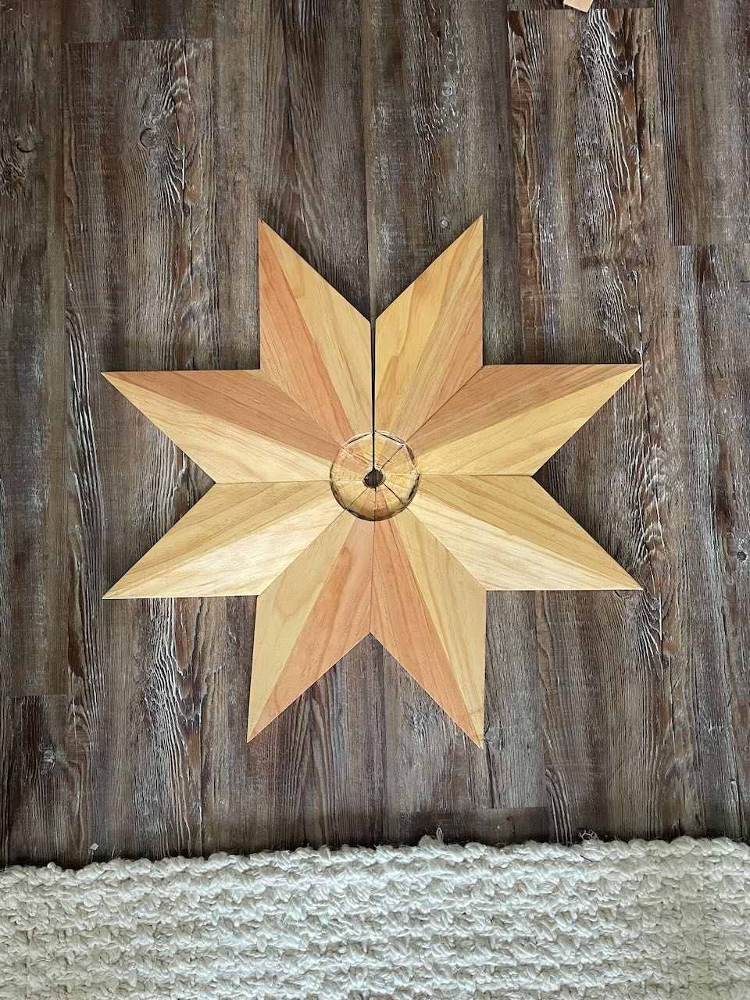
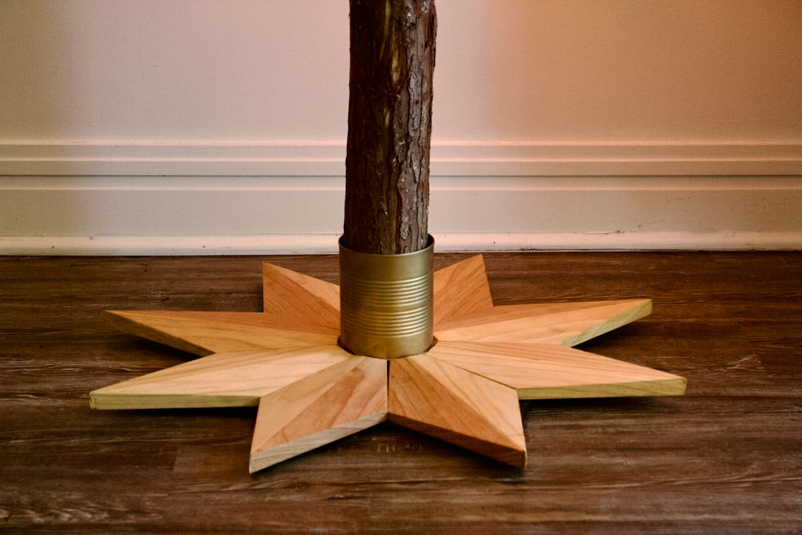
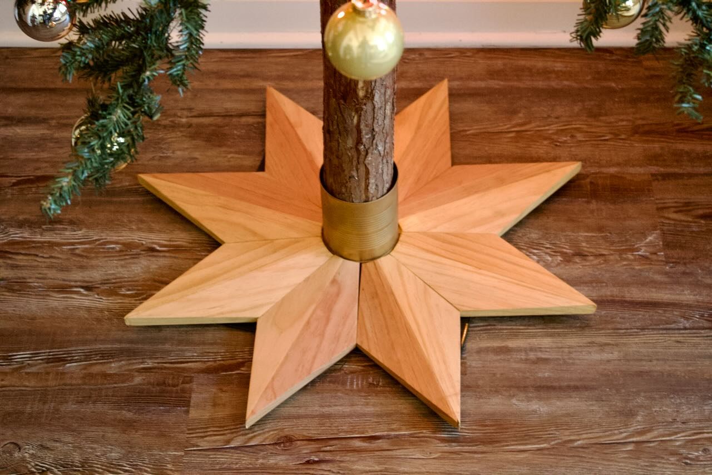
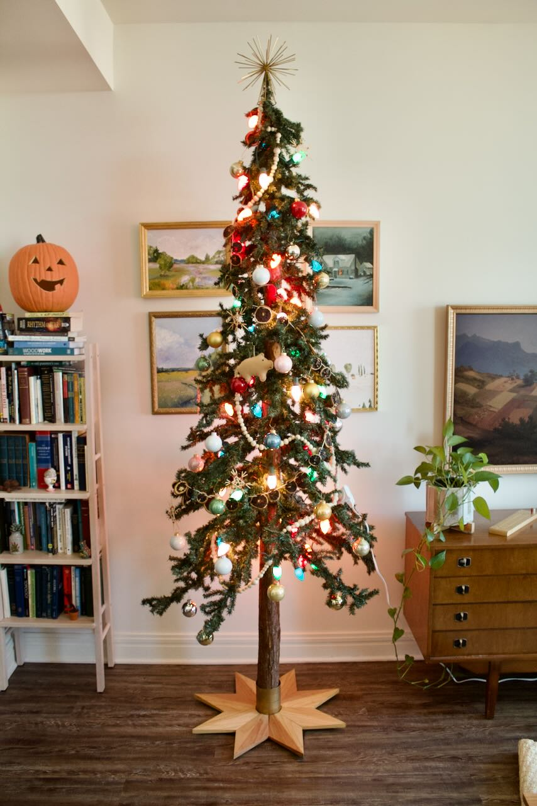

title: Christmas Tree Base
date: 2023-11-24
tags: furniture,woodworking,design
---

I made this christmas tree base about 2 years ago now. The construction was simple, just some pine boards cut into triangles, joined into rhombuses, and then glued again into halves to fit around the tree. Each rhombus was planed by hand so that the long diagonal was higher. I cut out the center with a chisel so that the tree could sit on a flatter surface. The base of the tree sits in spray-painted tin can. 

<section class="gallery" markdown="span">
    

        
        
        
        
    

</section>

