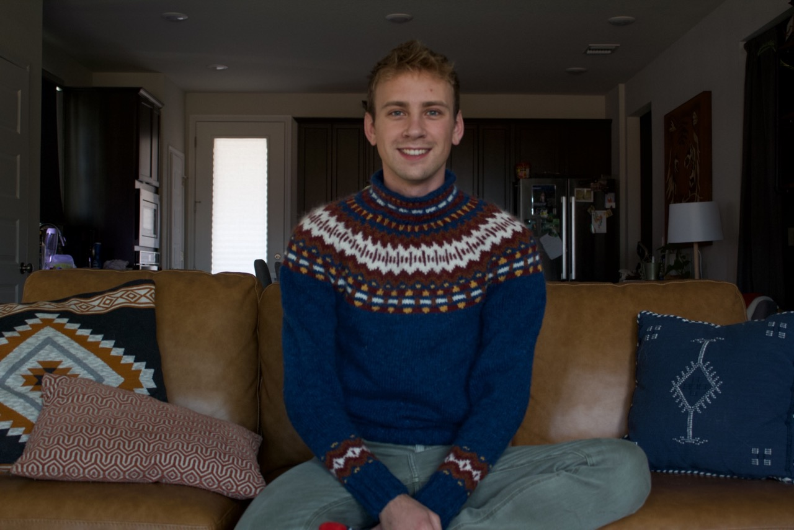
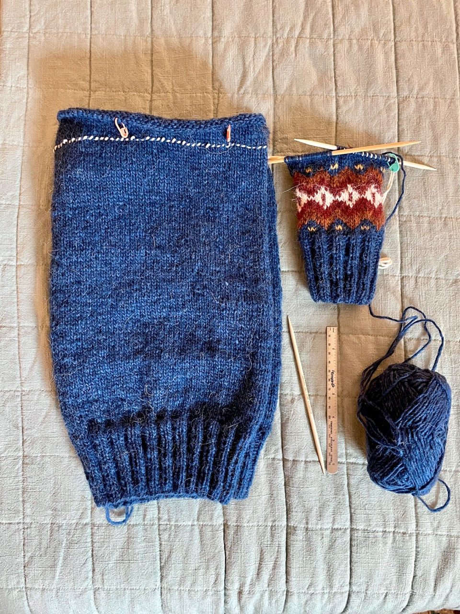
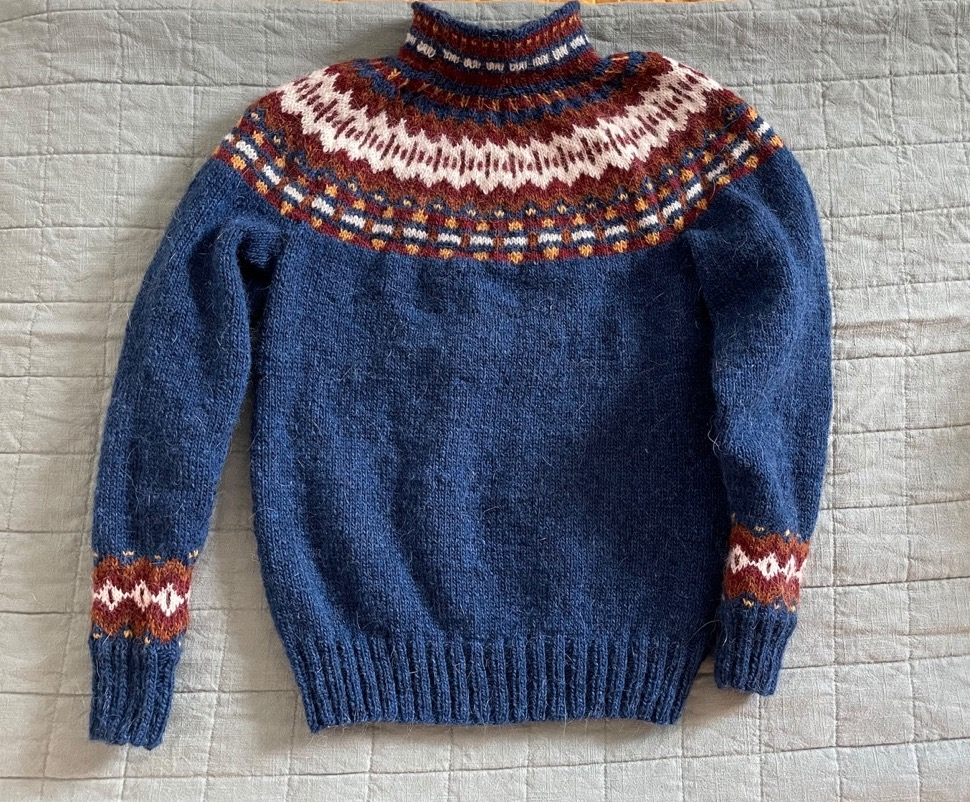
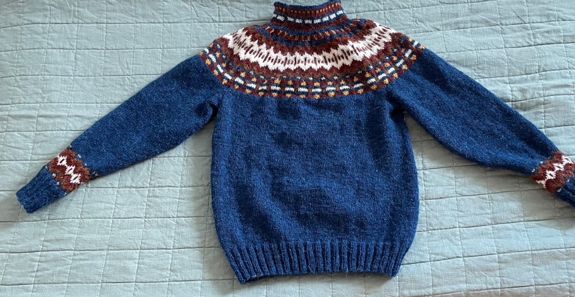

title: Inkineule Sweater
date: 2022-09-15
tags: knitting
backdated: true
---

This was my second sweater (well I started one between the first one and this one, but that one never got finished).

# Project Details
## Pattern
Inkineule by [Heli Nikula](https://villahullu.fi/en/).

I knit the large size

## Yarn
Lopi Lettlopi (Icelandic wool, 50 gram balls)

- 1403 Lapis Blue (8)
- 9431 Brick (2)
- 0051 White (2)
- 9427 Rust (1)
- 1703 Mimosa (1)

This is 100% icelandic wool. It's very warm and easy to work with. It is considerably more scratchy than other yarns I've worked with.

## Needles
- 3.5mm
- 4mm 

I used circular needles for the body and yoke, and dpns for the sleeves.

# Progress

This sweater is worked bottom up, which was very rewarding in the end. I still had the novelty of starting a new project for most of the body so the monotonous sea of blue went by pretty quickly.

Once you reach the armpit in the body you work the two sleves cuff-up and then join them all on to one circular needle to finish the yoke. 

My tension in the cuffs and the neck were a bit tighter than I wish, putting on and taking off the sweater is difficult with so little give in the fabric. But it's workable, so I didn't bother to redo them. I've done colorwork before but for this sweater I really honed working both continental and english knitting so that I could use both colors without having to switch the yarn in my working hand. There are a few places that use three colors in one row which was first for me, but ultimately the process was directly analogous to regular stranded color work.

