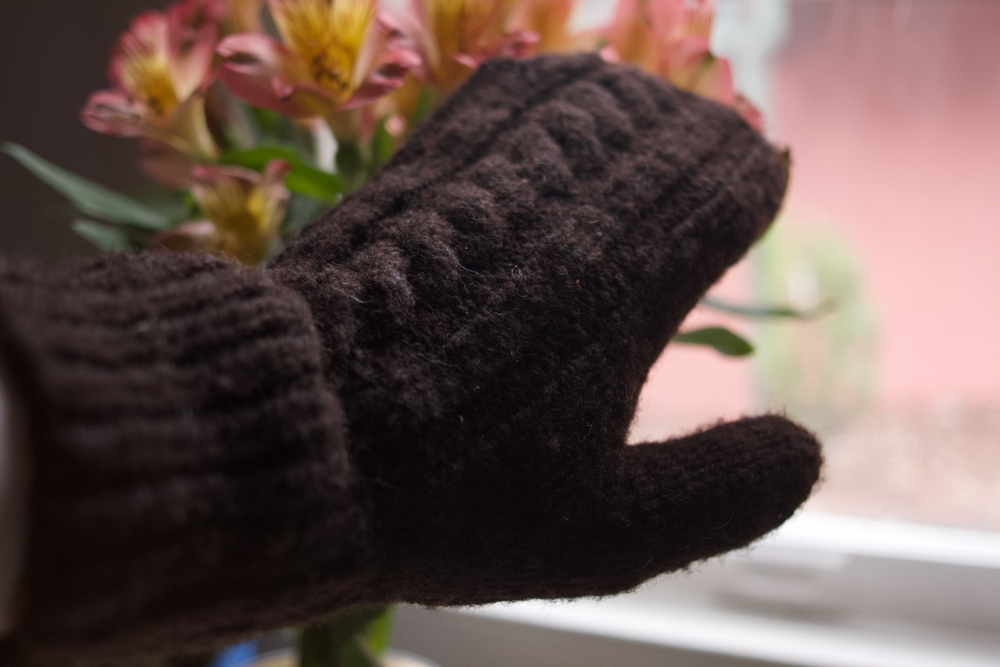
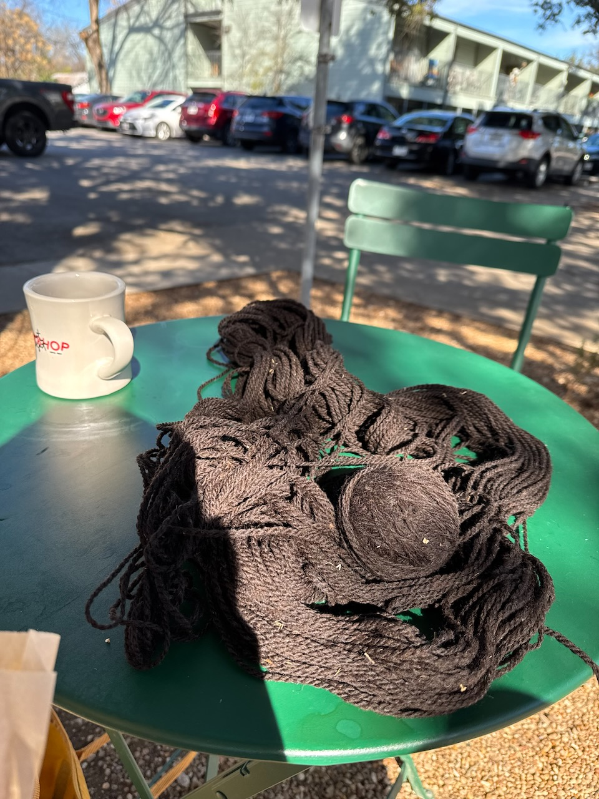
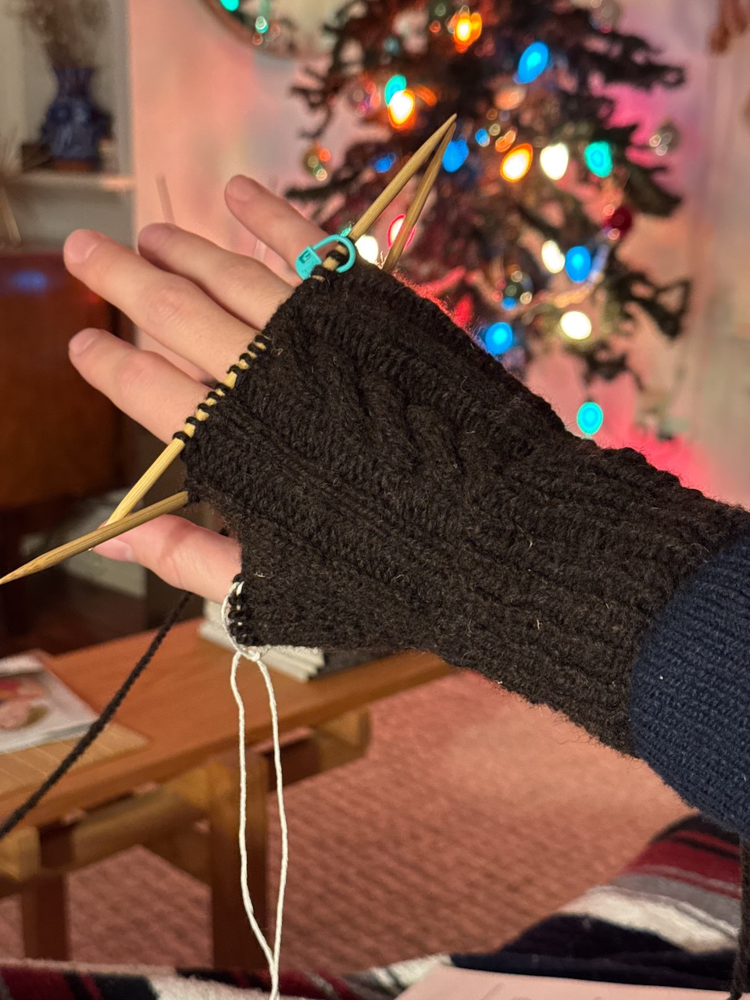
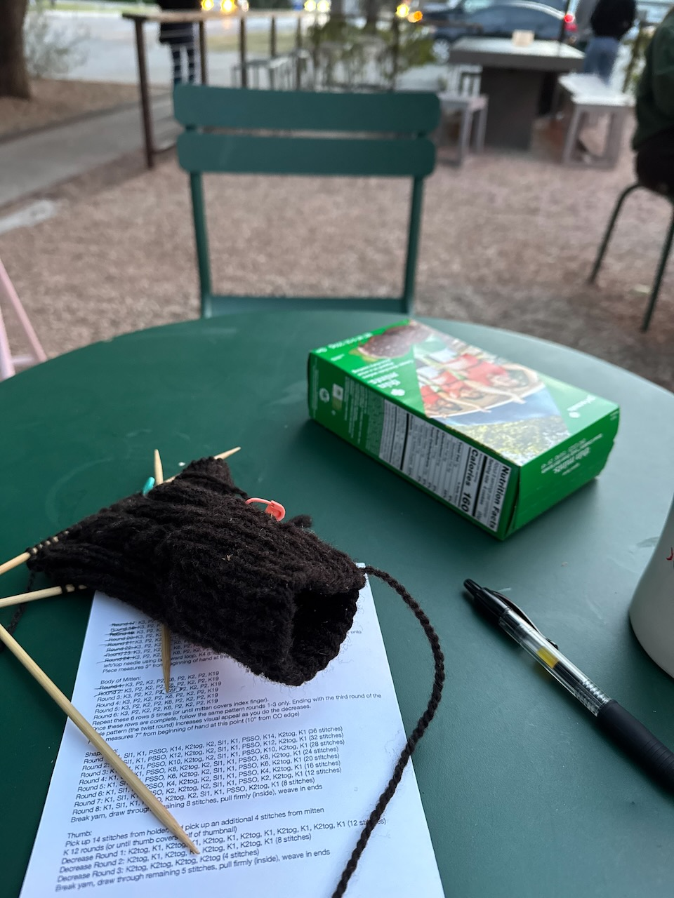
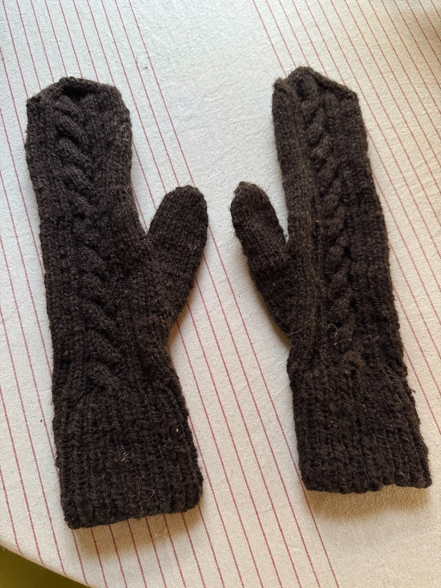
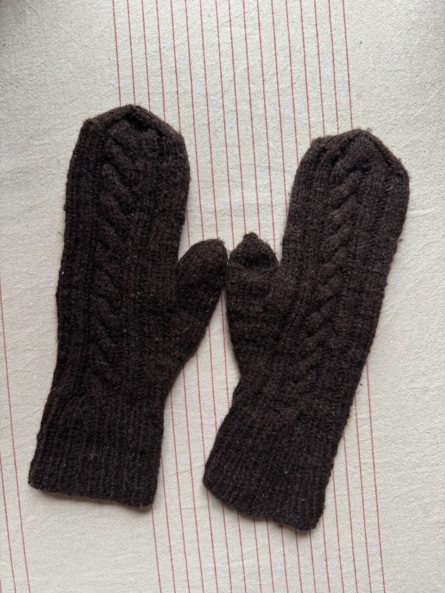

title: Mittens
date: 2025-01-18
tags: knitting
backdated: true
---

# Project Details
## Pattern
[Basic Cabled Mittens](https://ravel.me/basic-cabled-mittens) by Amy O'Dell.

## Yarn
Eleven Gates (100% wool)

This wool came from the farm my aunt and uncle live on and was gifted to me for Christmas. It is very soft and was perfect for this project.

## Needles
US 6 (4mm) dual-pointed needles

The pattern called for doing magic loop on circular needles, but I hate magic loop.

# Progress

First step, winding a ball from the skein at my favorite coffe shop/bookstore

Angsty emo Avril Lavigne sk8r boi gloves. Checking the thumb placement and reach of the cuff to make sure everything was good there before finishing through the end of my fingers.

Back at the coffee shop, a girl scout was making bank selling cookies at dinner time. I think everyone bought at least one box, and a lady even bought one of each.

Before blocking the mittens

Slightly more mitten shaped

