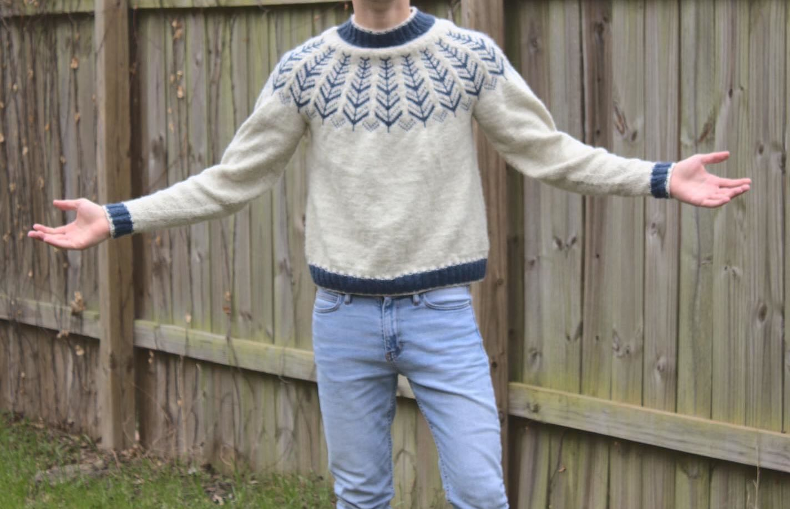
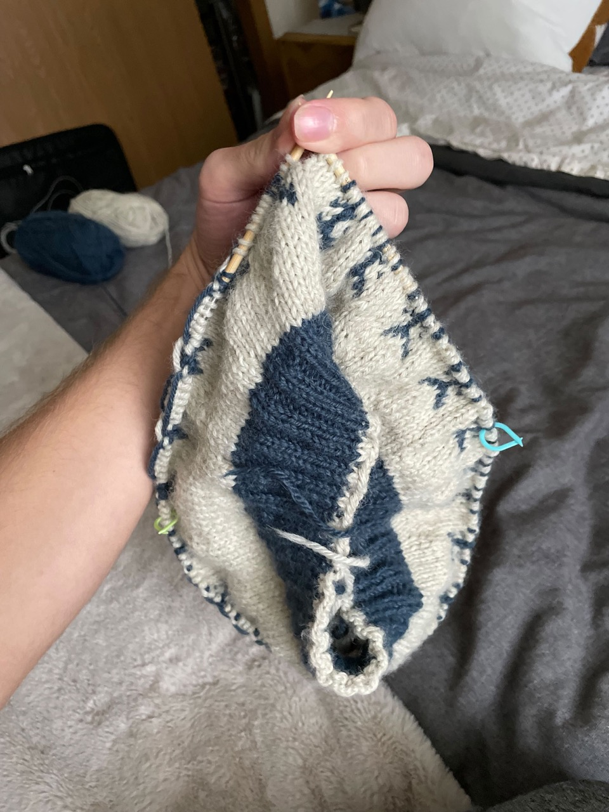
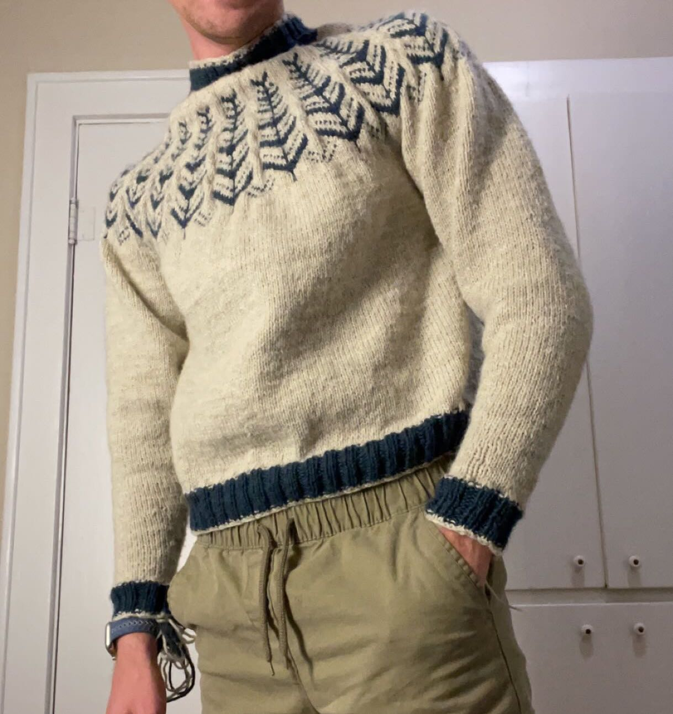
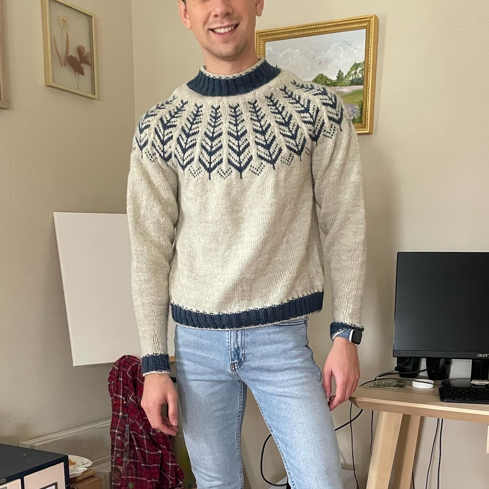

title: Inner Circle Sweater
date: 2022-03-07
tags: knitting
backdated: true
---

This was my first sweater

# Project Details
## Pattern
Inner Circle by [Drops Design](https://www.garnstudio.com/pattern.php?id=9599&cid=19).

I knit the large size

## Yarn
Lion Brand Wool-Ease (80% Acrylic, 20% Wool)

- 98 Natural Heather (5 skeins)
- 114 Denim (1 skein)

This was a great yarn to work with, super soft and plenty warm. 

## Needles
US 6 (4mm) circular needles

The pattern called for smaller needles on the ribbing, but I didn't do that.

# Progress

I started this sweater on a flight out to San Francisco. I get dizzy reading on planes and was afraid knitting would have the same effect, but it went smoothly and is a great way to fill the time.

The pattern is top down, meaning I started with the neck and worked the yoke then the body and finally the sleeves. The body was definitely the worst part of this, just endless days of knitting solid white. There was a long break during this project because of how monotonous working the body was.

But before I knew it, the sweater was done and just needed to be blocked and the ends woven in.

