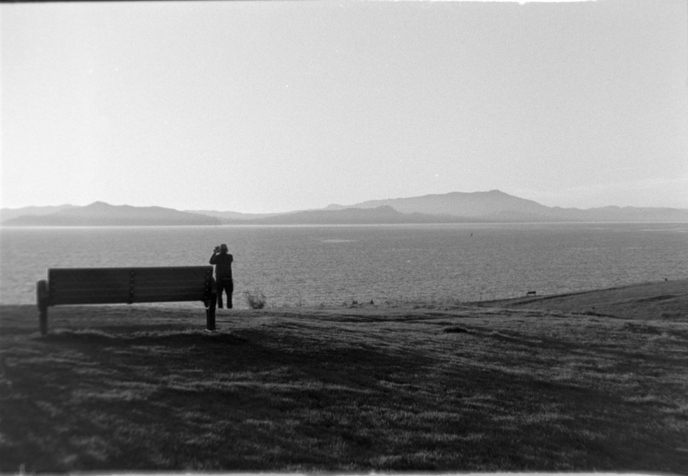
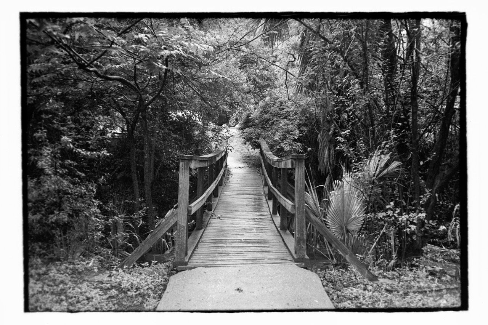
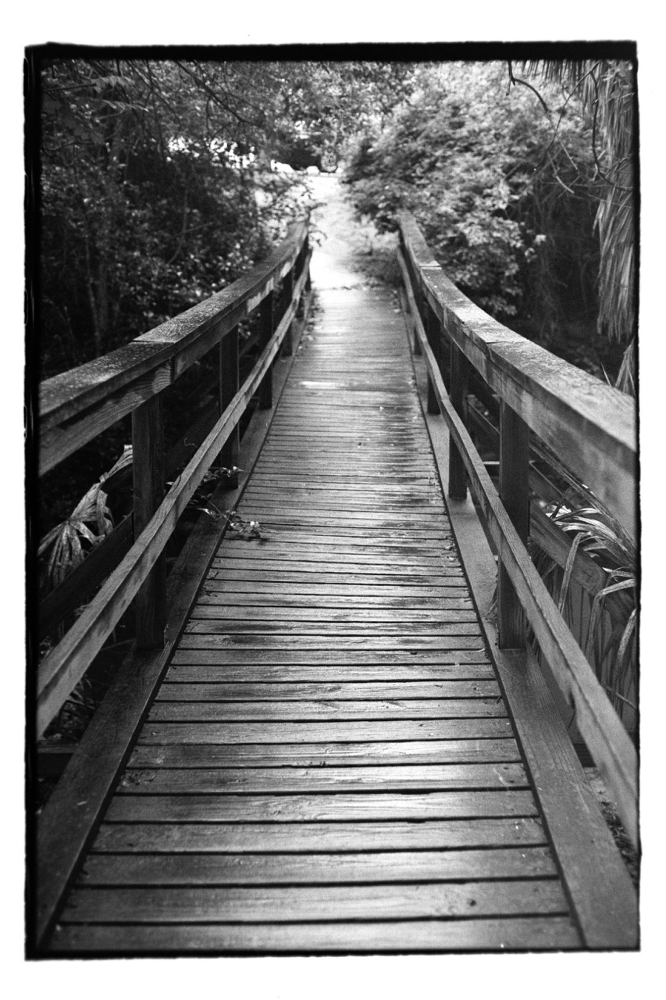
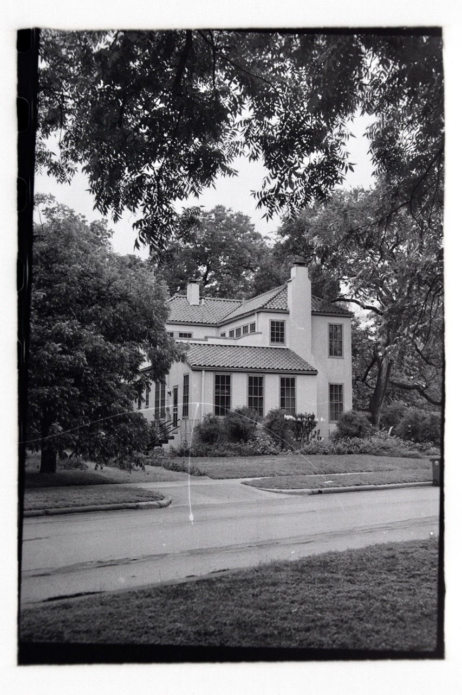
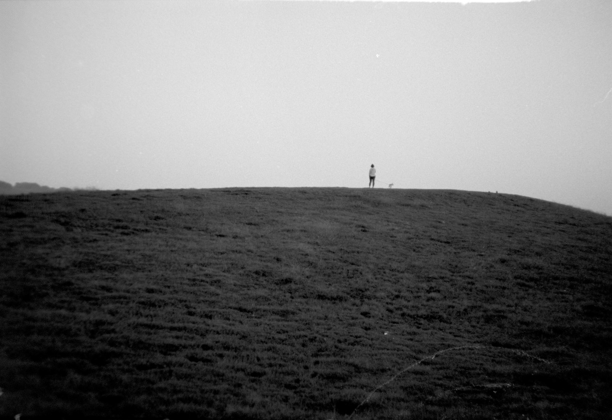
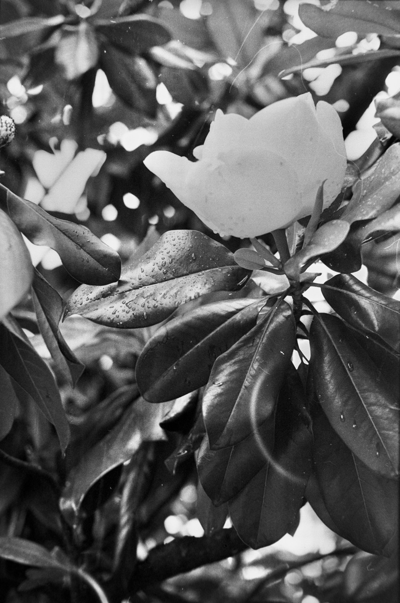
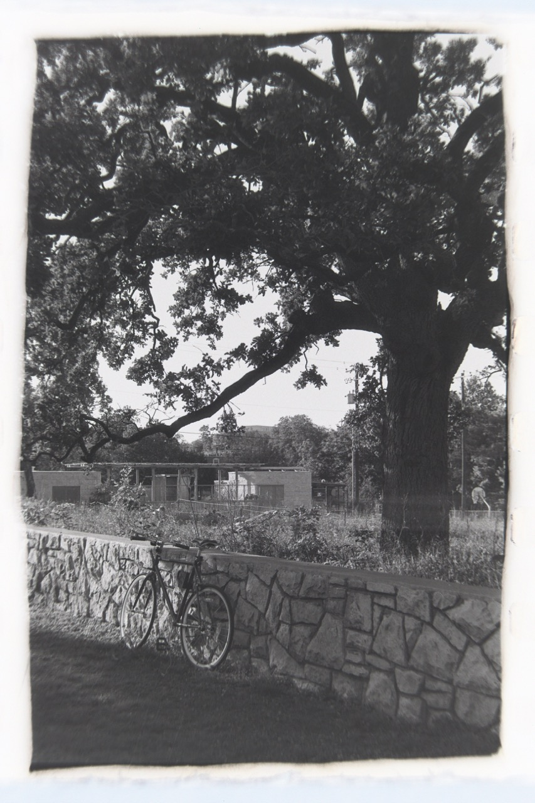
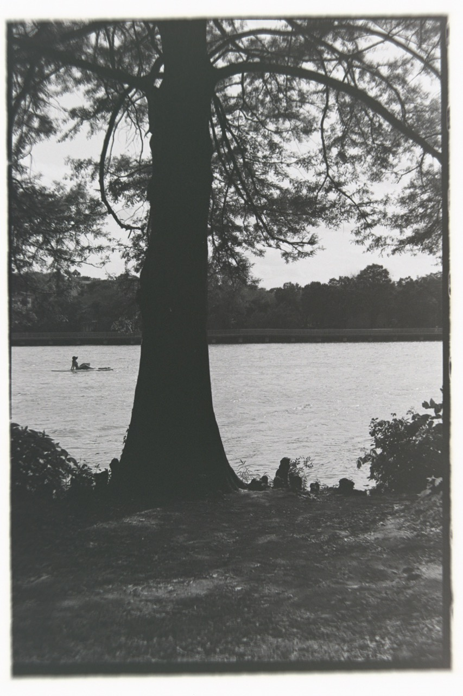
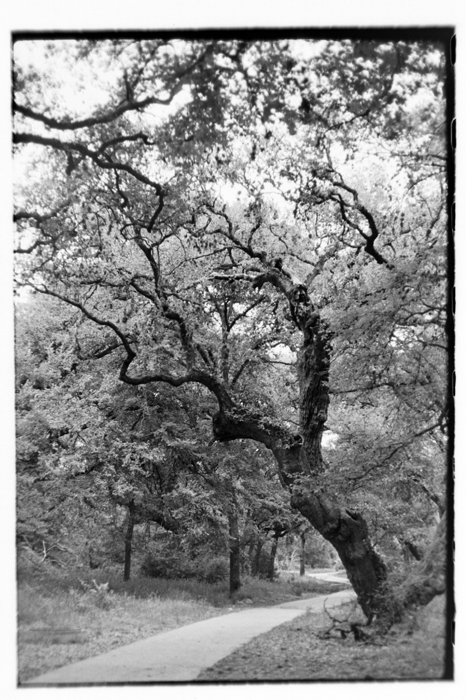

title: Caffenol Development
date: 2023-05-26
tags: art,photography
---

Developing black and white film in instant coffee, washing soda, and vitamin C powder. There is still a lot to experiment with in this space, but I've documented the recipe and procedure that has produced great results for me so far, more for my own reference than anything else since the recipe is easily available elsewhere online. Some further discussion of possible alternatives to instant coffee is introduced later in this post.

[TOC]

# Motivation
I started shooting film sometime around 2020. Was it covid-19 influenced? Hard to say. I bought my dslr in early high school, and even before then always had a camera of some sort to mess around with. I wanted to get into film for the longest time, but never really had the income to support it. Come 2020 I finally landed a "real job" and suddenly found that I had the means to fund the odd interest here and there --- so I picked up a Canon AT-1 from ebay and started down a fun path of re-framing my approach to taking photos.

Photography for me has as much value in the process as it does the final results. Generally I am not a fan of process for the sake of process --- don't get me started on scrum practices at work --- but when shooting with a camera it really does make the experience that much more enjoyable. Manually figuring out what settings to adjust for a good exposure, where to stand/crouch/climb for an interesting frame, choosing which lens will give you the effect you're looking for. The parameter space is massive and really gives the photographer so much latitude to mess around with and try new things.

Film photography adds a whole set of constraints on how the photographer shoots. You choose a roll of film and are limited to that ISO for the next 36 shots. Each frame is more expensive unit cost than the 600 shots you can get with a digital camera so maybe there is more thought into how you choose to compose an image. And when you finally make it through all those images, it's time to develop.

You can send the roll off to whatever lab is near you and get great results, but where's the fun in that? Home development lets the artist become a chemist, only if for a few moments. There are, of course, safety concerns in doing this kind of science at home too, you can find all sorts of laments about these chemicals from other sources online. My main motivation in doing caffenol development at home is in the spirit of DIY, at any rate. It's an opportunity to learn something new: a chance to experiment with using things familiar in novel ways, and ultimately a more rewarding experience than just letting someone else do it. There is something inherently cool about throwing some exposed film in a soup of instant coffee, cleaning powder, and health supplements and getting usable images out of it.

# Chemistry
I usually make the Delta-STD recipe [^Essl1] which works well with the black and white film I use.

## Solution A
- 150ml water
- 15g instant coffee (with caffeine)

## Solution B
- 200ml water
- 8g washing soda (sodium carbonate)

## Preparing the Developer
- Prepare separately and combine solutions A and B
- Add 7g of vitamin c powder
- Let sit for 5 minutes to clear bubbles

## Developing with Caffenol
I use a patterson tank when developing. The recipe above makes enough to develop two rolls in the tank at a time.

1. In a dark bag or room, remove the film from the roll and load into patterson tank reels. Assemble the tank and make sure light tight before removing from bag or dark room.
2. At room temperature (20-25C) add the developer to the tank
3. Develop for 11 minutes, agitating the tank every 30 seconds or so for 5-10 seconds (I usually spin a bit and invert the tank a couple time)
4. Pour out the developer for safe disposal in your area. It will contain silver
5. Rinse the tank a few times with water until it runs clear
6. Fix the film (I use Ilford Rapid Fix, generally in the 5-minute range)
7. Save the fixer for reuse or dispose of as appropriate
8. Rinse the film again with water until runs clear, add a drops or 2 of dish soap in the last rinse to help avoid watermarks when drying
9. Remove reels from tank, hang to dry in a dust free location. Squeegee if you can

This procedure is very loose and can be altered as you see fit. Most 100-400 iso black and white films I've tried are pretty forgiving with development times +/-2 minutes. For something more than an anecdotal statement, some development times can be seen on the caffenol.org website[^Essl2].

# How it works
How perfect must a process be for good results? Not very, evidently.

The seminal research into this started as a project at the Rochester Institute for Technology. Their initial studies resulted in a formula of instant coffee, sodium bicarbonate (baking soda), and potassium hydroxide[^RIT].

Let's start by looking at what goes into the developer

## Instant Coffee (Phenol Developing Agent)
The phenols are responsible for reducing the silver halides in the exposed emulsion (latent image) to metallic silver in caffenol development[^RIT][^wiki-silver][^wiki-developer]. Some suggest that it is specifically the caffeic acid, although other sources would indicate otherwise.

Instant coffee readily available source of phenols --- a study on Korean coffee drinking habits measured 117.2±13.3mg GAE/g DW (mg gallic acid equivalents per dry weight (DW) of coffee) for caffeinated instant coffee while only seeing 26.2±0.2mg GAE/g DW for roasted coffee[^Lee]. Gallic acid is a phenolic acid and commonly found in other plants like sumac, witch hazel, tea leaves, and oak bark[^wiki-gallic]. 

The same study also measured flavonoid content (a subgroup of polyphenols) in terms of catechin equivalents, and antioxidant capacities in terms of vitamin C equivalents, where instant coffee had higher measurements in each category[^Lee].

Other phenols exist, for example cloves are high in overall polyphenol content, including gallic acid with a mean of 458.19mg/100g FW (fresh weight), but their most common compound is eugenol at a mean of 12593mg/100g FW[^pe1][^pe2][^pe3]. 

I am not sure if one phenol outperforms another in terms of development efficacy, but some have experimented with other high-phenol food sources as replacements for instant coffee in silver-based black and white film development. Daniel Keating has tried clove, rosemary, mesquite seed pods, palo verde, and menthol crystals; all with decent success[^keating].

### Polyphenols in Food

The following a table of total polyphenol content, in mg/100g FW of selected food items, descending[^pe1][^pe2][^pe3]. These ingredients may be good sources for alternative developer chemistry in lieu of instant coffee, for a complete database see the referenced articles.

|Food|Mean|Min|Max|Standard Deviation|
|----|:----:|:---:|:---:|:--:|
|Cloves|16048|11320|24390|5731|
|Ceylan cinnamon|9700|7500|11900|3111|
|Pot marjoram, dried|9306|9306|9306|
|Adzuki bean, whole, raw|8970|8970|8970|
|Spearmint, dried|6575|1650|11500|6965|
|Cocoa, powder|5624|3712|8033|1577|
|Common bean [Others], dehulled, raw|5488|890|8600|2107|
|Common bean [Black], dehulled, raw|4846|1888|7300|2044|
|Summer savory, dried|4512|4512|4512|
|Sweet basil, dried|4318|740|6550|1452|
|Sweet bay, dried|4170|4170|4170|
|Marjoram, dried|3846|1690|8000|2940|
|Lentils, whole, raw|3697|635|6760|4331|
|Capers|3600|3600|3600|
|Oregano, dried (wild marjoram)|3117|782|5452|3302|
|Common sage, dried|2920|1360|4767|1722|
|Caraway|2913|610|6750|3345|
|Chestnut, raw|2757|1580|3673|662|
|Rosemary, dried|2519|2100|3196|592|
|Roman camomile, dried|2483|2483|2483|
|Coriander, dried|2260|520|4000|2461|
|Fenugreek, dried|2250|2250|2250|
|Turmeric, dried|2117|2117|2117|
|Cumin|2038|230|9000|4920|
|Black elderberry|1950|1950|1950|
|Nutmeg|1905|1610|2200|417|
|Winter savory, dried|1880|1880|1880|
|Chocolate, dark|1860|1173|4437|1248|
|Common thyme, dried|1815|1710|1920|148|
|Star anise|1810|1600|2020|297|
|Lemon balm, dried|1700|1700|1700|
|Parsley, dried|1585|960|2244|643|
|Walnut|1575|1556|1625|49|
|Pistachio|1420|867|1657|559|
|Common bean [Black], whole, raw|1391|56|4400|2037|
|Swiss chard leaves [Red], raw|1320|1320|1320|
|Pecan nut|1284|1284|1284|
|Dill, dried|1250|1250|1250|
|Plum, prune|1195|1195|1195|
|Common thyme, fresh|1173|213|1537|672|
|Italian oregano, fresh|1165|1165|1165|
|Globe artichoke, heads, raw|1142|731|1305|235|
|Rosemary, fresh|1082|219|1377|579|
|Curry, powder|1075|1075|1075|
|Grape, raisin|1065|1065|1065|
|Broad bean seed, whole, raw|1039|55|5590|2779|
|German camomile, dried|1010|850|1270|227|
|Pepper spice [Black]|1000|300|1700|990|
|Peppermint, fresh|980|226|2580|1010|
|Black raspberry, raw|980|980|980|
|Fig, dried|960|960|960|
|Oregano, fresh (wild marjoram)|935|435|2221|735|
|Lemon balm, fresh|900|126|2253|1126|
|Chocolate, milk|854|325|2439|673|
|Marjoram, fresh|854|854|854|
|Fenugreek seed|830|830|830|
|Swiss chard leaves [White], raw|830|830|830|
|Blackcurrant, raw|821|498|1410|230|
|Buckwheat, whole grain flour|791|8|3300|1153|
|Dandelion, raw|386|26|745|508|
|Fennel, fresh leaves|384|68|701|447|
|Pepper spice [Green]|380|380|380|
|Coriander seed|357|134|1250|789|
|Sorrel, dried|350|350|350|

## Sodium Carbonate (Buffering, Accelerator)
The acidic nature of coffee necessitated adding a buffering agent to the original caffenol recipe in order to increase the pH. This basic environment is what causes the gelatine to swell and allow easier diffusion of the developer to the exposed silver halides[^RIT]. Moreover, the alkalinity aids in the reduction process of the developing agent on the silver halides[^bowman]. The RIT team used sodium bicarbonate (baking soda) and potassium hydroxide (in drain cleaner) was titrated in to reach a pH of 9.0.

More recent recipes from the community use sodium carbonate (washing soda) for the same purpose[^Essl1].

## Vitamin C (Accelerator)
Vitamin C works as a developer itself, albeit slowly. It's purpose in this formulation is as a super-additive; it recharges the reducing capabilities of the main phenol developer, speeding up the development time[^learnfilm].

# Gallery
A selection of images developed in caffenol. Mix of Ilford HP5+, Fomapan 100, and Kentmere Pan 400.
<section class="gallery" markdown="span">
    

        
        
        
        
        
        
        
        
        
    

</section>

# References
[^Essl1]: Dirk Essl. 12 March 2010. [The Delta Recipe (Delta-STD)](https://www.caffenol.org/2010/03/12/the-delta-recipe/).
[^Essl2]: Dirk Essl. [Film Development Chart](https://www.caffenol.org/film-development-chart/).
[^RIT]: Dr. Scott Williams and the Technical Photographic Chemistry 1995 Class. [A Use for that Last Cup of Coffee: Film and Paper Development](https://people.rit.edu/andpph/text-coffee.html)
[^wiki-silver]: [Gelatin silver process](https://en.wikipedia.org/wiki/Gelatin_silver_process)
[^wiki-developer]: [Photographic developer](https://en.wikipedia.org/wiki/Photographic_developer)
[^Lee]: Lee, Bong Han et al. “Estimated daily per capita intakes of phenolics and antioxidants from coffee in the Korean diet.” Food science and biotechnology vol. 28,1 269-279. 9 Aug. 2018, doi:10.1007/s10068-018-0447-5 [NIH Hosted Article](https://www.ncbi.nlm.nih.gov/pmc/articles/PMC6365332/)
[^wiki-gallic]: [Gallic acid](https://en.wikipedia.org/wiki/Gallic_acid)
[^pe1]: V. Neveu and others, Phenol-Explorer: an online comprehensive database on polyphenol contents in foods, Database, Volume 2010, 2010, bap024, [doi](https://doi.org/10.1093/database/bap024) [Database](http://phenol-explorer.eu)
[^pe2]: Joseph A. Rothwell and others, Phenol-Explorer 2.0: a major update of the Phenol-Explorer database integrating data on polyphenol metabolism and pharmacokinetics in humans and experimental animals, Database, Volume 2012, 2012, bas031, [doi](https://doi.org/10.1093/database/bas031) [Database](http://phenol-explorer.eu)
[^pe3]: Joseph A. Rothwell and others, Phenol-Explorer 3.0: a major update of the Phenol-Explorer database to incorporate data on the effects of food processing on polyphenol content, Database, Volume 2013, 2013, bat070, [doi](https://doi.org/10.1093/database/bat070) [Database](http://phenol-explorer.eu)
[^keating]: Daniel Keating. 18 August 2020. [Polyphenol Developer Alternatives – A World full of Options](https://www.35mmc.com/18/08/2020/polyphenol-developer-alternatives-a-world-full-of-options-by-daniel-keating/)
[^bowman]: Tim Bowman. 8 June 2021. [Photographic developer components](https://hellothisistim.com/blog/photographic-developer-components/)
[^learnfilm]: Darren. [How the heck does coffee and Vitamin C develop film? (all about caffenol)](https://www.learnfilm.photography/how-the-heck-do-coffee-and-vitamin-c-develop-film-all-about-caffenol/)

