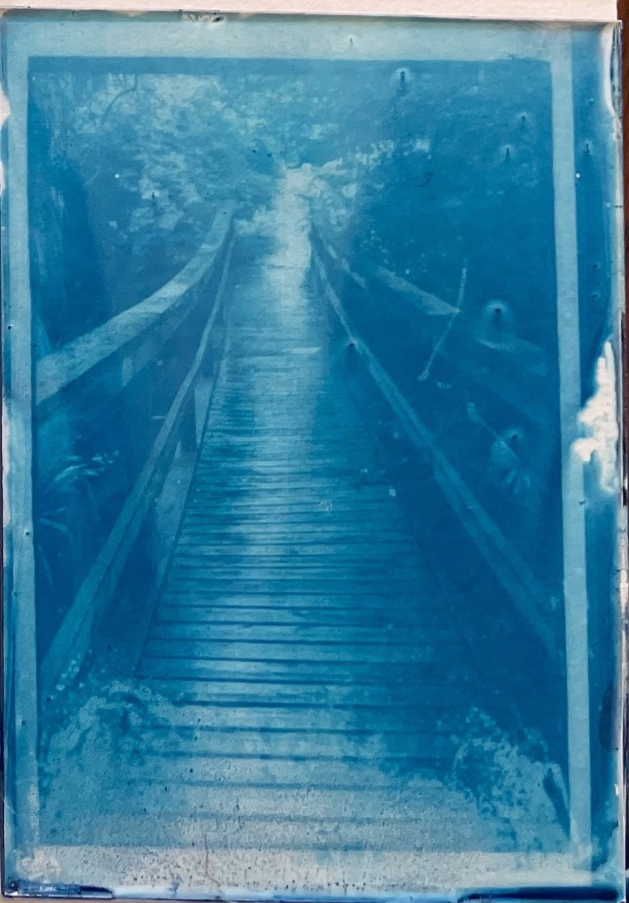
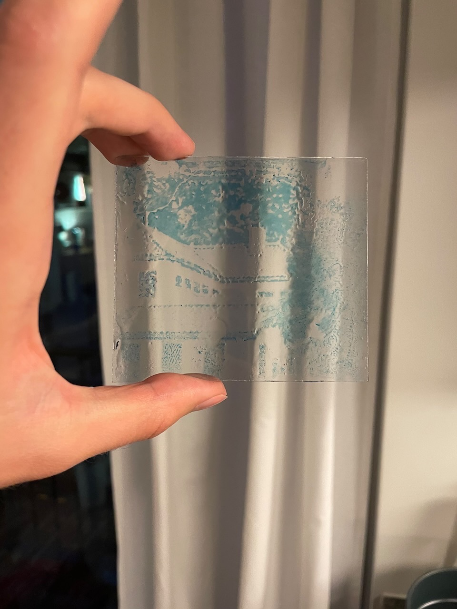
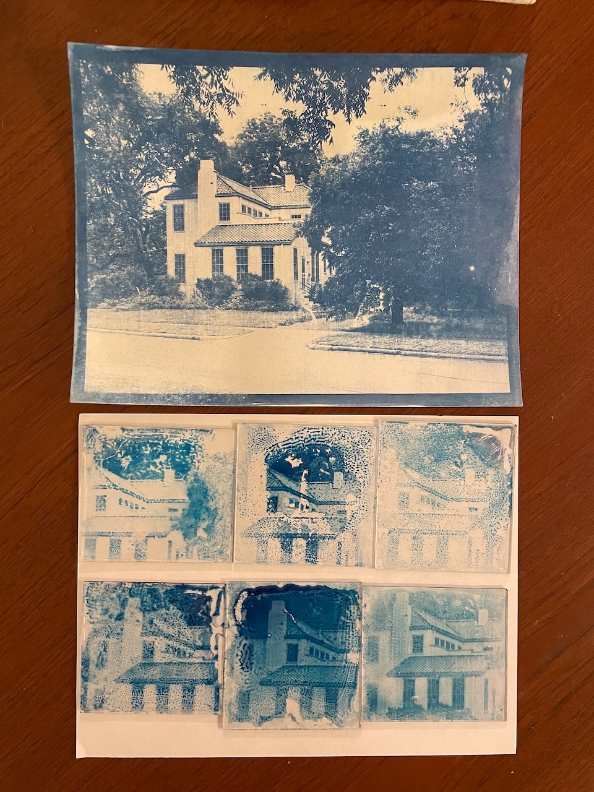
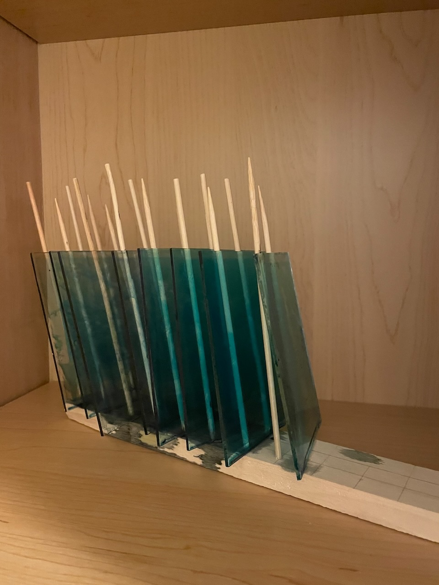
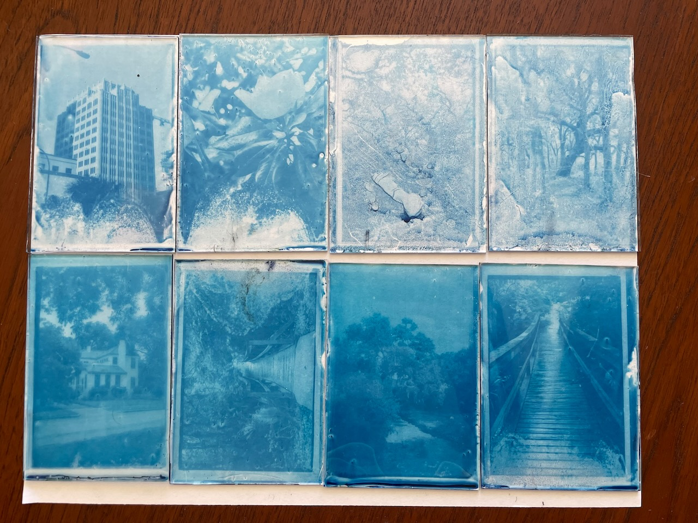
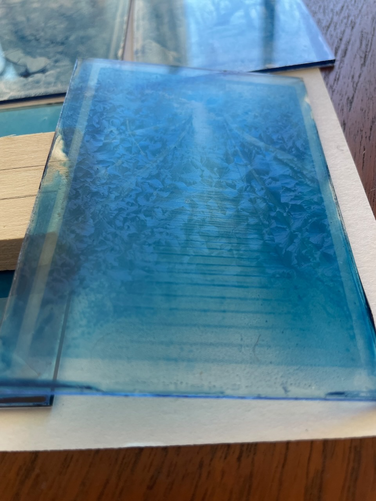

title: Cyanotype On Glass
date: 2023-04-27
tags: art,photography
---
I'll be using this post to document my experiments with cyanotype on glass. There is a lot to learn and try, so I expect it will grow as I figure out new things.

[TOC]

# First Attempt
After some research, there have been others to do cyanotype on glass with varying degrees of success and documentation. My initial attempt was a synthesis of the processes outlined by artists Aline Héau[^1] and Jo Howell[^2].

## Chemistry
Obligatory word of caution: always follow proper safety protocols when preparing and dealing with these chemicals. Always wear gloves and goggles. Wash up properly before and after. 

It is best to prepare these in a room with little UV light (ie regular incandescent bulbs and no windows)
### Part A
- 40ml water, 25C
- 10g ferric ammonium citrate
### Part B
- 40ml water 25C
- 4g potassium ferricyanide
### Stock C, Gelatin
- 8.36g gelatin
- 225ml water, 80C
### Sensitizer
- 10ml stock A
- 10ml stock B
- 30ml stock C, 25 C

I prepared way too much gelatin, in the future I'll use smaller amounts, but this 8.36g was what was in a single packet of food grade gelatin.

Don't worry too much about temperatures, parts A and B can be prepared at room temperature and the gelatin was prepared in water that was brought to a boil and allowed to cool for a minute or so.

I prepared the sensitizer after allowing the gelatin to cool for 3 hours at room temperature. It was still in a liquid state.

Store the solutions in light proof or brown glass bottles and keep in a dark place.

## Coating

### Prepare the glass slides

- Use odorless mineral spirits to clean the glass
- Wash with water and dish soap
- Rinse in water
- Allow to air dry, pat dry with paper towel when I was impatient

I re-use old picture frame glass for the plates since I have quite a few pieces lying around from painting projects.

### Prepare the sensitizer

- The sensitizer needs to be liquid, if it has solidified, heat it in a double boiler until it flows like water. Do not allow it to boil

### Coat the plates

- Pour the sensitizer solution onto a flat plate to cover roughly 70% of the surface
- Use a glass rod to spread the solution evenly over the plate
- Pour excess into another container
- Allow plates to dry flat

Plate 5 I did not pour as much of the excess off
Plate 6 I used the glass rod to smooth the surface after pouring the excess

## Development

My first attempt wasn't particularly great. Generally poor coating, the gelatin seized, highlights were completely washed out, the blue color was weak. Overall disappointing and yet a super exciting result all the same. There's so much to improve but nothing that couldn't be fixed!

I couldn't fix the coating issues with this first batch since I had done them all at the same time, but I could adjust the development parameters.

Here's what I found in the first go

|  Attempt  | Coating                                        | Exposure            | Development              | Notes                                                            |
|:---------:|------------------------------------------------|---------------------|--------------------------|------------------------------------------------------------------|
|     1     | Splotchy emulsion (fingerprints?). 24hr dry    | 4 minutes at 11 in. | Running water, room temp | Highlights completely washed out                                 |
|     2     | Splotchy emulsion. 24hr dry                    | 4 minutes at 11 in. | Cold water in pan        | Darker highlights and overall image                              |
|     3     | Decent emulsion, thick in one corner. 24hr dry | 2 minutes at 11 in. | Cold water in pan        | Bad exposure, very light image                                   |
|     4     | Splotchy emulsion. 24hr dry                    | 6 minutes at 11 in. | Cold water in pan        | Darker blue, details lost to coating                             |
|     5     | Heavy emulsion, blue haze. 48hr dry            | 5 minutes at 11 in. | Cold water in pan        | Very dark blue, good details in heaviest coated areas            |
|     6     | Very light emulsion. 48hr dry                  | 4 minutes at 11 in. | Cold water in pan        | Lighter image, good details but some smaller beading in emulsion |

## Results

A comparison of the glass plates with a piece of paper coated with the same gelatin mixture. Interesting how different the two blues are --- I think it may be because of the acidity of the paper but I'm not too sure.

I need to improve the coating process, the gelatin did not adhere well and seemed to seize or bead based on the swirly patterns it formed. The mineral spirits may be to blame, or an otherwise bad cleaning process. The glass rod seems to have created an uneven coating especially at the edges.

The optimal exposure time at 11 inches appears to be in the 4-5 minute range. It is possible that I can get darker blues from longer exposures, but risk the highlights also being darker.

# Second Attempt
## Chemistry
I used the same sensitizer solution from the first attempt
## Coating

For this attempt I removed the mineral spirits clean and the use of the glass rod when coating, and dried the plates upright

### Prepare the glass slides

- Wash with water and dish soap
- Rinse in water
- Allow to air dry, dry with paper towel to remove any remaining water or spots

### Prepare the sensitizer

- The sensitizer needs to be liquid, it was still in liquid form from the previous attempt after being allowed to sit at room temperature for a day.

### Coat the plates

- Pour the sensitizer solution onto a flat plate held in hand to cover roughly 70% of the surface
- Gently rock the plate back and forth to evenly coat the surface
- Touch edge to next plate to transfer excess
- Allow plates to dry upright

When pouring the sensitizer I found it best to balance the plate on my finger tips rather than holding the sides, otherwise my fingers would break the surface tension of the liquid and it would flow over the edges.

I found that 10ml of the sensitizer was enough to coat the rough 570cm2 area of the plates.

## Development
Plates 1-4 were exposed for 4 minutes at 11in, and developed in a pan of cold water.

Plates 5-8 were exposed for 5 minutes at 11in, and developed in a vinegar solution given below

### Vinegar development solution
- 200ml water
- 25ml 9% distilled white vinegar

## Results

The coating process produced significantly better plates this time around. There was an accumulation of dust and bubbles that got transferred between successive plates, for the next attempt I'll stick to pouring the excess into different container to be filtered before being applied to another plate.

Drying the plates vertically may not be the best option. I had done it in this attempt to avoid dust but might be able to do so just by drying them flat in a cabinet. This may produce a better coating with little to no gradient[^3]. An alternative (and more active) method others have done is to dry vertically but to move/rotate the plate to avoid accumulation at one end[^4].

Plate 3 really struggled to form a good image; I sacrificed the plate to see if the emulsion could withstand running water --- it could not.

The longer exposure and acidic development produced darker blues but also a different hue. Still determining if this is wanted. The highlights definitely suffered --- unsure if this is a result of the exposure time or the acid but I'm leaning towards acid. It might be worth developing in water first then doing an acid bath, which supposedly intensifies darker values while reducing the lighter ones[^5].

The gelatin seems to have crystallized when drying. This may be an effect of allowing the sensitizer to sit at room temperature for a day and then not re-warming it before application. It is only viewable from the back (gelatin coated) side from an angle so overall image quality isn't (too) effected by it. It may also be a result of the food grade gelatin used. Others have guessed that drying time, temperature, and humidity might be at play[^3] and have been able to mitigate the effect but with a "secret" method.

# References
[^1]: Aline Héau. [Cyanotype On Glass: History, Process, Variations](https://cyanotyp.es/technique/cyanotype-on-glass-history-processes-variations/).
[^2]:Jo Howell. [Cyanotype process on Glass and Ceramic](https://maverickbeyond.com/2021/02/11/cyanotype-on-glass-and-ceramic/). 11 February 2021.
[^3]: Aline Héau. [Cyanotype Failures](https://cyanotyp.es/cyanotype-failures/).
[^4]: Damir Pildek. [Cyanotype on Glass](https://www.pildek.com/2019/09/16/cyanotype-on-glass/). 16 September 2019.
[^5]: Christopher James. The Book Of Alternative Photographic Processes. Delmar 2002. (115)
