title: Lens Design
date: 2023-07-07
tags: art,photography,3D print
---
This is another photography project long in progress. Many years back (2017?) I purchased some surplus doublet lenses from a distributor in Pennsylvania with no plan and the only reason being they were cheap. A few months ago I decided it was time to use them in a diy camera lens.

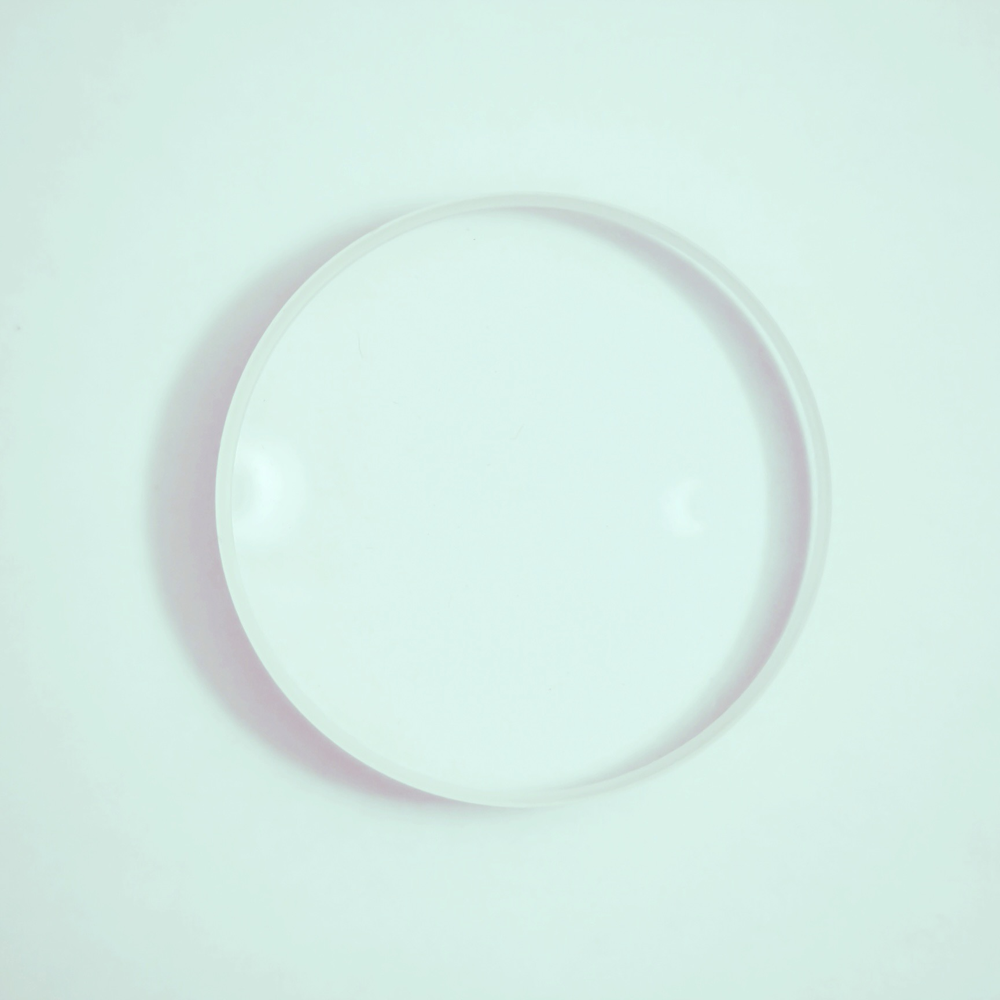

[TOC]

I definitely picked up the lens around the time I was taking a course on Southeast Asian art history. I was very into the work of S.H. Raza[^SHRaza] in his Bindu series from the late 90s and early 00s and definitely posted a derivative work of it on my instagram that a friend mistook for a petri dish --- art is what you interpret it I suppose. All the same, and same and all, I've since lost the paperwork from the purchase in the several moves I've made and had no documentation of any properties of these lenses. Consequently, the first step is to take some measurements so that I can plan out the design.

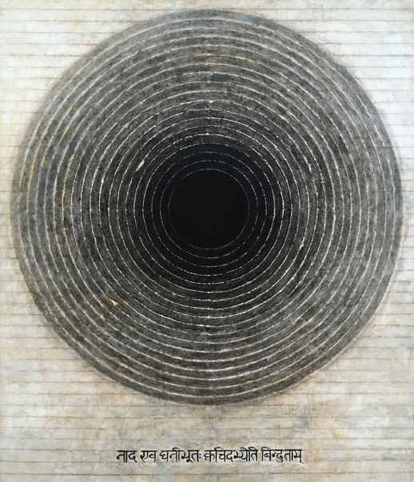

# Measuring the Lenses

## Diameter
The two lenses are the same size across their diameter, or at least any difference is indiscernible to me. Thankfully the geometry of this situation made measuring the diameter easy without a pair of calipers. Lay the two lenses side by side, run two straight boards parallel to each-other with the lenses in the middle, and measure the distance between the two boards to get the diameter of the lenses.
```{use_pygments=false}
--------
 ()  ()
--------
```

## Height
The maximum height of the lenses can be measured in the same way, this time with the lenses laid on their sides. 

The minimum height doesn't have to deal with finding gradient zero of a curved surface and can just use a regular ruler and the lens laid flat-side-down on the table.

## Focal Length
Now for an optical property of the lens. Focal length is a measure of how strongly a lens converges (or diverges) light. I'm not doing anything critical or that can't be fixed by adding in some tolerances to the final build to compensate for inaccuracies or imprecision, so I took this measurement with the assumption of a thin lens.

We have a fun little equation to use $\frac{1}{f} = \frac{1}{u} + \frac{1}{v}$ where $f$ is the focal length, $u$ is the distance from the object to the lens, and $v$ is the distance from the lens to the image.

As $u$ increases, the term $\frac{1}{u}$ approaches $0$, so for a sufficiently far enough subject, this term is negligible. Hence, we get $f\approx v$

The set-up is simple:
```{use_pygments=false}
|    ()            ☀️
---------------------
  v         u
```
Fix the lens in place pointed at a distant object, move a white card back and forth behind the lens until the distant object is in focus on the card. Measure the distance $v$ from the lens to the card, $v \approx f$.

The two lenses I am working with happened to be $f_1=241$mm and $f_2=132$mm.

# Optical Design
The two elements combined allow for a shorter focal length than either lens on its own. With a little math and a neat little java program I was able to engineer a system with a more desirable effective focal length.

But the question is, what is the desired output of that system?

## Minimum Lower Bound
What's the smallest focal length that is useful in this lens design? I have three camera systems with interchangeable lenses: a Canon EOS Rebel T2i/550D, a Canon AT-1, and a Praktica FX, which have the Canon EF, Canon FD, and M42 mounts, respectively. I wanted to design my lens to be usable for all of these mount systems.

The flange-to-focal distance is the measurement I needed for each mount specification. It is, as the name implies, the distance from the flange (opening of the camera body that the lens mounts into) to the focal plane of the camera (the film or electronic image sensor). Unfortunately I've lost the thin lens approximation now that I'm trying to combine the two lenses, but thankfully it doesn't really matter --- I choose now to measure "focal length" as the *back focal distance*, which is this distance from the last optical piece of the system to the focal point of objects near infinity. Any lens mounted on the camera with flange-to-focal distance $d$ needs a back focal distance $f$ where $f\geq d$. This ensures that when the lens focuses objects near infinity, the focused image is formed on the focal plane with the lens _outside_ of the camera body. If $f<d$, then the lens would need to be positioned inside the camera, past the flange, in order to properly focus at infinity.

Armed with this knowledge, picking the lower bound of $f$ amounts to choosing the longest flange-to-focal distance of the three camera bodies I owned, in this case the M42 mount on the Praktica FX. The other bodies, by nature of having shorter flange-to-focal distance, can have adaptors added to 1) convert the mounting mechanism from one type to the other, and 2) increase the overall distance to match the flange-to-focal distance of the M42. 

## Refining the lower bound
Lower bound is a misleading term for what I was actually trying to measure here, which is this: the minimal distance $d$ from the rear of the last element in the lens system to the focal plane such that an object at infinity is in focus. (It's worth noting that things closer than infinity are focused on the focal plane by moving the lens further away) The rear of the lens system needs to be able to be positioned between the lower bound and the value we find here in order to ensure that the camera can focus at infinity. Truthfully this value is the _exact_ closest point the lens needs to come to the image plane to focus at infinity, but it turns out machining stuff perfectly as a hobbyist maker is not easy, so it's always good to build some tolerance into our designs.

Okay some quick math! For a combined lens system made from a thins lens with focal length $f_1$ and another with focal length $f_2$ separated by a distance $d$ we have $\frac{1}{f} = \frac{1}{f_1} + \frac{1}{f_2} - \frac{d}{f_1 f_2}$. Do a little algebra, plugging in the values I measured for the lenses, $f_1=241$mm and $f_2=132$mm, we see $f = \frac{241\cdot 132}{241 + 132 - d}$.

This $f$ is not the back focal distance, however. To calculate that we need to take it one step further. For our system we have $\delta=\frac{-d}{n} \frac{f}{f_1} = v' - v$. In air we have $n=1$, so $\delta = \frac{-df}{f_1}=v'-v$. Now, $v$ is the effective focal distance of the system, and also $f$ from above. $v'$ is the back focal distance, solving for that we have 

$$v=v'- \frac{-d\cdot f}{f_1} = \frac{f_1\cdot f_2}{f_1+f_2-d} - \frac{-d\cdot \frac{f_1\cdot f_2}{f_1+f_2-d}}{f_1} $$

Clean that up,

$$v= \left(\frac{f_1\cdot f_2}{f_1+f_2-d}\right)\left(1 + \frac{d}{f_1}\right)$$

Plug some values in,

$$ v = \left(\frac{31812}{373-d}\right)\left(1 + \frac{d}{241}\right)$$

Let's graph it
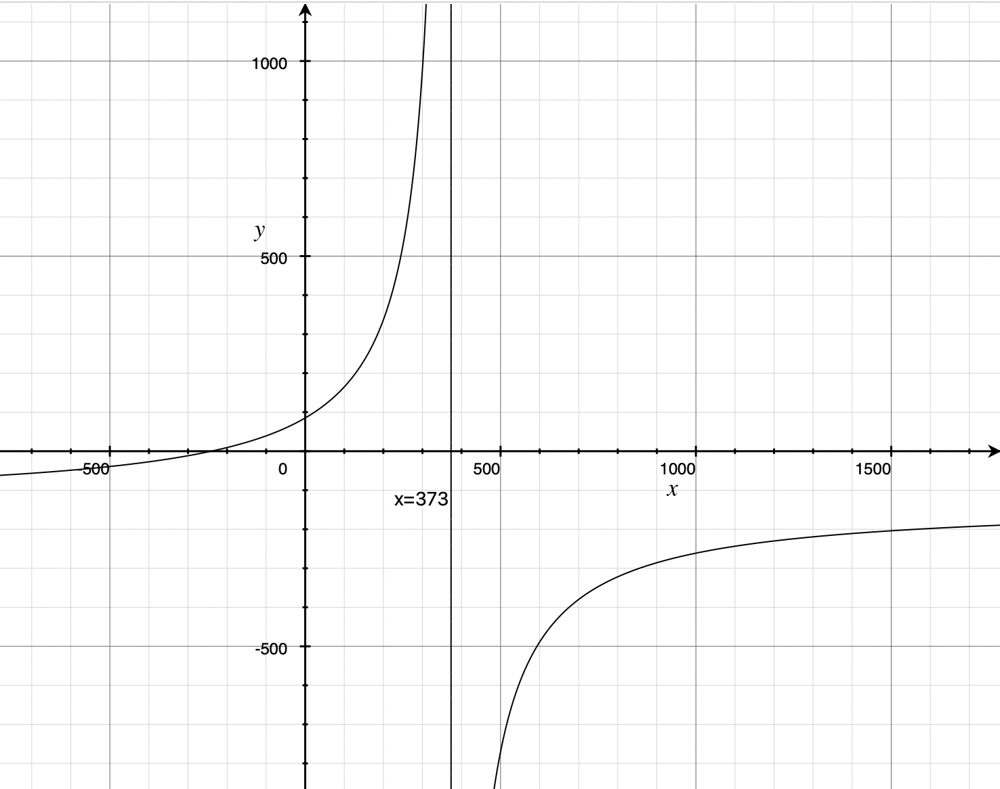
For a distance $0$ between the two lenses we get $v\approx 85$. As $d$ increases, so does $v$ until we reach $373$mm, which would be an absurdly long lens. The practical upshot of all of this is: the lenses can be as close or as far from each-other as needed without running into issues with focusing at infinity since $85\geq 45.46$mm, the shortest possible distance with the given mount.

## Why bother
This may seem like a silly exercise in algebra for something that doesn't matter, just cram the two lenses together and see if the image they project is focused for an object at infinity with a back focal distance greater than the limitation imposed by the flange-focal-distance fo the lens mount. And you'd be right! But sometimes it's nice to back things up with numbers, and it gives you some theory to play around with without having to deal with physical experimental setups and such. Now I can design new lens systems with glass I have yet to purchase, knowing just the focal length of the lenses. Or I can figure out how much room for play there is to add something like a mechanical iris or other system to work as an adjustable aperture on the complex lens.

## Optical Ray Tracer
A picture may be worth a thousand words, but Optical Ray Tracer is worth a billion calculations. Fill out some parameters to copy your lens, Move some things around, and suddenly you have a virtual version of the lenses that you can move around and ray trace with. This tool was incredibly helpful in the designing process and super easy to use. Not to mention it is released under GPL, it truly is a wonderful open-source project.[^OpticalRayTracer]


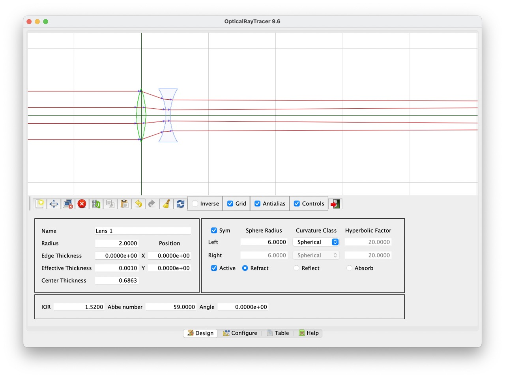

# Drafting
Modern lenses are mechanical beauties. So many small, intricate parts machined precisely and with great complexity. Simply put: beyond my construction abilities *(for now...)* But a lens doesn't need fancy helical focus systems, mechanical irises, or even (as you'll find out) a properly spec'ed mount system. It really just needs to be a light tight tube that can move the lens back and forth for focus that can be affixed the camera.

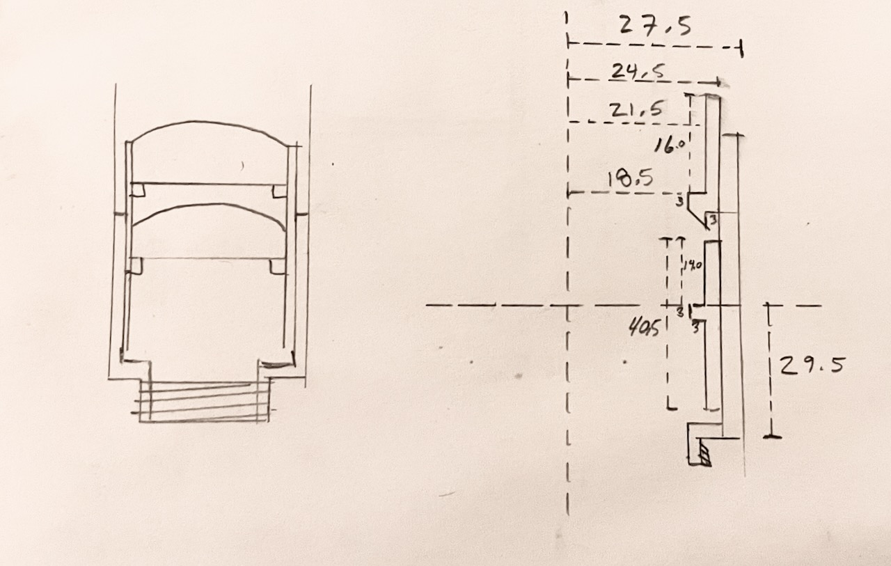

## Blender afficionado?
Towards that end, I can carve wood crudely, I've worked with angle iron back when I thought I was going to be an engineer, and I have tried my hand at polymer clay --- all three would have turned out with astonishingly horrible results even with this simplified design. However, and in my favor, I do have access to an SLA 3D printer that uses UV sensitive material to build up 3D objects using nothing more than an LCD screen that emits UV light and single-axis print bed. 

Ever the artist and technologist I have a pretty long history with the open source 3D modeling software [Blender](https://www.blender.org). It really is quite a powerhouse app, and I think one of the better examples of the beauty of open source software. Romanticism aside, it isn't exactly the *best* tool for printing objects, but I know how to use it, my designs are simple enough to draft accurately on a point-by-point basis, and it's free.

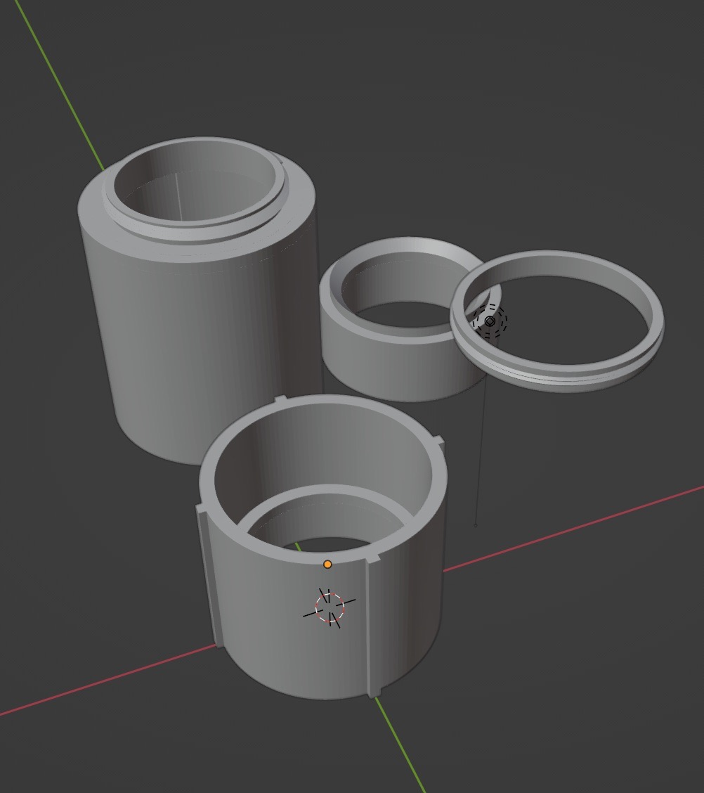

The basic design is simple: a big tube to connect to the camera body and a smaller tube to go inside the big tube that is made from two parts that hold the two lenses a fixed distance from each other. The two parts of the smaller tube have small annular "shelves" with an inner radius smaller than that of the lenses so that they can be glued into place without rotation on two axis (the third axis of the lenses are aligned through the optical center of each by virtue of the inner diameter of the smaller tube being equal to the diameter of the lenses themselves). 

## Printing
The first iteration on this I tried to be fancy and included two "improvements" to the basic design

1. M42 mount. This one seemed easy! Just make a threaded base that matches the spec of the M42 screw mount. Internal diameter 41mm, external diameter 42mm, 1mm thread pitch. Take a triangle with base 1mm and height 1mm, oriented with the base 41mm from the origin and the apex 42mm from the origin, spin it around a couple of revolution moving up 1mm with each full turn. It printed **beautifully**, I was so proud of my handiwork. Until I tried to screw it onto my Praktica and learned that SLA resin is not very strong and the metal on the screw mount of the camera absolutely decimated the threads. Ah well. I can work around it.
2. Internal "rails" to keep the lens stable. These, as printed, would induce linear motion of the lens. This in and of itself isn't particularly useful for the lens design as is but is indeed a nice feature down the line especially when using something like a polarizing filter whose orientation greatly effects the image. The goal was to print these rails then modify the body afterwards to add an easy stop on the inside to limit focusing past infinity (build for tolerances then fine tune it). The first print I didn't scale down the rails enough for the smaller tube to fit in the larger. The second attempt I tried a print-in-place method that resulted in the tubes forever melded together. No third attempt but it could work, at any rate.

I went back and removed all the complexity from the design and ran the print for another attempt. The results were...discouraging.


The people who have the patience to deal with this amaze me. I certainly didn't have the interest to try again. But over-engineering saved me again. The core part of the failed piece were printed correctly, namely the "shelf" and any semblance of a tube were enough to work with. The full length of this part was initially designed so that the bottom of it rested against the bottom of the larger tube with the rear lens exactly the back focal distance away from the focal plane. It's a shorter overall length but enough that the inner tube is still contained entirely within the outer tube even when focused on near object, so "it's good enough" was the prevailing wisdom.

# Assembly
The assembly of the lens was pretty straight forward. Clean the component lenses as well as possible. Glue both onto their corresponding shelves. Glue the two parts of the inner tube together. Insert the inner tube into the big tube. Voila, a lens.


Wow so blurry and out of focus...it's artsy?

# Mounting
Okay assembly had one more thing to account for since my attempt to print the M42 screw mount failed miserably. I scraped the idea of mounting it to my Praktica (for now, although I'm sure there is a way to do it by extending some platform right around the flange end of the larger cylinder and extensive use of rubber bands). Instead, I went with the mount on my digital camera which ultimately made testing the lens much easier than film ever would have been. Since the lens was designed to fit in a M42 mount without threading, I ordered an M42 to EF-S adapter, glued the large tube into place and suddenly I had an EF-S mount diy lens.


# Using it
Usage is pretty straight-forward: aim at a subject, pull the lens out to focus closely or move it in to focus farther away. There is no aperture to concern yourself with (so convenient!) so exposure needs to be controlled via shutter speed and ISO (or creative use of something else to make an ad-hoc aperture)
The inner tube I downsized maybe slightly too much in that it wiggles a bit when extended for close focusing. "Artistic limitations".


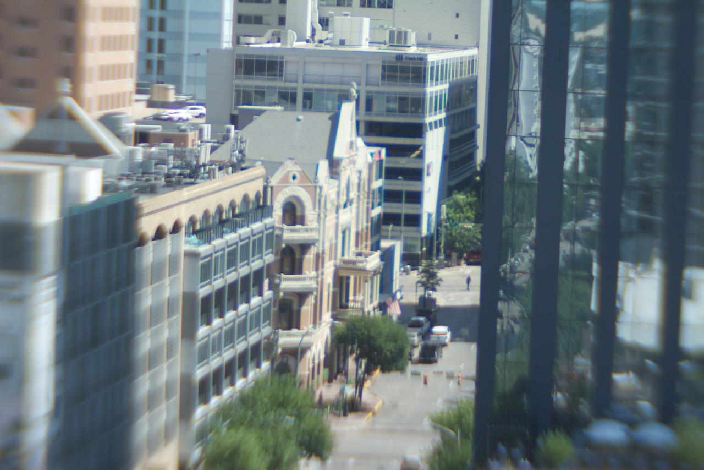

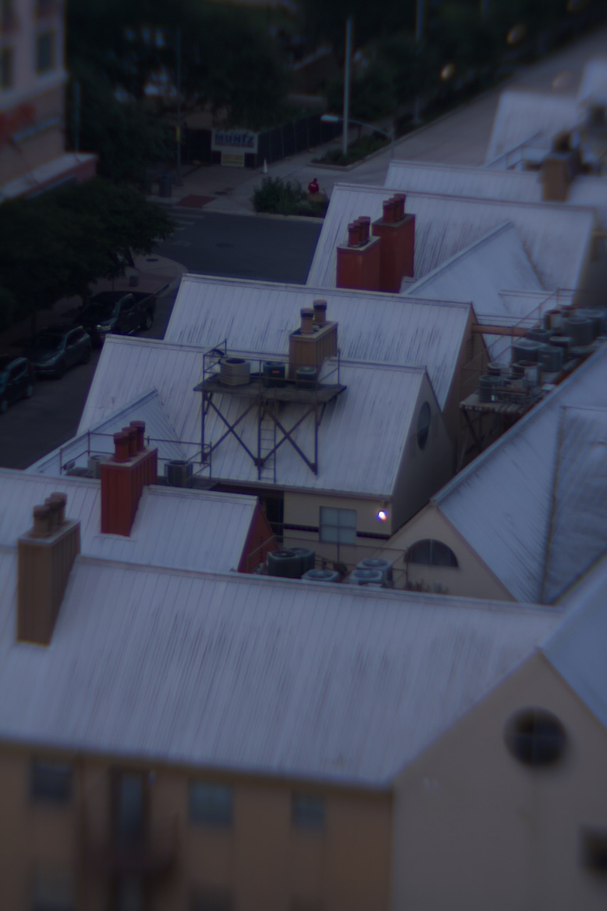

# Final thoughts
I really enjoyed this project. It was a longggggg process in the making, and there is so much more I can improve on. For the next iteration I'd like to figure out a better sliding mechanism, be that rails or some kind of helical screw. A proper aperture is also a must to help bring the edges of the photo in focus. See below for some results to judge the photo quality yourself.

# Gallery
<section class="gallery" markdown="span">
    <div markdown>
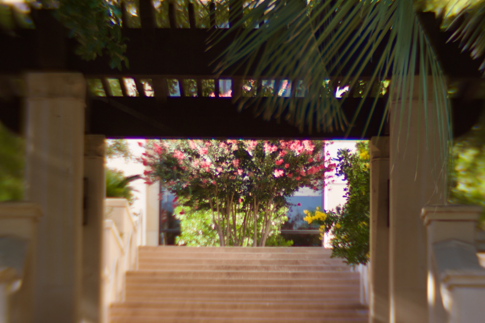

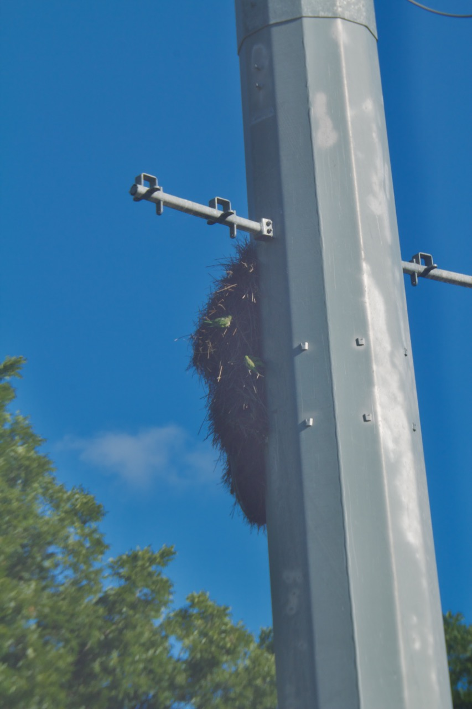

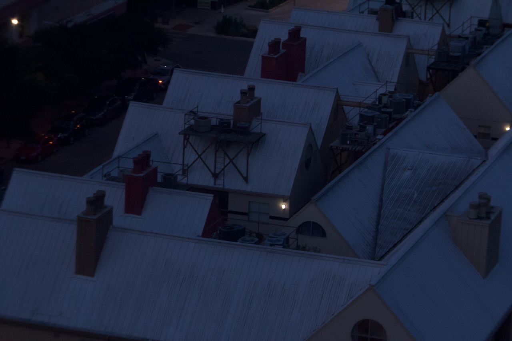

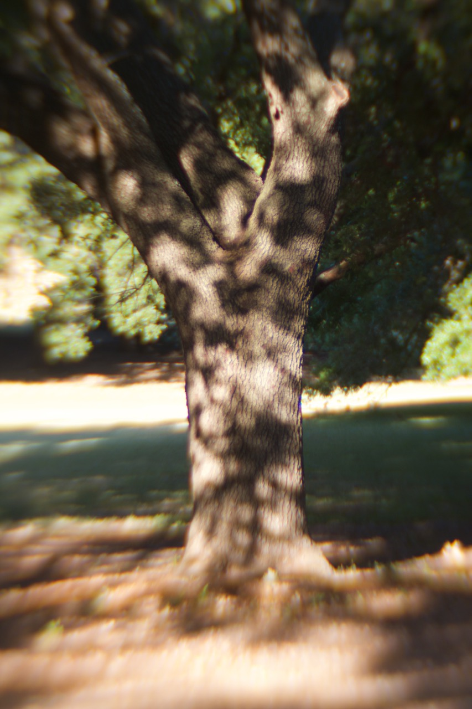


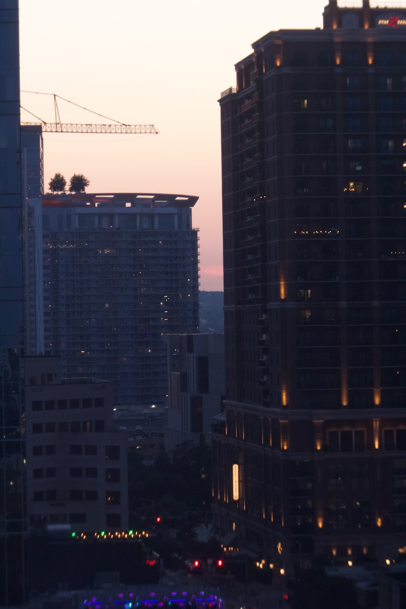
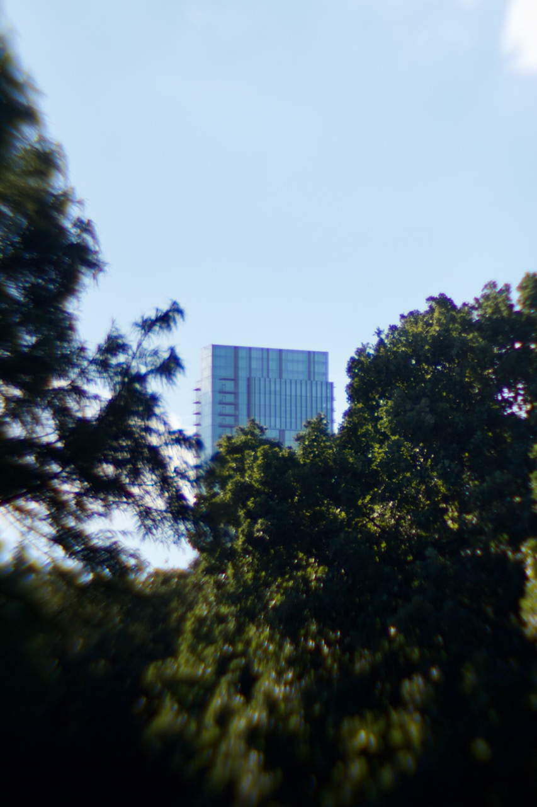


    </div>
</section>

# References
[^SHRaza]: S.H. Raza Nad Bindu. 1995, 175½ x 150 cms, acrylic on canvas. [rlfinearts](http://www.rlfinearts.com/artists/artist/s.h.-raza)
[^OpticalRayTracer]: Optical Ray Tracer. Paul Lutus. [arachnoid](https://arachnoid.com/OpticalRayTracer/)


