title: Knitting Interpreter
date: 2024-02-26
tags: programming,knitting
mathjax: true
codehilite: true
---
<link rel="stylesheet" href="./knitting.css">

# Motivation
This project began from the want to test knitting patterns before going through the labor of knitting it up physically. I had been drafting a cable-knit pattern for a long time, and each iteration meant a lot of wasted time plotting out cables and knitting a test piece. Naturally it got me thinking: can I do this with software?

There are three main components to the suite of tools that came from this idea: the parser generator, the knitting pattern api, and visualization. The three in tandem allow a user to parse a knitting pattern, translate it into a data structure, and then estimate the physical form of the finished object in 3d space.

<figure class="figure" markdown="span">

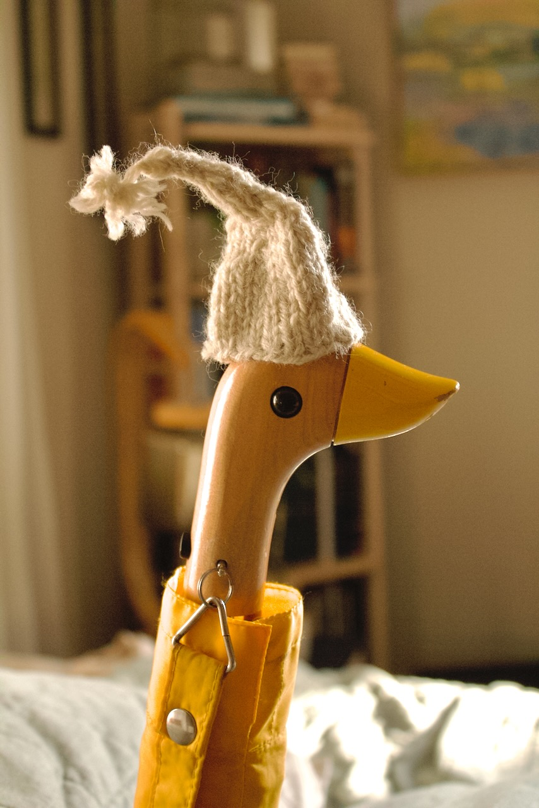
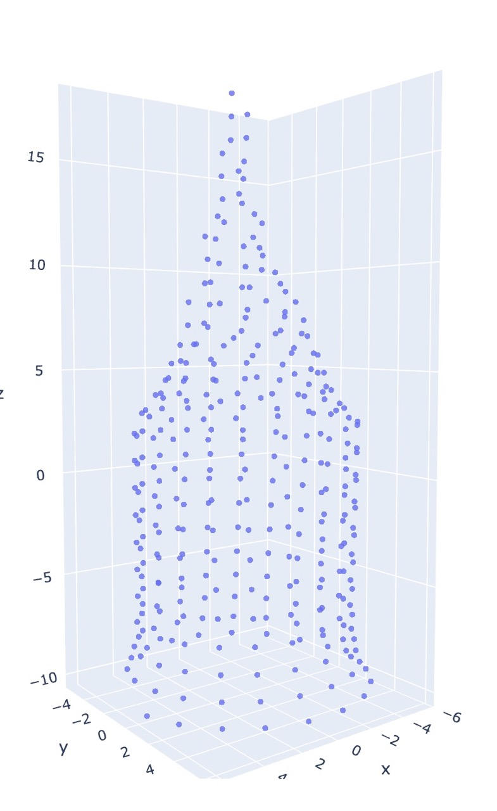
<figcaption markdown="span">A knitted hat for the duckbrella and its estimated visualization
<br/>

`co20 (k20)10 (k2tog k5)18`
</figcaption>
</figure>

_**Find the code on [Github](https://github.com/ryanramsdell27/knitting)**_

[TOC]

---

# Defining a formal language: concepts of knitting

What's a knitting pattern other than a program you can execute on knitting needles? No pattern writer follows an exact set of rules when writing out a pattern, but there are a number of widely adopted norms that make defining a formal knitting language easy.

## Casting on
The first step when knitting is always to cast on stitches -- this places new live stitches on the needle that can be knit from later.

Generally this is represented in a pattern as some variation of `cast on X` or `coX` for `X` number of stitches.

## Knitting
The knit stitch is the most basic knitting operation. It creates a new loop on top of the next live stitch.

This is denoted with `knit` or `k` for singular operations, or `knit X` or `kX` for doing `X` number of stitches.

## Purling
Purling is the reverse of a knit stitch.

This is denoted with `purl` or `p` for singular operations, or `purl X` or `pX` for doing `X` number of stitches.

## Decreases
Decreases are a way of reducing the total number of live stitches on the needles. There are several ways of doing a decrease, including slipping stitches over others, and knitting or purling stitches together. For now, I consider just two forms: knitting or purling some number X of stitches together. This operation builds the new stitch with the next X live stitches as its parents.

These decreases are expressed as `knitXtog` or `kXtog` for knitting `X` live stitches together, or analogously `purlXtog` and `pXtog` for purling.

## Increases
Increases are the opposite of decreases, and add additional live stitches onto the needles. For the purpose of this program, increases will be interpreted as "makes", which take a single live stitch and builds two children stitches with the single shared parent. These increases can be done as knits (default) or "purlwise", and also can be done to have a left or right lean to them.

Increases can be given as `make X` or `mX` for adding `X` stitches. Adding in the optional specifiers, we should also aim to capture `make X purlwise left` or `mXpl`.

## Repeats
A key structural tool in knitting patterns is the concept of the repeat, which tells the knitter to do some combination of stitches multiple times. This is already seen in the [knit](#knitting) and [purl](#purling) productions, like the construction `k5`, but can be generalized to a combination of expressions, i.e. doing the sequence `knit 5 purl 4 k2tog` 5 times.

To represent repeats for an expression, I've adopted the notation `(<EXP>)X` where `<EXP>` is any valid sequence of operations, including other repeats, that will be done in sequence `X` number of times. For example, `((purl 2)4 knit 2)5` will result in 50 stitches.

---

# JavaCC: parser generator

Parsing a pattern isn't a trivial exercise, especially with looping and nesting constructs. To simplify this process, I've made use of JavaCC[^javacc] (Java compiler compiler). By equipping this parser-generator with a grammar specification, it produces java code capable of interpreting/matching input (in this case a knitting pattern) to that grammar.

## JJTree
In addition to the parser generator, JavaCC includes JJTree which produces a tree representation of the input sent to the parser. JJTree specific metadata can be included in the grammar specification used by JavaCC through the definition of Abstract Syntax Tree (AST) nodes. 

When the generated parser produces a tree, it maps a matched production (like `knit 8` or `(p3 k4)6`) to a well-defined object (AST class), with information that can be used in interpreting the tree[^nmsu]. For example, the grammar can specify that JavaCC should recognize `knit 8` as a valid expression, the jjtree information within that grammar spec will turn that expression into some object that semantically knows that the instruction was `knit` and that there are `8` stitches, which then becomes accessible information when interpreting the tree later. The AST classes defining such objects are auto-generated but can be overwritten to include the additional metadata.

## Tooling

Working with JavaCC is a bit cumbersome by default. JavaCC reads a grammar specification, generates java code (the actual parser) which then needs to be compiled within the context of some other application in order to be useful. Java's dependency managers help simplify this process.

I made use of the JavaCC Compiler Plugin for Gradle[^javaccGradle]. Configuration is easy, and the parser generator runs at build time before compiling the rest of the code so that the necessary files (parser and jjtree AST classes) are in place for the rest of the build.

---

# Grammar specification

## Tokens
The first step in writing the grammar specification is to define some tokens. These are the regular expressions that the parser will recognize as valid strings in the grammar.

```.javacc
SKIP : { " " }
SKIP : { "\n" | "\r" | "\r\n" }
TOKEN : { < NUMBER : (["0"-"9"])+ > }
TOKEN : { < CAST_ON : "cast on" | "co" | "caston">}
TOKEN : { < KNIT : "knit" | "k" >}
TOKEN : { < KNITWISE : <KNIT> | "knitwise" >}
TOKEN : { < PURL : "purl" | "p" >}
TOKEN : { < PURLWISE : <PURL> | "purlwise" >}
TOKEN : { < TOG : "together" | "tog" > }
TOKEN : { < MAKE : "make" | "m" > }
TOKEN : { < LEFT : "left" | "l" > }
TOKEN : { < RIGHT : "right" | "r" > }
TOKEN : { < OPEN_PAR : "(" > }
TOKEN : { < CLOSE_PAR : ")" > }
TOKEN : { < QUALIFIER : ":" <OPEN_PAR> (["a"-"z","A"-"Z","0"-"9"])+ <CLOSE_PAR> > }
```
The `SKIP` tokens are used to tell the parser that those inputs are to be ignored, in this case white spaces and new lines (with and without carriage returns)

The `<NUMBER>` token matches 1 or more repetitions of digits 0-9.

Everything after is some combination of strings, where things that are semantically the same, such as `knit` and `k`, are parsed as the same token.

The `<QAULIFIER>` token matches strings of the form `:(\w)` where `\w` is an alphanumeric "word".

JavaCC gives precedence to tokens in the order they are defined. For this matter, since `<PURLWISE>` also matches on the token for `<PURL>` it needs to be defined after `<PURL>`. Purlwise is a modifier used to describe an increase/decrease, and syntactically comes after declaring the stitch, i.e. `purl 3 make 1 purlwise`. If the order were switched in defining these tokens, then the parser would output something like `purlwise 3 make 1 purl`, which is garbage.

## Expressions/productions

Parsing tokens by themselves do not provide us with enough information to do anything meaningful, the context in which they appear also needs to be considered! To do that, we define expressions (productions) that the parser will look for, which are strings of tokens to match.

Let's examine the expression for a basic stitch:

```.javacc
void Stitch() :
{
    Token stitchType;
    Token num = null;
}
{
    (stitchType = <CAST_ON> | stitchType = <KNIT> | stitchType = <PURL>)
    [num = <NUMBER>]
    {
        int n = num != null ? Integer.parseInt(num.image) : 1;
        switch (stitchType.kind) {
            case CAST_ON:
                jjtThis.setType(StitchType.CAST_ON);
                break;
            case KNIT:
                jjtThis.setType(StitchType.KNIT);
                break;
            case PURL:
                jjtThis.setType(StitchType.PURL);
                break;
        }
        jjtThis.setNum(n);
    }
}
```
Lines 3 and 4 are just declaring variables to be used later.

Lines 7 and 8 are the pattern to match. It checks for `CAST_ON`, `KNIT`, or `PURL` and assigns that token to the `stitchType` variable. It then looks for an optional `NUMBER` token and assigns that to `num`.

Next, the parsed tokens are converted into more strongly typed objects, in this case `num` becomes an `int` and `stitchType` is mapped to the enum `StitchType`.

Associated with this production is an `AST` (abstract syntax tree) class, a syntax tree node that extends `SimpleNode`.[^nmsu] This is the object produced by the parser and represents the expression in the overall tree once the entire pattern has been parsed.  It can be auto-generated, or  pre-defined with additional fields. In this example, `ASTStitch` has the fields `StitchType type` and  `Integer num`. The production's node is accessible through `jjtThis`, allowing those fields to be set in the parsing phase.

---

# Interpreting a tree

Now that the JavaCC parser generator has created a parser, and the parser has been used with JJTree to produce a tree, the tree still needs to be interpreted.

The process is simple: work down leaves of the tree at the same level in order. For any leaf with children nodes (only repeats in this grammar), work through those children (in order again) the number of times specified by the repeat.

While traversing the tree, any knitting instructions are executed via the [knitting API](#a-knitting-api). The implementation of the API determines what objects you build, in this case I've written two: a simple pattern class that keeps track of stitches and their neighbors (predecessors, successors, and parent/children links), and another that keeps track of the total number of stitches performed as a means to estimate total yarn yardage. This tree traversal effectively converts the input into a linear program, and would be every step a knitter performs in sequence when following a pattern.

```{.java}
public class TreeInterpreter<T extends KPattern> {
  public T interpret() {
    ASTStitch castOn = (ASTStitch) this.root.jjtGetChild(0);
    assert (castOn.getType().equals(StitchType.CAST_ON));
    this.pattern.init(castOn.getNum(), true);
    for (int i = 1; i < this.root.jjtGetNumChildren(); i++) {
      processNode(this.root.jjtGetChild(i), this.pattern);
    }

    return this.pattern;
  }

  private void processNode(Node node, T pattern) {
    if (node.getClass().equals(ASTStitch.class)) {
      ASTStitch stitch = (ASTStitch) node;
      for (int i = 0; i < stitch.getNum(); i++) {
        pattern.basicStitch(stitch.getType());
      }
    } else if (node.getClass().equals(ASTRepeat.class)) {
      ASTRepeat repeat = (ASTRepeat) node;
      for (int i = 0; i < repeat.getNum(); i++) {
        for (int j = 0; j < repeat.jjtGetNumChildren(); j++) {
          processNode(repeat.jjtGetChild(j), pattern);
        }
      }
    } else if (node.getClass().equals(ASTDecrease.class)) {
      ASTDecrease decrease = (ASTDecrease) node;
      pattern.decrease(decrease.getType(), decrease.getNum(), decrease.getDecreaseType());
    } else if (node.getClass().equals(ASTIncrease.class)) {
      ASTIncrease increase = (ASTIncrease) node;
      pattern.increase(increase.getType(), increase.getNum(), increase.getIncreaseType());
    }
  }
}
```

The interpretation phase starts with the assumption that the first node in sequence will be `ASTStich` with type `cast on`. The API specifies an `init` method that will set up the first cast on stitches, since they can behave differently than other stitches: they have no parents and joining in the round requires making non-standard links.

Following that, nodes in the tree are processed by working down the tree. The only branching mechanism here is the `Repeat` production, which recursively and repeatedly processes its children nodes. The other expressions map to constructs of the API, so the chosen implementation calls the associated method, passing the proper meta-data as gathered from the parsing step.

---

# A knitting API

In much the same way the parser grammar was constructed, there needs to be something to map input into actual instructions. The API can be used for generating a pattern object for analyzing the final network of linked stitches, as a base for building a mesh representation of the knitted object to be loaded in some 3d visualization software, or really anything as long as it supports the following methods.


_**void init(int numStitches, boolean join);**_
 >  Initial cast on of a project. It takes the number of stitches to initially cast on and whether to join in the round. The join param is still in process, the parser currently has no mechanism for identifying joins, and all implementations of this API default to being in the round.

_**Stitch basicStitch(StitchType type);**_
  > Performs a stitch operation of StitchType type onto the current knitting pattern, i.e. knit, purl, cast on. It will return the stitch object it performed.

_**void decrease(StitchType type, int num, DecreaseType decreaseType);**_
 > Perform a decrease that combines num stitches together.

_**void increase(StitchType type, int num, IncreaseType increaseType);**_
 > Perform an increase of num stitches.

---

# Visualization

Once a pattern has been parsed and interpreted into some data structure, it can then be visualized. The goal here is to convert a graph (a collection of vertices with weighted edges) into a 3d mesh, preserving edge weights as pairwise distances between vertices.

## Naïve approach
The current linear time solution is to map stitches to coordinates in 3d space by estimating where they would be based on which row/round in the pattern the stitch is, and how many stitches are in a round. This will place each stitch on a circle with a radius determined by the number of working stitches. This is not very accurate for anything besides tubes.

<figure class="figure" markdown="span">

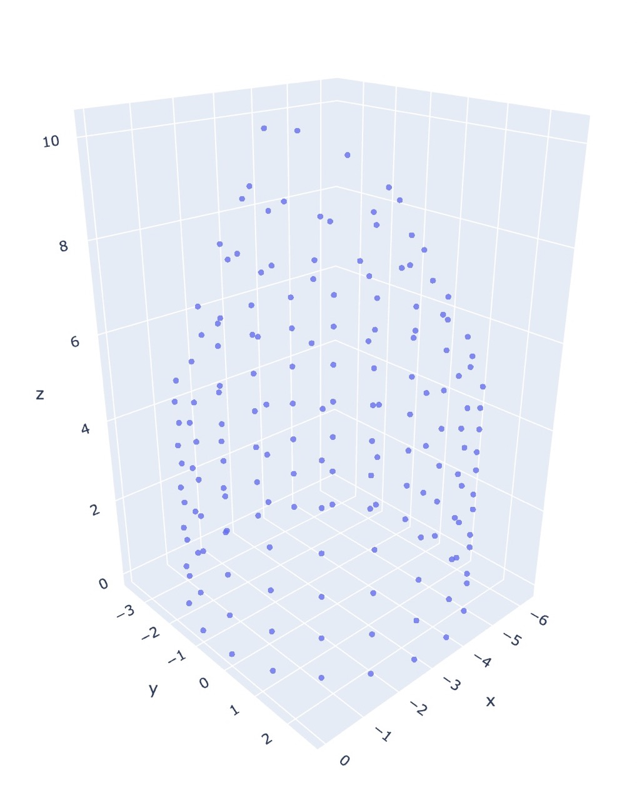
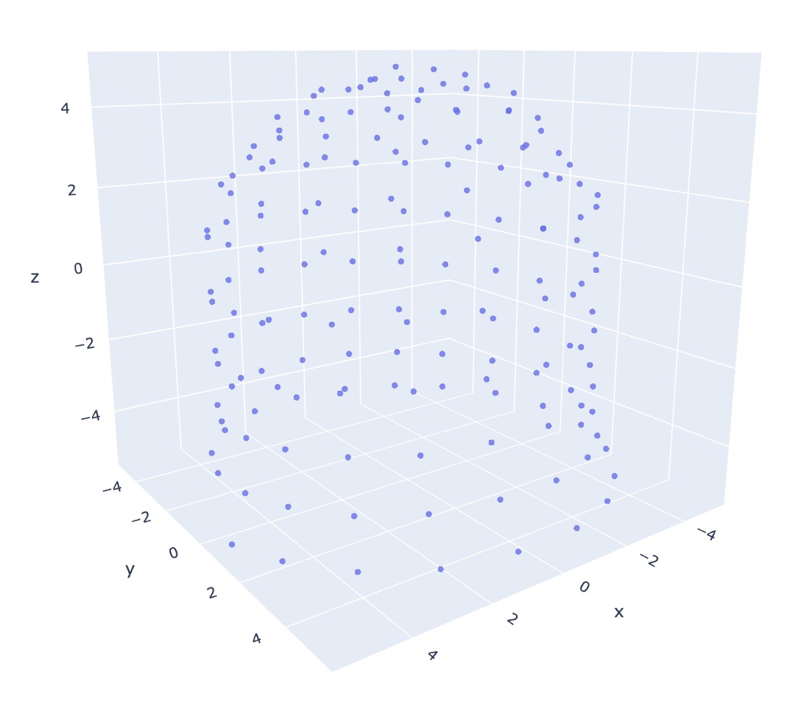
<figcaption markdown="span">The naïve approach vs MDS for a "hat" pattern<br/>

`co20 (k20)5 (k2tog k4)5 (k2tog k3)4 (k2tog k2)3 k8tog`
</figcaption>
</figure>

Notice that it fails to consider the pull of neighboring stitches as decreases are performed, resulting in each round/row being equidistant (conical shape). Instead, as in the MDS case, the final form is much rounder.

<figure class="figure" markdown="span">

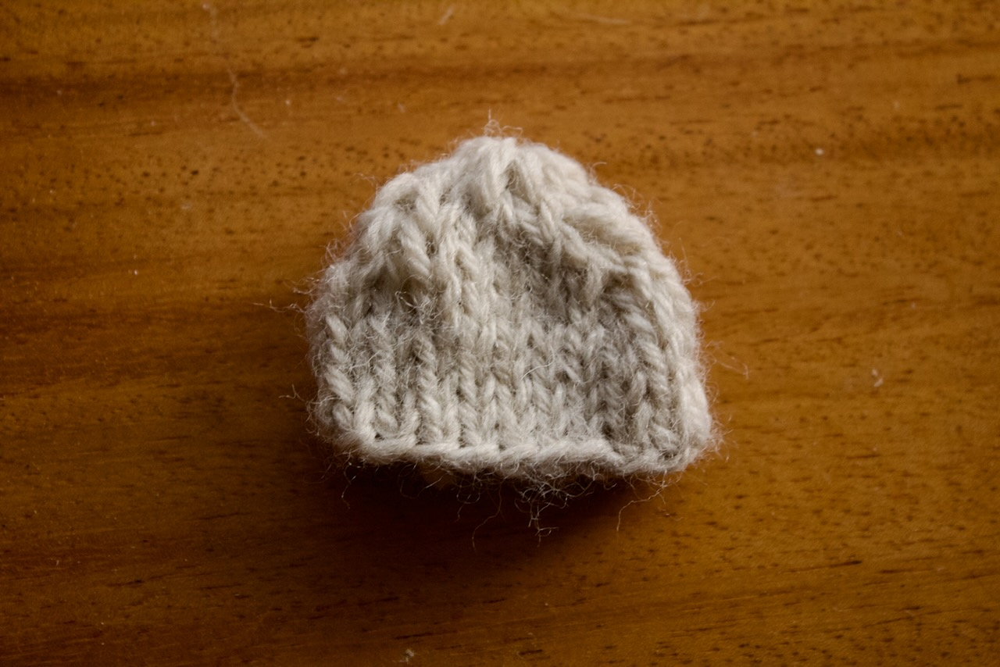
<figcaption>An object in the real world</figcaption>
</figure>

The physical object turns out to be even stouter than either estimation.

## Multidimensional scaling
An alternate solution is through constructing a dissimilarity matrix based on distance along the surface of the knitted object as represented as walks on the graph of stitches (with edge weights determined by stitch type). This matrix is constructed by finding the shortest paths between each set of points, and then through multidimensional scaling (aka principal coordinate analysis) it can estimate coordinates in euclidean space.

### Why should this work?
MDS takes `n` data points in `m` space, and reduces it to an `nxr` matrix for some chosen value of `r`, trying to preserve pairwise ditances between each of the `n` points. Generally the `m` coordinates of a datapoint is some collection of meta-data. As an example, it could be results of a survey on cheeses, each datapoint corresponds to a cheese, and is a vector of measures like (hardness, scent, nuttiness, age, fat percentage, tonnage produced per year). 

We could then reduce these 6 dimensions to 2 by performing MDS. The dissimilarity matrix is simply made up of entries that are the pairwise euclidean distance in $\mathbb{R}^6$ between each cheese type. The resulting `nx2` matrix maps each of the `n` cheeses to only 2 dimensions, the semantics of which we don't know. But the beauty of MDS is that this dimensionality reduction may show some pattern in the data: there could be a strong correlation between hardness, age, and nuttiness so cheeses that had similar values in all three of those categories, may be mapped to similar locations in 2-space.

Now back to the case of knitting, the dissimilarity matrix is the collection of shortest-paths between each point. Path length is itself a measure of distance, so the resulting 3-space coordinates from MDS will be strongly tied to this relative distance as it tries to preserve each pairwise path-distance now with a new (euclidean) metric. 

<figure class="figure" markdown="span">
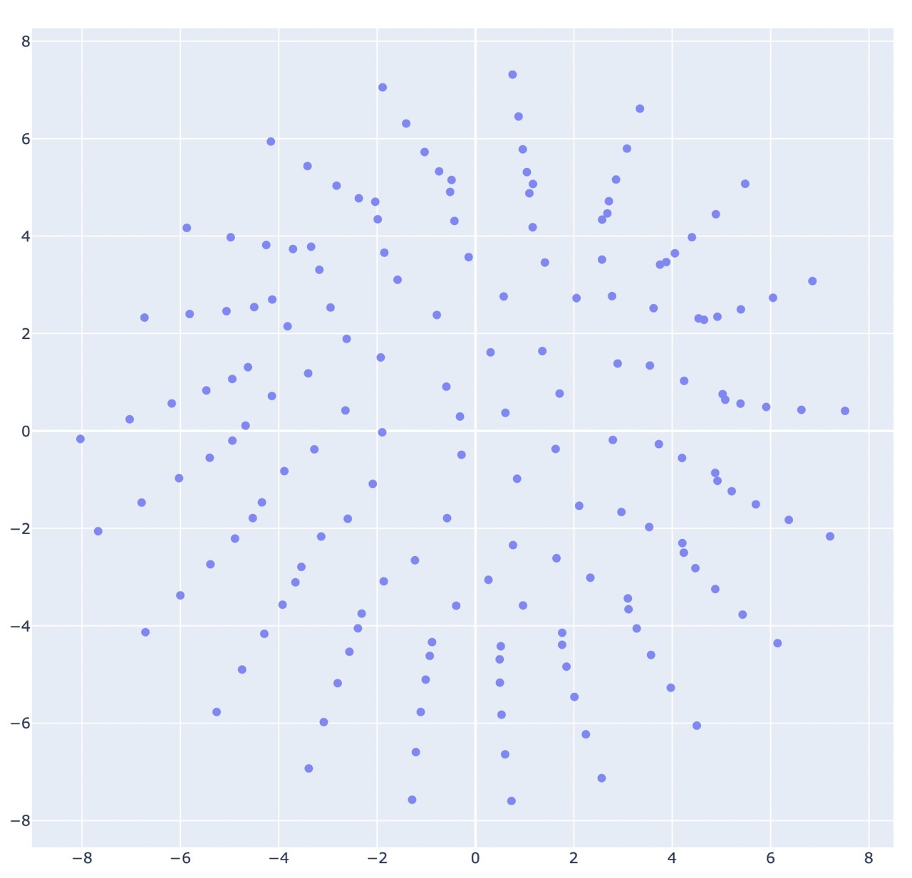
<figcaption>2d projection of the "hat" pattern</figcaption>
</figure>

### Constructing a distance matrix
The first step in performing MDS is constructing a dissimilarity matrix $M$ given the graph $P$ of stitches $s_i$ in the pattern. Each entry $e_ij \in M$ is the distance $d(s_i,s_j)$ for stitches $s_i,s_j\in P$. 

There are many ways to define distance, but in this case we consider it to be the shortest path between stitches in the graph. For the initial phase of this project we assume that if $s_i$ and $s_j$  share an edge (i.e. are neighbors), then the length of that edge is $1$. In real life, this number is likely to be different depending on the type of stitches --- switching between knits and purls produces ribbing that is more elastic than stockinette (straight knits or purls in the round), which suggests that the distance between knits and purls is shorter than that between stitches of the same type. Additionally, left-right distances are often longer than up-down.

Finding the shortest path on a graph is a well known problem in computer science, and there are multiple algorithms that may be helpful.

#### Depth limited BFS
This implementation arose from the goal to build fast without worrying about complexity or problems with scale. It performs breadth-first search starting from each stitch, initialized with its neighbors in the queue. This search is limited to a fixed number of hops from the source, and the distance matrix is updated with the shortest path found between the source and the node.

It relies on the assumption that edges are positive, non-zero lengths and that the graph is connected. 

The distance matrix can be rather sparse with this algorithm. Since not all stitches will connect in a path shorter than the limited depth, the matrix will potentially have several 0 distance entries. The MDS algorithm needs to be aware that these 0 distances are not that the stitches are superimposed, but instead that their relative effect on each-other is negligible. 

It is incredibly inefficient. But works fine enough on smaller graphs that it filled the need as I built out other parts of the system.

#### Floyd-Warshall[^rosen]
Consider $G$, a directed weighted graph with no negative cycles on $n$ vertices. The Floyd-Warshall algorithm finds all pairwise-shortest paths between each of the n vertices in $\mathcal{O}(n^3)$ time. The basic principle is that it checks if the known distance between two vertices, $j$ and $k$, can be made shorter by going through an intermediary vertex $i$.

Space is bounded by the distance matrix, so it's necessarily $\mathcal{O}(n^2)$.[^floydNote]
```
let D be an nxn matrix with values initialized to infinity
for edge e_ij in G:
  D[i][j] = weight of e_ij
for i from 1 to n:
  for j from 1 to n:
    for k from 1 to n:
      D[j][k] = minimum of D[j,k] and D[j][i] + D[i][k]
```
#### Repeated Dijkstra's
Dijkstra's algorithm produces the shortest path tree for vertex $s_i$ to all $s_j$ in graph $G$[^dijkstraNote]. Running this algorithm for each vertex in $G$ then would be enough to generate a dissimilarity matrix for the whole graph.

```
let d be a nx1 matrix
let q be a queue
for vertex v in G:
  d[v] = infinity
  add v to q
  
  while q is not empty:
    u = v in q with min d[u]
    remove u from q
    
    for each neighbor v of u still in q:
      alt = d[u] + e_uv                   #e_uv is the edge length between u and v
      d[v] = minimum of d[v] and alt
return d
```

On graph $G$ with $n$ vertices and $m$ edges, the base operation of the algorithm is $\mathcal{O}(n^2)$ for a single vertex in $G$, so total complexity is $\mathcal{O}(n^3)$.

This can be improved using a min priority queue, reducing base complexity to $\mathcal{O}(m + n\log{n})$ and total to $\mathcal{O}(nm + n^2\log{n})$[^dijkstras], I have yet to do this, but it is promising, as most stitches are only connected to 4 others (a parent, a predecessor, a successor, and a child), so the $m$ term is likely on the same order as $n$ for most valid patterns.

#### Johnson's algorithm[^johnsons]
I haven't implemented this algorithm. It supposedly is also $\mathcal{O}(nm + n^2\log{n})$ for a graph on $n$ vertices with $m$ edges.

### Performing MDS
With a dissimilarity matrix in hand we can now use multidimensional scaling to map our vertices into 3d euclidean space. 

There are a few publicly available libraries that implement MDS. An opensource java library is available from the University of Konstanz[^mdsj], although I opted not to use this one because I was unsure of what licensing (if any) that I wanted to use here. 

Instead, I made use of the python scikit-learn[^sklearn][^sklearnUG] library, a collection of ai/data tools built around numpy, scipy, and matplotlib.

#### Metric vs non-metric

The scikit docs explain it better than I can
> In Metric MDS, the input similarity matrix arises from a metric (and thus respects the triangular inequality), the distances between output two points are then set to be as close as possible to the similarity or dissimilarity data. In the non-metric version, the algorithms will try to preserve the order of the distances, and hence seek for a monotonic relationship between the distances in the embedded space and the similarities/dissimilarities.[^sklearnUG]

A key part of these distinctions is that non-metric mds can have 0-weighted edge length to indicate missing values. This allows for an incomplete dissimilarity matrix as would be the case for [depth limited bfs](#depth-limited-bfs). This also opens the door to limit other algorithms, possibly reducing their overall runtime complexity.


The following figures are the output of the pattern `co20 (k20)10 (k2tog k5)18`, using the repeated Dijkstra's algorithm for generating the dissimilarity matrix.

I found that non-metric mds does not do well unsupervised, and is better suited for refining coordinates rather than generating them.

<figure class="figure" markdown="span">

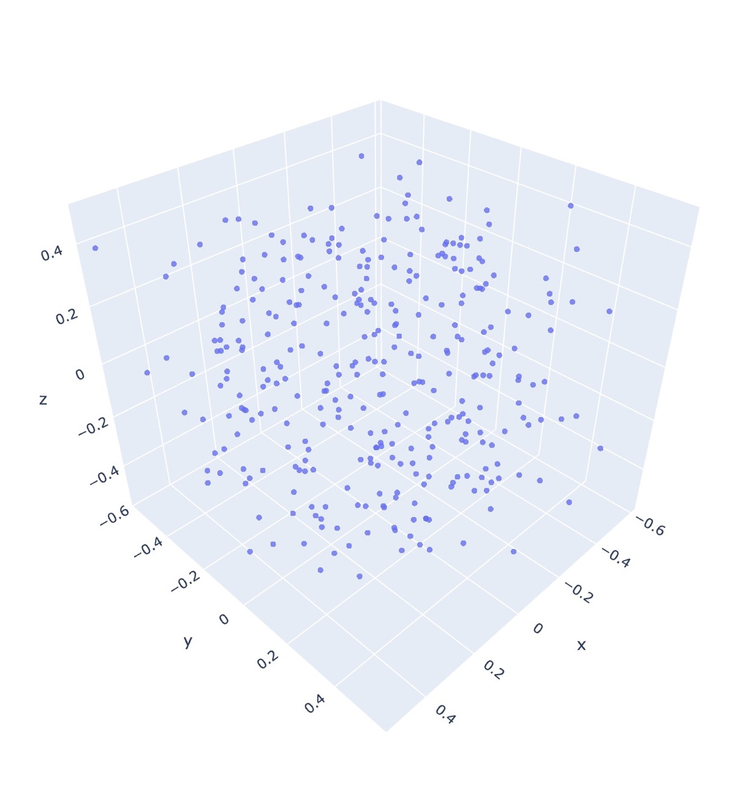
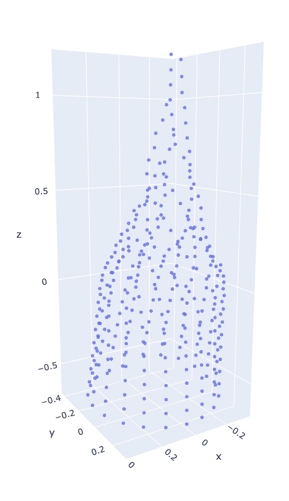

<figcaption>Uninitialized non-metric MDS vs initialized</figcaption>
</figure>
Wow that's a big difference! And this is using a complete dissimilarity matrix.

As for metric MDS, the algorithm is able to infer the general shape without any prior coordinate information! Furthermore, initialization only makes a subtle difference.

<figure class="figure" markdown="span">
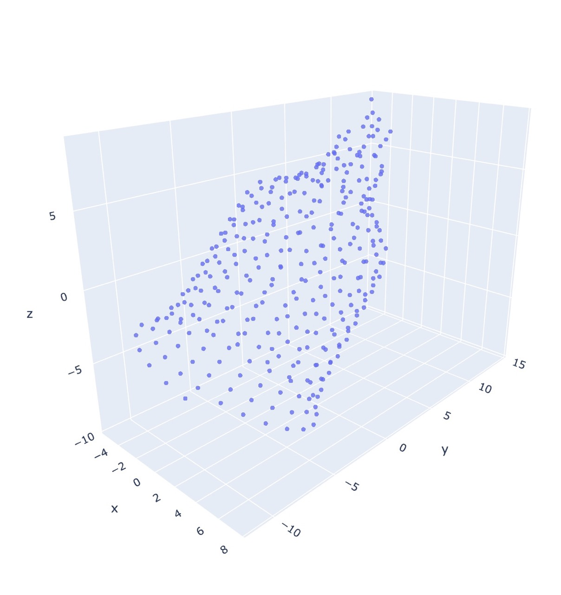

<figcaption>Uninitialized metric MDS vs initialized</figcaption>
</figure>

One thing to note is that in both the initialized and uninitialized metric case, there is an observed flaring near the bottom of each graph which is not present in the non-metric initialized output, and we actually get the opposite effect in real life.

<figure class="figure" markdown="span">

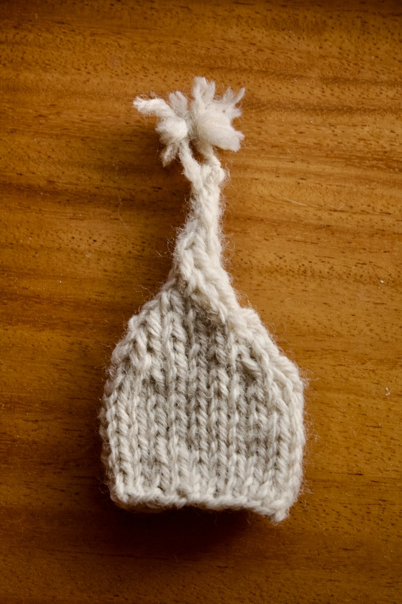
<figcaption>The knitted funnel "hat", complete with pom-pom</figcaption>
</figure>

#### Computational limitations

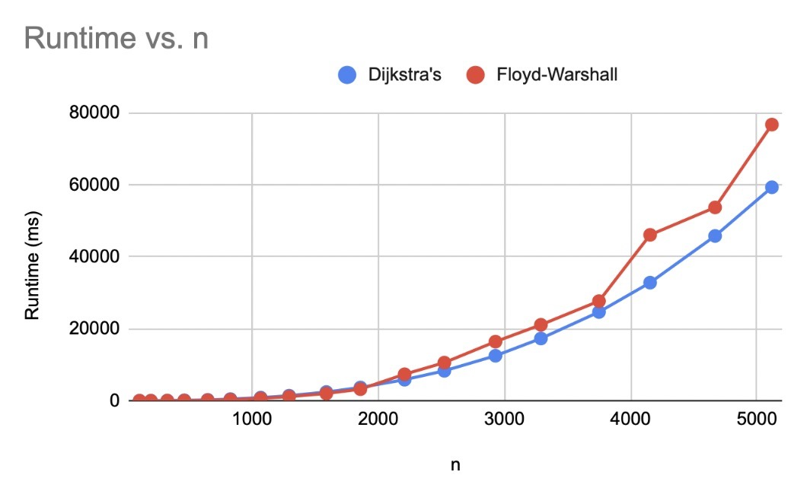

Unfortunately, this is not a cheap analysis to perform. The shortest path algorithms all are $\mathcal{O}(n^3)$ for $n$ stitches (although this can be improved given the assumption that we don't have a complete[^completeGraph] graph, as seen with Floyd-Warshall, Dijkstra's, and Johnson's). There are other algorithms than have stricter requirements on the starting graphs with better bounds, that may be applicable to this use case, see Raman[^raman] and Thorup[^thorup].

Space also becomes an issue as patterns become larger. Everything is bounded below by the size of the dissimilarity matrix, which is $\mathcal{O}(n^2)$. Since I want to support non-integer distances (knit-knit edges are longer than knit-purl), I've opted to use the `double` type in java. This is an 8 byte type, if we take a max heap size for the jvm of 2gb and assume our `double[][]` array can use it all with no overhead from the rest of the app, we're looking 2e+9 bytes = 250000000 doubles = (roughly) 15811 stitches. This is under the median number of stitches in a sweater (20,000)[^fruehwald] and already the problem is feasibly incalculable! Switching the type to `int`, at 4 bytes, would get us to some 22360 stitches in that 2gb space, but the math doesn't bode well for scaling. I could switch data types to use a disk-backed array, but I fear that time considerations would only be made worse with constant lookups.

Classical MDS might not be a tenable solution for larger datasets. As an alternative, there are a few algorithms that approximate MDS without needing the entire dissimilarity matrix in memory, or the large time constraints[^delicado]. An interpolation-based algorithm using Gowler's interpolation forumla[^gowler] seems a promising solution but still holds a lot to be explored. My current concerns are: I've never used R, and the implementation provided by Delicado implicitly uses the euclidean distance on subsets of the data -- I'd have to re-implement the shortest path metric, repeated Dijktra's is a strong contender since that one can be modified so as not to produce the entire `nxn` dissimilarity matrix, but possibly Johnson's, Raman, or Thorup may work as well.

---

# Closing thoughts

Altogether, I am quite happy with how this project has been coming along. The parser-generator can interpret patterns closely resembling those in the real world, the knitting API is simple enough to be implemented multiple ways, but expressive enough to capture key information about a knitting pattern, and the visualization via both geometric and statistical methods produce a plausible 3d representation of a knitted object.

Of course, there is still a lot to improve on. So many features to implement from the parsing side: cables, stranded color work, short rows, flat knitting, intarsia, lacework, etc. Expanding the API to support all of those will likely introduce some complexity -- particularly the color work seems troublesome. And then finally reflecting those new features in the visualization will undoubtedly have its issues. Beyond that, performance enhancements for MDS on larger data sets depend on rethinking the approach from the classical implementation to one of the algorithms given in Delicado[^delicado]. I've also done some simulation work with Blender with the naïve visualization approach, but haven't updated it to use the output of MDS. Improving the mesh generation part of that code to produces proper edges and faces would be ideal, and using the fabric simulator there may produce interesting results.

# References and Notes
[^javacc]: Java Compiler Compiler [docs](https://javacc.github.io/javacc/)
[^nmsu]: Roger Hartley. Writing Interpreters with JavaCC. New Mexico State University. [site](https://www.cs.nmsu.edu/~rth/cs/cs471/InterpretersJavaCC.html)
[^javaccGradle]: JavaCC Compiler Plugin for Gradle [repo](https://github.com/javacc/javaccPlugin)
[^rosen]: Keneth H Rosen. Discrete Mathematics and Its Applications (With Combinatorics and Graph Theory), Seventh Edition. Graphs, section 8.6 Shortest-Path Problems. McGraw Hill.
[^floydNote]: *I present these bounds as fact, but you can verify yourself.* Further reading on Wikipedia [Floyd-Warshall algorithm](https://en.wikipedia.org/wiki/Floyd–Warshall_algorithm)
[^dijkstraNote]: *The original variant only produced the shortest path from $s_i$ to $s_j$.* See more on Wikipedia [Dijkstra's algorithm](https://en.wikipedia.org/wiki/Dijkstra%27s_algorithm)
[^dijkstras]:[Dijkstra's algorithm](https://en.wikipedia.org/wiki/Dijkstra%27s_algorithm)
[^johnsons]: [Johnson's algorithm](https://en.wikipedia.org/wiki/Johnson%27s_algorithm)
[^mdsj]:Algorithmics Group. MDSJ: Java Library for Multidimensional Scaling (Version 0.2). Available [here](http://www.inf.uni-konstanz.de/algo/software/mdsj/). University of Konstanz, 2009.
[^sklearn]: Scikit Learn. [MDS Docs](https://scikit-learn.org/stable/modules/generated/sklearn.manifold.MDS.html). 
[^sklearnUG]: Scikit Learn. [MDS User Guide](https://scikit-learn.org/stable/modules/manifold.html#multi-dimensional-scaling-mds)
[^completeGraph]: *Every pair of vertices is connected with an edge.* See Wikipedia [Complete graph](https://en.wikipedia.org/wiki/Complete_graph)
[^raman]: Rajeev Raman. Recent results on the single-source shortest paths problem. 1997. [doi](https://dl.acm.org/doi/10.1145/261342.261352). [pdf](https://dl.acm.org/doi/pdf/10.1145/261342.261352)
[^thorup]: Mikkel Thorup. On RAM Priority Queues. 2000. [doi](https://epubs.siam.org/doi/10.1137/S0097539795288246)
[^fruehwald]: Joesf Fruehwald. How Long Does it Take You to Knit a Sweater. 13 Jan, 2020. [Article](https://medium.com/@JoFrhwld/how-long-does-it-take-you-to-knit-a-sweater-74e35cf5c3c1#:~:text=It%27s%20important%20to%20keep%20the,number%20of%20stitches%20is%2020k)
[^delicado]: Pedro Delicado, Cristian Pachón-García. Multidimensional Scaling for Big Data. 2024. [arXiv:2007.11919](https://arxiv.org/abs/2007.11919). [doi](https://doi.org/10.48550/arXiv.2007.11919)
[^gowler]: Gowler, J.C. Adding a point to vector diagrams in multivariate analysis. 1968. Biometrika 55(3): 582-585. [jsotr](https://www.jstor.org/stable/2334268). *(I haven't actually read this one, but it seemed helpful to link for further work)*
