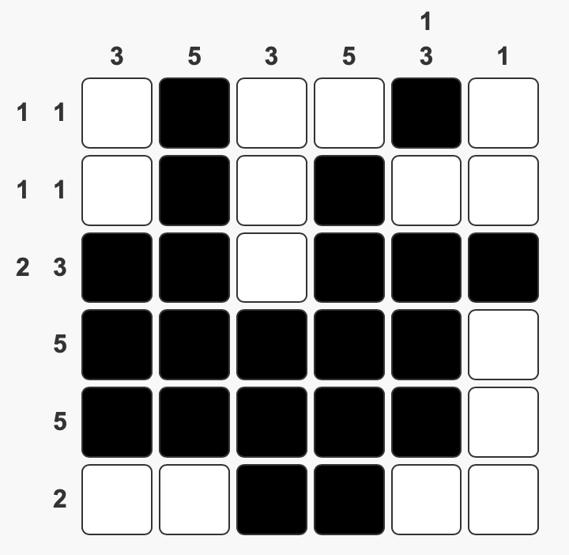

title: Nonograms
date: 2025-01-26
tags: programming,games,math
mathjax: true
codehilite: true
---
<link rel="stylesheet" href="./nonogram.css">

I started writing this months ago, with an ambition to generate uniquely solvable nonogram puzzles. Although I have yet to do this, I've found in practice that randomly generated ones at the board size I like to play with are generally easy enough to determine if I'll be able to solve it or not. 

This post documents some of the things I've explored and may be expanded on in the future. But for now it is something that has been sitting un-published for too long.

[Play the game here](../../static/nonogram)

[TOC]

# Fun and Games
Nonograms are a type of logic puzzle wherein the player is presented with a grid and a series of clues for each column and row. Using these clues, the player marks certain cells in the grid in one of three states: filled, empty, and unknown.


## The Game
Each column and row has a clue, which is an ordered list of integers. These integers indicate consecutive groups of filled cells, each group separated by one or more empty cells. 

For example, consider a 6-cell wide row with hint `1,3`. There are 3 possible solutions

>1, 3  &#9726 &#9725 &#9726 &#9726 &#9726 &#9725
> 
>1, 3  &#9726 &#9725 &#9725 &#9726 &#9726 &#9726
> 
>1, 3  &#9725 &#9726 &#9725 &#9726 &#9726 &#9726
>
> Key:
unknown &#9974
filled &#9726
empty &#9725

Players can deduce that the following filled squares will always be filled with hint `1,3` in a 6-cell row (or column)

>1, 3  &#9974 &#9974 &#9974 &#9726 &#9726 &#9974

(If you think of each row as a 6-bit number with filled as 1 and empty as 0, this is the bitwise `AND` of all possible solutions)

The player can then look at the other rows and columns, determine which cells need to be filled, and work their way iteratively through the board, revisiting columns and rows after more information has been gained from an intersecting row or column. 

Following these rules, the player fills in a game board until complete.

<figure class="figure" markdown="span">



<figcaption>A solved nonogram with clues</figcaption>
</figure>

This method of solving doesn't always work, however. Occasionally there is not enough information to consider single rows and columns, but instead you need to consider a combination of them.

The simplest example of one such technique is what Battenburg calls $(2,2)$ solvable, a specific instance of $(p,q)$-solvability [^Batenburg2012]. For a #m\times n$ nonogram and for $1\leq p \leq m$, $1\leq q \leq n$, the puzzle is $(p,q)$ solvable if it can be solved by using alternating row and column inferences, and then consider all $p$ rows and $q$ columns and finding where the intersection of such have cells that guaranteed to be filled in any configuration. $(2,2)$ solving, then, involves looking at the intersection of 2 rows and 2 columns and finding any fixed cells in those instances. 

## The Question of Uniqueness
As it turns out, the game can be a bit more complicated than that. For starters, a set of hints is not guaranteed to be uniquely solvable! This becomes a problem when trying to generate puzzles, as having multiple solutions can make it significantly more difficult to solve. 

### Patterns that lead to multiple solutions
Classifying the types of patterns that result in multiple solutions isn't immediately obvious (to me at least).

Some key properties that may help give some better understanding on the problem could be: proximity, cardinality, or parity.

<figure class="figure" markdown="block">

|   | 1      | 1      |
|---|--------|--------|
| 1 | &#9726 | &#9725 |
| 1 | &#9725 | &#9726 |

<figcaption markdown="span">Solution A</figcaption>
</figure>

<figure class="figure" markdown="block">

|   | 1      | 1      |
|---|--------|--------|
| 1 | &#9726 | &#9726 |
| 1 | &#9726 | &#9725 |

<figcaption markdown="span">Solution B</figcaption>
</figure>

For example, in the figure above, two solutions arise just by flipping the bits of a `2x2` square. Should this be classified as a "close" pattern? Cardinal 2 because it produces two solutions? "Even" parity because it involves two cells? This type of pattern is explored by Valve[^Valve], where he named it a "switching component".


Another example

<figure class="figure" markdown="block">

|     | 1      |        | 1      |        | 1      |
|-----|--------|--------|--------|--------|--------|
| 1,1 | &#9726 | &#9725 | &#9726 | &#9725 | &#9725 |
| 1   | &#9725 | &#9725 | &#9725 | &#9725 | &#9726 |

<figcaption markdown="span">Solution A</figcaption>
</figure>

<figure class="figure" markdown="block">
|     | 1      |        | 1      |        | 1      |
|-----|--------|--------|--------|--------|--------|
| 1,1 | &#9726 | &#9725 | &#9725 | &#9725 | &#9726 |
| 1   | &#9725 | &#9725 | &#9726 | &#9725 | &#9725 |

<figcaption markdown="span">Solution B</figcaption>
</figure>

<figure class="figure" markdown="block">

|     | 1      |        | 1      |        | 1      |
|-----|--------|--------|--------|--------|--------|
| 1,1 | &#9725 | &#9725 | &#9726 | &#9725 | &#9726 |
| 1   | &#9726 | &#9725 | &#9725 | &#9725 | &#9725 |

<figcaption markdown="span">Solution C</figcaption>
</figure>

Three solutions. The filled cells are all separated by some number of empty cells, should this be classified as "far"? Cardinal 3? "Odd" parity? Is this pattern a combination of three of the first type?

Ultimately classifying these types of patterns is really only useful if we can get additional information out of them. And for that matter, what really is useful? From personal experience, the first example is incredibly easy to solve in practice. The implications are clear and often when it arises in a larger problem it is has little effect on the rest of the solution -- you just pick one option and continue solving everything else.


### Combinations
In addition to a single clue configuration resulting in multiple solutions, these ambiguous patterns can be combined in a single board to create a game with many solutions.

<figure class="figure" markdown="block">

|     | 1        | ...       | 1        |
|-----|----------|-----------|----------|
| 1   | &#9725   | (&#9974)  | &#9726   |
| ... | (&#9974) | ...       | (&#9974) |
| 1   | &#9726   | (&#9974)  | &#9725   |

<figcaption markdown="span">Solution A</figcaption>
</figure>

<figure class="figure" markdown="block">

|     | 1        | ...       | 1        |
|-----|----------|-----------|----------|
| 1   | &#9726   | (&#9974)  | &#9725   |
| ... | (&#9974) | ...       | (&#9974) |
| 1   | &#9725   | (&#9974)  | &#9726   |

<figcaption markdown="span">Solution B</figcaption>
</figure>

The "..." can be any other puzzle, and the configuration on the outer-edge will necessarily double the number of possible solutions from the puzzle defined just by "..."

These "embeddings" of patterns aren't limited to edges, however. Consider the following:

<figure class="figure" id="combined_puzzle_1" markdown="block">

|       | 1<br/>1 | 1<br/>1 | 1      | 1<br/>1 | 1      | 1<br/>1 |
|-------|---------|---------|--------|---------|--------|---------|
| 1,1,1 | &#9726  | &#9725  | &#9725 | &#9726  | &#9725 | &#9726  |
| 1     | &#9725  | &#9726  | &#9725 | &#9725  | &#9725 | &#9725  |
| 1,1   | &#9725  | &#9725  | &#9726 | &#9725  | &#9726 | &#9725  |
| 1     | &#9725  | &#9725  | &#9725 | &#9725  | &#9725 | &#9726  |
| 2,1   | &#9726  | &#9726  | &#9725 | &#9726  | &#9725 | &#9725  |

<figcaption markdown="span">Figure A</figcaption>
</figure>

Each blue marked box is itself of the `2x2` pattern. There are 4 solutions possible just by virtue of these yellow boxes alone.

But there is compounding ambiguity, as several of these highlighted cells are actually part of other ambiguous patterns.

<figure class="figure" id="combined_puzzle_2" markdown="block">

|       | 1<br/>1 | 1<br/>1 | 1      | 1<br/>1 | 1      | 1<br/>1 |
|-------|---------|---------|--------|---------|--------|---------|
| 1,1,1 | &#9726  | &#9725  | &#9725 | &#9726  | &#9725 | &#9726  |
| 1     | &#9725  | &#9725  | &#9726 | &#9725  | &#9725 | &#9725  |
| 1,1   | &#9725  | &#9726  | &#9725 | &#9725  | &#9726 | &#9725  |
| 1     | &#9725  | &#9725  | &#9725 | &#9725  | &#9725 | &#9726  |
| 2,1   | &#9726  | &#9726  | &#9725 | &#9726  | &#9725 | &#9725  |

<figcaption markdown="span">Figure B</figcaption>
</figure>

<figure class="figure" id="combined_puzzle_3" markdown="block">

|       | 1<br/>1 | 1<br/>1 | 1      | 1<br/>1 | 1      | 1<br/>1 |
|-------|---------|---------|--------|---------|--------|---------|
| 1,1,1 | &#9726  | &#9725  | &#9725 | &#9726  | &#9725 | &#9726  |
| 1     | &#9725  | &#9725  | &#9726 | &#9725  | &#9725 | &#9725  |
| 1,1   | &#9725  | &#9726  | &#9725 | &#9725  | &#9726 | &#9725  |
| 1     | &#9725  | &#9725  | &#9725 | &#9725  | &#9725 | &#9726  |
| 2,1   | &#9726  | &#9726  | &#9725 | &#9726  | &#9725 | &#9725  |

<figcaption markdown="span">Figure C</figcaption>
</figure>

These ambiguities make some of these puzzles particularly hard to solve, somtimes impossibly so through inference alone, requiring the solver to make guesses and verify later if it was a correct decision.

### How to avoid non-unique puzzles

Generating puzzles is easy, just make an `nxm` bit map and calculate the clues. Both have time complexity $\mathcal{O}(nm)$ see [board generation](#board-generation) and [clue calculation](#clue-calculation).

The much harder problem is determining if that set of clues has a unique solution. Turns out this is NP-Complete[^Ueda]. Ueda shows that  *Another Solution Problem (ASP)* for nonograms is reducible to the *3D Matching* problem. *ASP-Nonogram* is formulated as: *given a set of clues and a solution $P$, does there exist another solution $P'\neq P$ satisfying the same clues?* This is exactly the situation we have after generating a board.

For small enough boards you can just enumerate the entire space of nonograms (the bitmaps) and calculate their associated clues. If you group all of these nonograms by matching sets of clues, then each group is the solution space for those clues. Groups of cardinality 1 have a single solution to a set of clues and can be classified as "solvable". Groups with more than a single solution then must have some ambiguity in the clues.

| Nonogram | # Boards | # Unique clues | # Non-unique clues | % Non-unique |
|----------|----------|----------------|--------------------|--------------|
| 2x2      | 16       | 15             | 1                  | 6.3          |
| 2x3      | 64       | 58             | 6                  | 9.4          |
| 3x3      | 512      | 445            | 67                 | 13.1         |
| 3x4      | 4096     | 3588           | 508                | 12.4         |
| 4x4      | 65536    | 58196          | 7340               | 11.2         |

This quickly becomes intractable, the number of boards increases exponentially with the size of the puzzle, specifically there are $2^{nm}$ boards for an $n\times m$ puzzle. 

## Solvability with lacking information
Solving some puzzles is easy. Each clue might have some set of cells that are guaranteed to be filled in the solved state. Filling in a cell for one clue might give more information for another clue (ie the intersecting, perpendicular clue)---if the solver iterates over the clues repeatedly they may gain enough information in each pass to eventually solve the puzzle in its entirety.

Sometimes this inferential solving technique is not enough to deterministically solve the puzzle. What can they do from this point?

***I'll leave these questions for another post***

- (How) can you confirm guesses by filling in the board after making an assumption?
- Is a puzzle acceptable if it has only one instance where you need to guess
- Are there single-solution problems that cannot be solved inferentially (ie need to guess at some point)

# Implementing
## The Game
### Board Generation
Given an `nxm` puzzle, generate a board. In this case, the code simply creates a `nxm` bitmap, with `0` for an empty cell and `1` for filled.
```
let board = array2d(n, m)
for i in range(n * m):
    board[x][y] = randomBit()
return board
```

### Clue Calculation
Given an `nxm` board (bitmap), calculate the set of clues
```javascript
static calcRowHints(image) {
    let out = []
    let max_hints = 0;
    image.forEach((row) => {
        let count = 0;
        let r_h = [];
        for(let i = 0; i < row.length; i++) {
            if(row[i] == '1') {
                count++;
            }
            else {
                count !== 0 ? r_h.push(count) : '';
                count = 0;
            }
        }
        count !== 0 ? r_h.push(count) : '';
        out.push(r_h);
        max_hints = Math.max(max_hints, r_h.length);
    });
    out = out.map((hint) => {
        return [...Array(max_hints - hint.length).fill(0), ...hint];
    });
    return out;
}

let row_clues = calcRowHints(image)
let column_clues = calcRowHints(matrixTranspose(image))
```
To find the clue for a given row of digits you iterate over it until you reach the first filled one. Count how many appear contiguously until you reach an empty digit or the end. Add this count to a running array of counts, reset the count to zero and repeat until you reach the end of the row.

A set of clues for the rows is then just running over the entire image, and for columns it is doing the same but on the transpose of the image.

[//]: # (## Python analysis tools)

# Future Topics
There is a lot to explore in this space. 

There still might be some heuristic for generating uniquely solvable puzzles that isn't np-complete, some ideas are explored by Henrick Valve[^Valve].

I've completely avoided the topic of actually *solving* these puzzles in any kind of algorithmic way---there is already pretty extensive literature on this.[^Batenburg2008],[^Oosterman]

Finding a better representation for these problems may aid in analysis. Particularly finding a group representation for both the boards and the clues where the map of boards -> clues can be studied more rigorously.


# References and Notes
[^Batenburg2012]: K. Joost Batenburg and Walter A. Kosters. December 2012. On the Difficulty of Nonograms. [PDF](https://liacs.leidenuniv.nl/~kosterswa/nonodec2012.pdf)
[^Ueda]: Nobuhisa Ueda and Tadaaki Nagao. May 1996. NP-Completeness Results for NONOGRAM via Parsimonious Reductions. [PDF](https://citeseerx.ist.psu.edu/document?repid=rep1&type=pdf&doi=1bb23460c7f0462d95832bb876ec2ee0e5bc46cf)
[^Batenburg2008]: K. Joost Batenburg and Walter A. Kosters. November 2008. Solving Nonograms by combining relaxations. [PDF](https://homepages.cwi.nl/~kbatenbu/papers/bako_pr_2009.pdf)
[^Oosterman]: R.A. Oosterman. April 2017. Complexity and solvability of Nonogram puzzles. [PDF](https://fse.studenttheses.ub.rug.nl/15287/1/Master_Educatie_2017_RAOosterman.pdf)
[^Valve]: Henrik Valve. 2022. On the estimation of the number of solutions for nonograms. [PDF](https://lutpub.lut.fi/bitstream/handle/10024/166259/diplomityo_henrik_valve.pdf?sequence=3&isAllowed=y)
