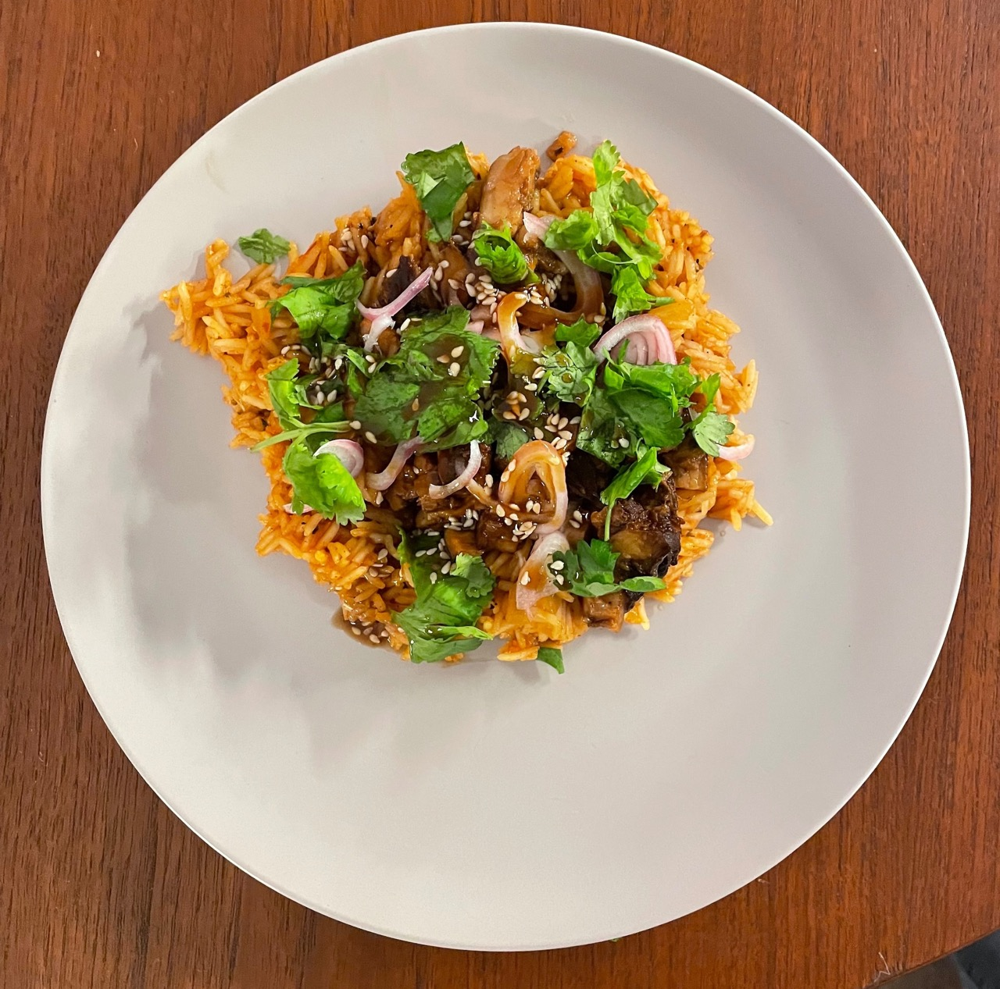

title: Cajun Pork and Rice
date: 2023-03-19
tags: recipe
---

This recipe is heavily inspired by the cochon de lait I get at a local Austin restaurant, Vic and Al's. Sadly I can't spit-roast a pig in my apartment, but I do have a great pork chashu recipe I make that always has enough pork for multiple meals --- hence the need for something that isn't ramen. There's still some work to do balancing things out, all quantities are estimations since I don't really measure out anything besides the rice and water.

# Pork
Prepare the pork a day in advance. Substitute white wine for sake. To reheat, shred the pork and place in a small sauce pan with some of the braising liquid on low for 10 minutes.

[Braised pork recipe](/recipes/pork_chashu.html)

# Rice

## Ingredients
- 2 tbs butter
- 1/2 a white onion, diced
- 2-3 cloves of garlic
- 1 tsp paprika
- 1/2 tsp celery salt
- 1/2 tsp chili powder
- 1/2 tsp red pepper flakes
- 1/2 tsp rubbed sage
- 1/2 tsp marjoram
- 1/2 tsp black pepper
- 1/4 cup crushed tomatoes
- 1 tbs salsa
- 1 tsp bouillon
- 2 cups water
- 2-3 sprigs of thyme
- 1 bay leaf
- 1/2 dried ancho chili
- 1 cup basmati or other long grain rice

## Instructions
1. In a medium sauce pan heat the butter over medium-high. Add the diced onion and cook until slightly translucent
2. Add the garlic and dried spices, cook until fragrant ~30 seconds to a minute
3. Add the crushed tomatoes and salsa. Allow to cook for 2 minutes
4. Add the bouillon, water, thyme, bay leaf, and ancho chili; bring to a boil
5. Reduce heat to a simmer and add rice. Cook, covered, for 15 minutes until rice is fluffy

# Toppings

## Pickled shallots

- 1 shallot, thinly sliced
- 1/2 cup vinegar
- 1/4 cup water
- 1 tsp salt

Combine all the ingredients in a small container and let sit

## Sauce

- 2 tbs hoisin sauce
- 1 tbs apple cider vinegar
- 3 tsps sesame seeds
- 1/4 tsp (or less) sesame oil

Combine all ingredients in a small bowl, mixing well

## Cilantro
- 3 tbs cilantro, chopped

This one is really just the ingredient, quantity adjusted to taste

# Final prep

Once everything is prepared, serve the rice topped with the pork, pickled shallots, sauce, and cilantro