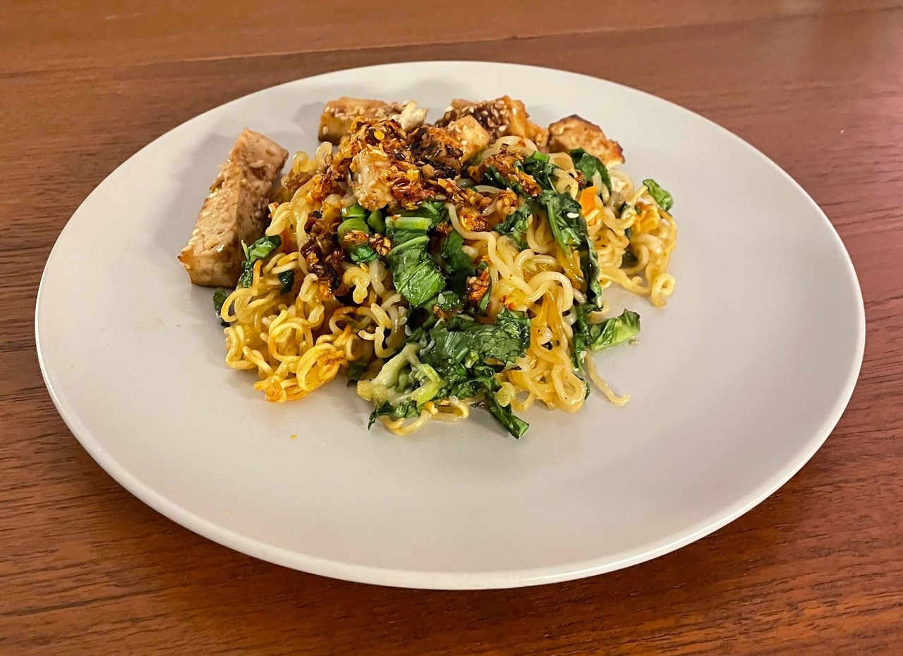

title: Tofu with Crispy Noodles
date: 2023-03-15
tags: recipe
---
This is a great, easy meal to make that scales well.

Yield: 2 servings

# Ingredients
- 2 packs of instant ramen
- 2 tablespoons vegetable (or other neutral) oil
- 1 tablespoon sesame oil
- 1/2 block of tofu
- 1 cup Baby bok choy, julienned
- 1/2 cup Cilantro
- 2 green onions, sliced

# Marinade
- 2 tablespoons hoisin sauce
- 1 tablespoon sesame oil
- 2-3 cloves garlic
- 1 tablespoon sesame seeds
- 1/2 tablespoon soy sauce

# Prep
1. Preheat oven to 425F
1. Grease a large sheet pan
1. Press and drain half a block of tofu, slice into strips 1cm x 1cm
1. Prepare two packages of instant ramen according to directions. Drain and set aside when done
1. Combine the ingredients for the marinade in a medium bowl. Coat tofu in marinade and place on the prepared sheet pan. Do not clean the marinade bowl
1. Coat the prepared ramen noodles in vegetable and sesame oils. Then spread out on the sheet pan, the more surface area covered, the crispier they will be
1. Cook tofu and noodles at 425F for 14 minutes
1. Meanwhile cut vegetables and coat in the remaining marinade, add to pan after timer stops. Broil for 4 minutes
1. Serve with chili oil