title: Fish Bag
date: 2025-06-14
tags: furniture,woodworking,design,lighting
backdated:true
---
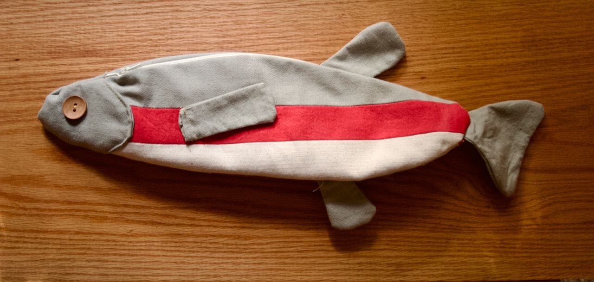
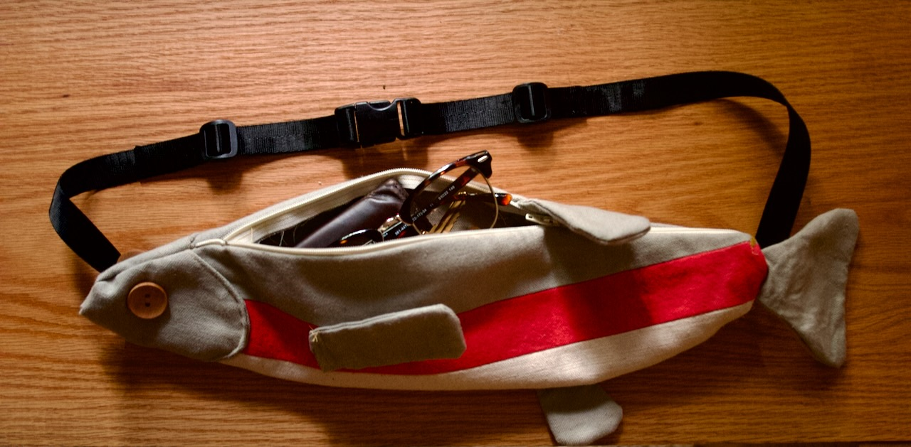

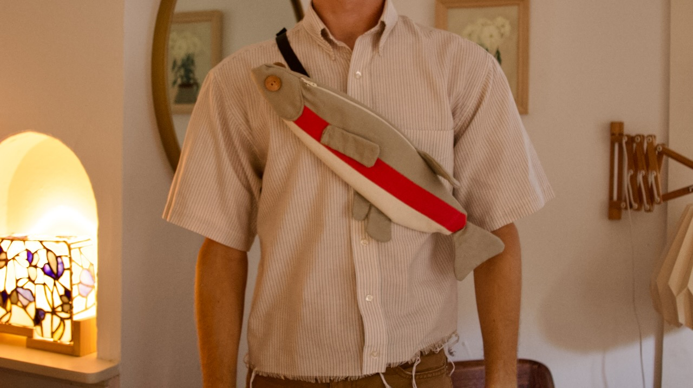

I've been a runner on-and-off since middle school, but I only just started running with a club this year. I'm loving the social aspect, but the club meets downtown, so I bike down before the run. 

Ever since my handlebars came loose on a ride back in 2020, I try not to go without a set of tools on me. And since I live in Texas, I sweat *a lot* when I run: enter the need for a bag large enough to hold my tool set, a travel pump, and a spare shirt but small enough to stash away safely.

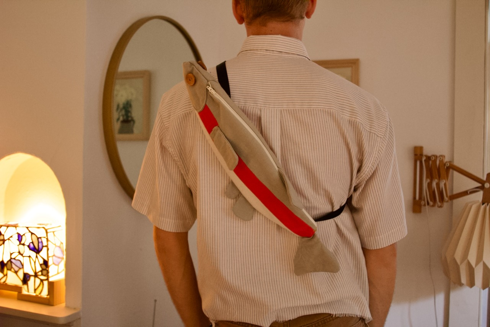

The design I copied from a bag I saw floating on the [internet](https://www.etsy.com/listing/1818293323/rainbow-trout-fish-crossbody-bag-sewing?gpla=1&gao=1&). I've been learning to sew and figured this would be an easy enough project to do without a pattern and practice my own drafting abilities.

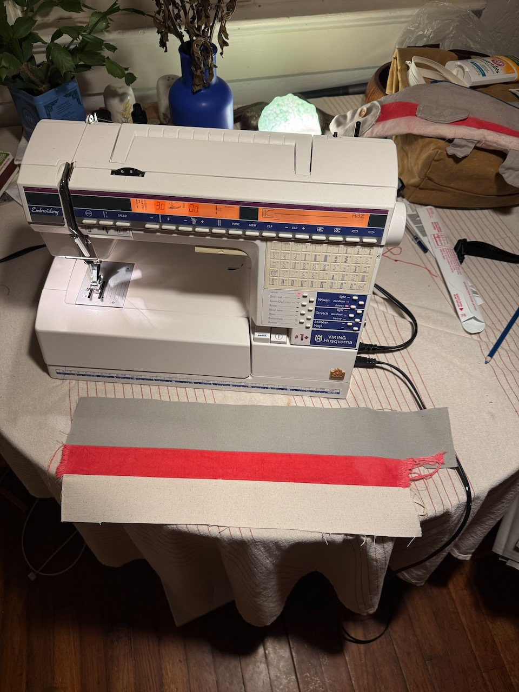
First step was to put together the striped pattern of the fish. I made two of these sections and backed them with some plain canvas to form a liner. Looking closely at the picture, you can see the first iteration chilling in the back. If I were to make this a third time I'd probably wait to attach the liner until I could hide the fins as well.

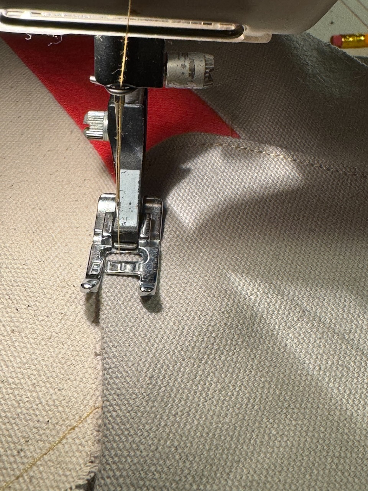

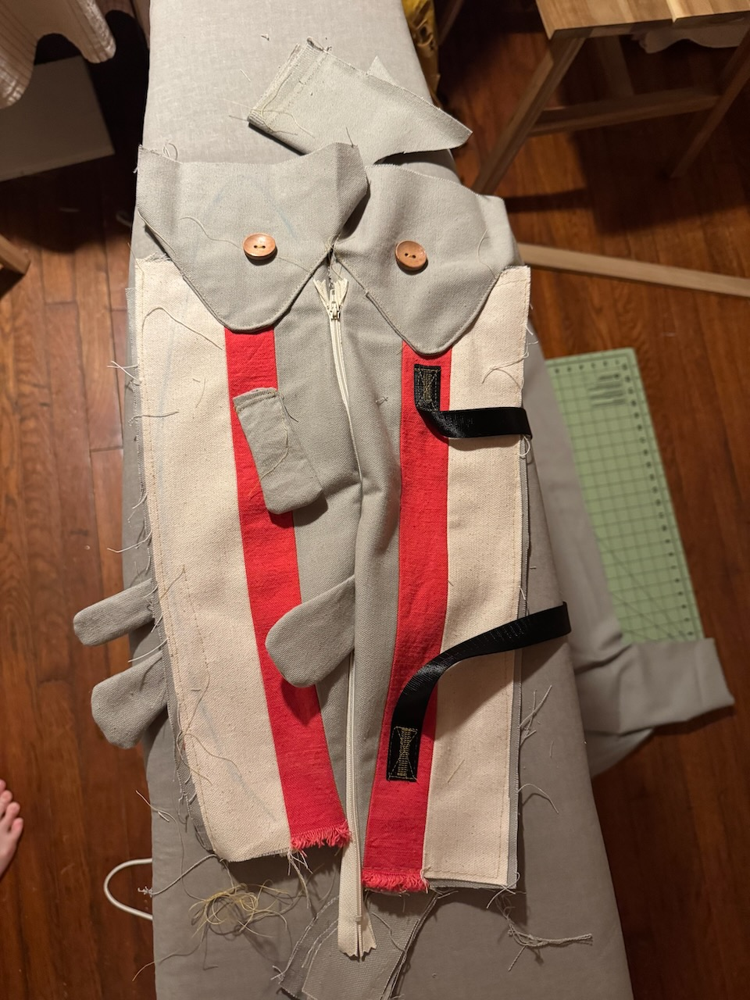
I'm terrible at taking step-by-step pictures, so by this point I had made all the fins, attached them, added the zipper, added the straps, and sewn on the button eyes.

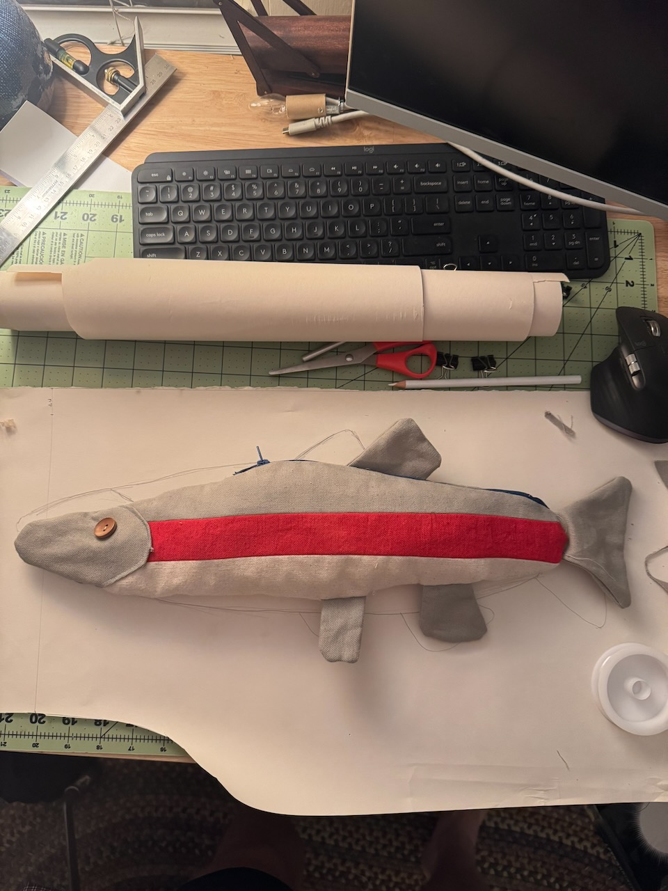
My first attempt at this fish turned out pretty well, except I did not properly wash the red fabric after dyeing it. I got caught in a sudden downpour biking back home one day and the colors bled which really ruined the effect I was going for.

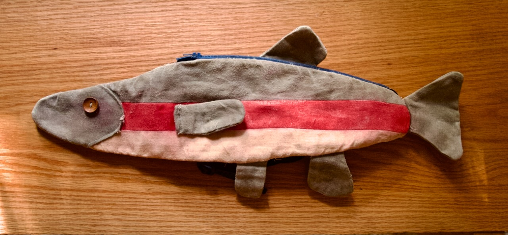

But I had enough fabric on hand to do it again, this time with some fixes. The head seams on the old bag were not great and showed the raw edge of the fabric. I added in a liner, adjusted the zipper size and position, and found a better way to attach the straps that didn't dig into my skin; I guess it was a happy accident?

Just look at the difference:

<section class="gallery" markdown="span">
    

        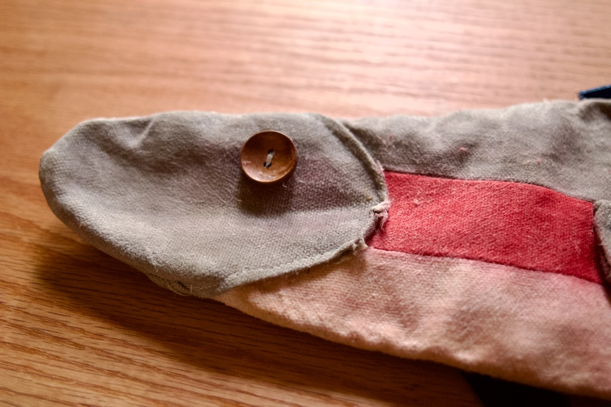
        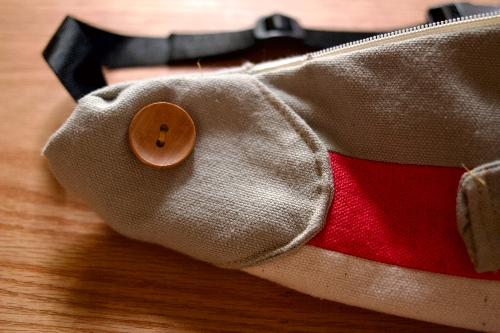
    

</section>

Another upside, I now have two of these bags! Meaning I had a test subject for waxing the bag to make it waterproof. Eventually I would like to make a frame bag for my bike with what I've learned from this project.

<section class="gallery" markdown="span">
    

        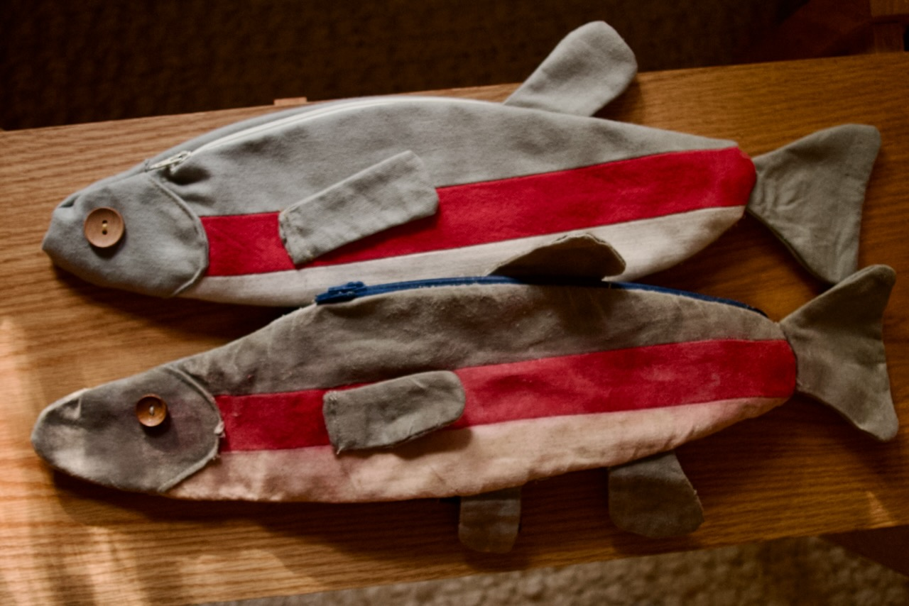
        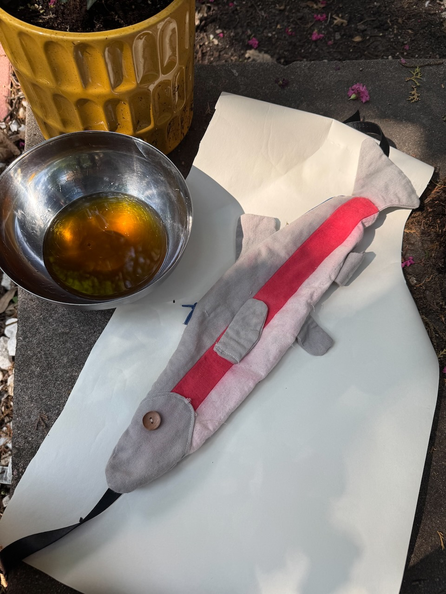
    

</section>

